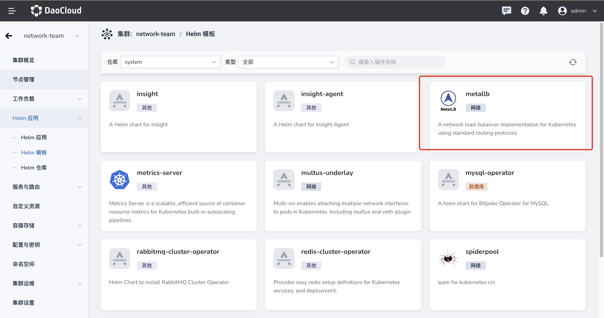

---
hide:
  - toc
---

# 安装

若需安装 ARP Pool，需启用 Helm 并使其处于就绪等待状态。具体安装步骤如下：

1. Metallb Helm Chart 存放于 system repo 下：

    

2. 安装 IP 池

    安装 Metallb 时，可选择安装 IP 池。LoadBalancer Service默认会从这个池中分配 IP 地址，并且通过 APR 宣告这个池中的所有 IP 地址。

    !!! note

        地址池列表可以配置 IPv4 和 IPv6 的地址。
        每个地址段输入格式可以为合法的 CIDR（如 192.168.1.0/24），也可以为 IP 范围（如 1.1.1.1-1.1.1.20）。
        输入的每个地址段应当属于节点某个网段，但注意不要已有的 IP 地址冲突。

    

3. 配置 LoadBalancer IP 的下一跳

    默认情况下，所有节点都会作为 LoadBalancer IP的下一跳，但可以限制只有某些节点作为 LoadBalancer IP 的下一跳:

    

    如上图配置表示，只有 Master 和 Worker1 节点 会作为 LoadBalancer IP 的下一跳。

4. 上面配置只会初始化 Metallb ARP 模式，配置比较简单。
    这里并不包括初始化 Metallb BGP模式。BGP 模式配置较为复杂，且需要硬件支持。如需配置 BGP 模式，
    请参考[advanced_bgp_configuration](https://metallb.universe.tf/configuration/_advanced_bgp_configuration/)。

5. 安装完成

    
