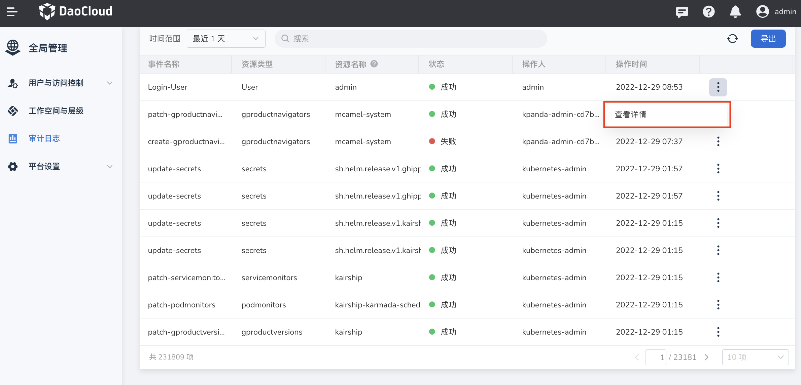
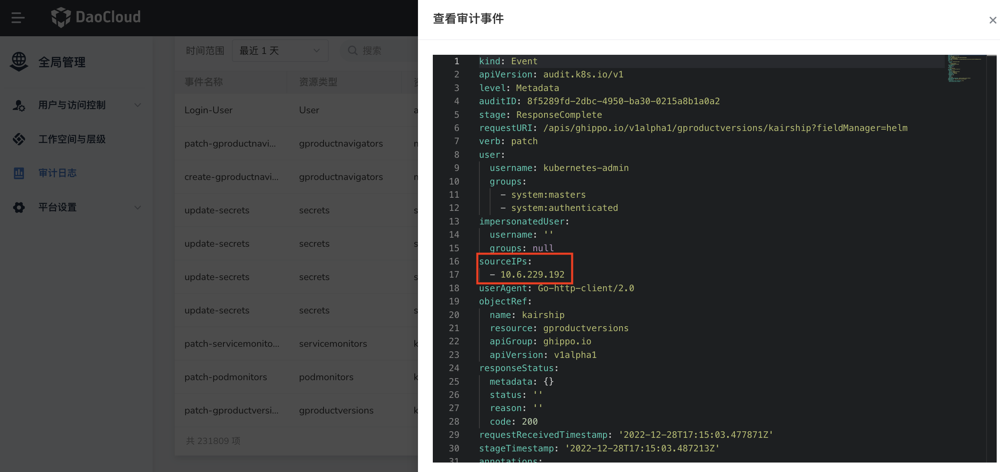

# 通过 Metallb + istio-ingressgateway 获取客户端源 IP

## 背景

通过 Metallb ARP 模式，用户可以在`全局管理`—>`审计日志`中查看操作者的真实 IP,而不是被 SNAT 后的 IP 地址。通过 Metallb + istio-ingressgateway 获取客户端源 IP 的主要思路为: 将 istio-gateway pod 部署的
节点与 Metallb 宣告的节点保持一致。

## 操作步骤

1. 给指定节点打上标签。

    ```shell
    kubectl label nodes demo-dev-worker-03 loadbalancerIPs.metallb.io=arp
    kubectl label nodes demo-dev-worker-04 loadbalancerIPs.metallb.io=arp
    ```

2. 使 istio-ingressgateway Pod 调度到上述节点。

    ```shell
          nodeSelector:
            loadbalancerIPs.metallb.io: arp
    ```

    ```shell
    [root@demo-dev-master-01 ~]# kubectl get po -n istio-system -o wide
    NAME                                           READY   STATUS             RESTARTS           AGE     IP                NODE                 NOMINATED NODE   READINESS GATES
    istio-ingressgateway-9b8c76bfc-rr5lg           1/1     Running            0                  2d9h    192.168.138.159   demo-dev-worker-03   <none>           <none>
    ```

3. 配置 Metallb 宣告上述节点作为 LB IPs 的下一跳。

    ```shell
    [root@demo-dev-master-01 ~]# kubectl get l2advertisements.metallb.io -n metallb-system default-l2advertisement -o yaml
    apiVersion: metallb.io/v1beta1
    kind: L2Advertisement
    metadata:
      annotations:
        helm.sh/hook: post-install
        helm.sh/resource-policy: keep
      creationTimestamp: "2022-11-14T06:04:35Z"
      generation: 2
      labels:
        app.kubernetes.io/instance: metallb
        app.kubernetes.io/managed-by: Helm
        app.kubernetes.io/name: metallb
        app.kubernetes.io/version: 0.13.5
        helm.sh/chart: metallb-0.13.5
      name: default-l2advertisement
      namespace: metallb-system
      resourceVersion: "133681854"
      uid: c5301f5b-fb08-40ae-8a22-2b03e129a092
    spec:
      ipAddressPoolSelectors:
      - matchLabels:
          l2.ipaddress-pool.metallb.io: default-pool
      ipAddressPools:
      - default-pool
      nodeSelectors: 
      - matchLabels:
          loadbalancerIPs.metallb.io: arp
    ```

    通过配置 `spec.nodeSelectors` 来实现绑定。

4. 修改 service: istio-ingressgateway 的 `spec.externalTrafficPolicy` = `Local` , 此模式可以保留真实源 IP:

    ```shell
    [root@demo-dev-master-01 ~]# kubectl get svc -n istio-system istio-ingressgateway -o yaml
    apiVersion: v1
    kind: Service
    metadata:
      annotations:
        ckube.daocloud.io/indexes: '{"cluster":"kpanda-global-cluster","createdAt":"2022-11-25T08:27:35Z","importedAt":"","is_deleted":"false","labels":"{\"app\":\"istio-ingressgateway\",\"app.kubernetes.io/managed-by\":\"Helm\",\"app.kubernetes.io/name\":\"istio-ingressgateway\",\"app.kubernetes.io/version\":\"1.15.0\",\"helm.sh/chart\":\"gateway-1.15.0\",\"istio\":\"ingressgateway\"}","name":"istio-ingressgateway","namespace":"istio-system"}'
        ckube.doacloud.io/cluster: kpanda-global-cluster
        controller.mspider.io/workload-id: kpanda-global-cluster-deployment-istio-system-istio-ingressgateway
        controller.mspider.io/workload-status: '{"workloads":{"kpanda-global-cluster-deployment-istio-system-istio-ingressgateway":{"workload_id":"kpanda-global-cluster-deployment-istio-system-istio-ingressgateway","replicas":3,"available_replicas":3,"available_injected_replicas":3,"injected":true,"needs_restart":false,"running":true}},"diag_messages":{"injection":{"message_type":"injection","ready":true,"message":""},"need-restart":{"message_type":"need-restart","ready":true,"message":""},"running":{"message_type":"running","ready":true,"message":""}}}'
        meta.helm.sh/release-name: istio-ingressgateway
        meta.helm.sh/release-namespace: istio-system
      creationTimestamp: "2022-11-25T08:27:35Z"
      labels:
        app: istio-ingressgateway
        app.kubernetes.io/managed-by: Helm
        app.kubernetes.io/name: istio-ingressgateway
        app.kubernetes.io/version: 1.15.0
        helm.sh/chart: gateway-1.15.0
        istio: ingressgateway
      name: istio-ingressgateway
      namespace: istio-system
      resourceVersion: "198389187"
      uid: 9308a4fa-88b2-48ff-9ccf-a9fa4d6c6bcf
    spec:
      allocateLoadBalancerNodePorts: true
      clusterIP: 10.233.32.214
      clusterIPs:
      - 10.233.32.214
      externalTrafficPolicy: Local
      healthCheckNodePort: 32109
      internalTrafficPolicy: Cluster
      ipFamilies:
      - IPv4
      ipFamilyPolicy: SingleStack
      ports:
      - name: status-port
        nodePort: 32082
        port: 15021
        protocol: TCP
        targetPort: 15021
      - name: http2
        nodePort: 30421
        port: 80
        protocol: TCP
        targetPort: 8080
      - name: https
        nodePort: 30483
        port: 443
        protocol: TCP
        targetPort: 8443
      selector:
        app: istio-ingressgateway
        istio: ingressgateway
      sessionAffinity: None
      type: LoadBalancer
    status:
      loadBalancer:
        ingress:
        - ip: 10.6.229.180
    ```

5. 在`全局管理`—>`审计日志`页面，在任意事件后点击`查看详情`，查看获取到的客户端源 IP：

    

    
