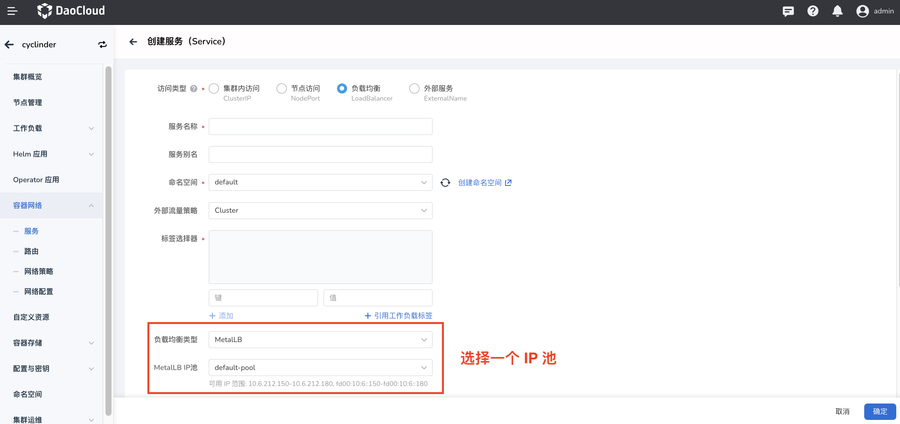
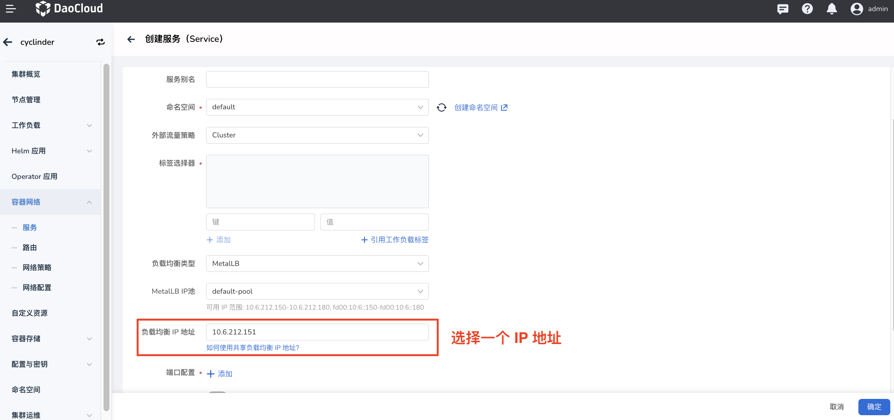

# IPPool 使用说明

## 集群默认地址池

如果创建 `LoadBalancer Service` 的时候没有通过 Annotations: `metallb.universe.tf/address-pool` 指定地址池或通过 Annotation: `metallb.universe.tf/loadBalancerIPs` 指定 IP，那么会从现存的地址池中设置 `autoAssign=true` 的池中分配地址。

!!! note

    创建的地址池必须跟 `Metallb` 组件在同一个 namespace，否则 `Metallb` 无法识别。

## 指定地址池

创建 `LoadBalancer Service` 的时候可以通过 Annotations: `metallb.universe.tf/address-pool` 指定地址池：

```yaml
apiVersion: v1
kind: Service
metadata:
  name: metallb-ippool3
  labels:
    name: metallb-ippool3
  annotations:
    metallb.universe.tf/address-pool: default  # default 必须和 metallb 组件在同一个 namespace 下
spec:
  type: LoadBalancer
  ...
```

创建 `LoadBalancer Service`	,详情请参考：[创建服务(Service)](../../../kpanda/user-guide/services-routes/create-services.md)

## 指定 IP 地址

创建 `LoadBalancer Service` 的时候可以通过 Annotations: `metallb.universe.tf/loadBalancerIPs` 指定 IP：

```yaml
apiVersion: v1
kind: Service
metadata:
  name: metallb-ippool3
  labels:
    name: metallb-ippool3
  annotations:
   metallb.universe.tf/loadBalancerIPs: 172.16.13.210  # 该 IP 地址必须存在于现存的地址池中
spec:
  type: LoadBalancer
  ...
```



## 共享 IP 地址

在 `k8s v1.20` 之前，`LoadBalancer Service` 不支持配置多种协议（`v1.24` 支持，已成为 Beta 功能），参考 [#issue 23880](https://github.com/kubernetes/kubernetes/issues/23880)。

`Metallb` 通过创建不同的 Service 并共享 Service IP，间接的支持这个功能。

创建两个 Service：

```yaml
apiVersion: v1
kind: Service
metadata:
  name: dns-service-tcp
  namespace: default
  annotations:
    metallb.universe.tf/allow-shared-ip: "key-to-share-1.2.3.4"
spec:
  type: LoadBalancer
  loadBalancerIP: 1.2.3.4
  ports:
    - name: dnstcp
      protocol: TCP
      port: 53
      targetPort: 53
  selector:
    app: dns
---
apiVersion: v1
kind: Service
metadata:
  name: dns-service-udp
  namespace: default
  annotations:
    metallb.universe.tf/allow-shared-ip: "key-to-share-1.2.3.4"
spec:
  type: LoadBalancer
  loadBalancerIP: 1.2.3.4
  ports:
    - name: dnsudp
      protocol: UDP
      port: 53
      targetPort: 53
  selector:
    app: dns
```

!!! note

    只要 Annotations (`metallb.universe.tf/allow-shared-ip`) key 和 value 相同，那么不同的 `LoadBalancer Service`就会具有相同的 IP 地址（ipv4/ipv6）。
    当然也可以通过 Annotations (`metallb.universe.tf/loadBalancerIPs`) 指定 ipv4/ipv6 地址，或者通过 `.spec.loadBalancerIP` 指定（只支持 ipv4）。
    创建后编辑 Annotation 没有效果。

共享 IP 另一个作用是 `LoadBalancer IP` 地址不足，需要多个 Service 共享同一个 IP，但注意不同 Service 的协议和端口应该是不同的，否则无法区分连接。

