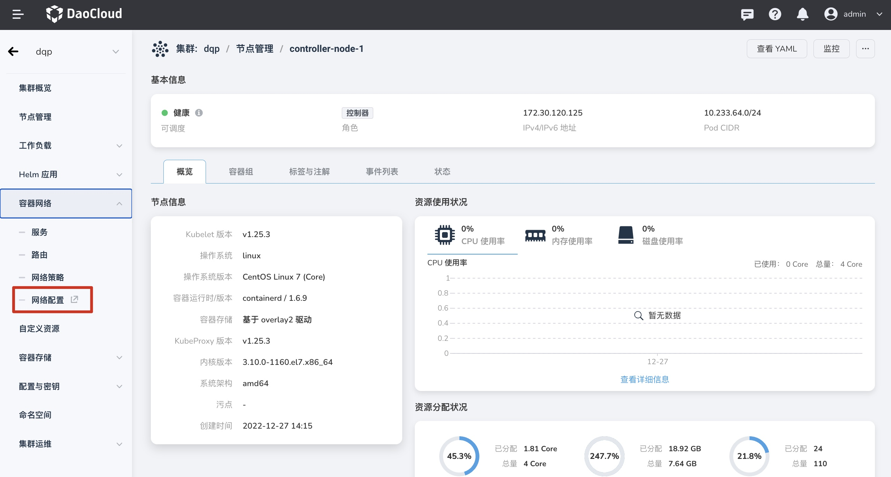
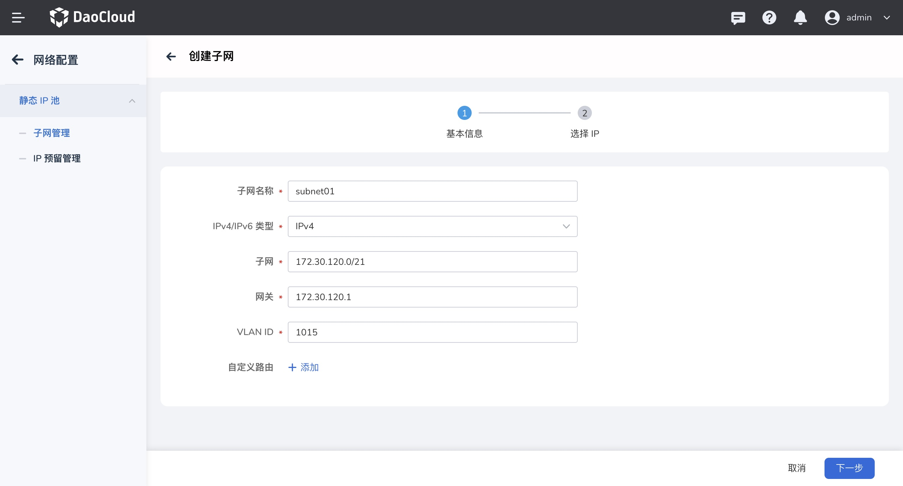
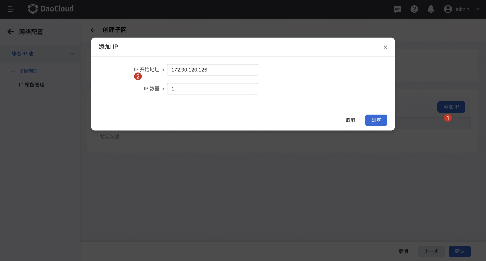
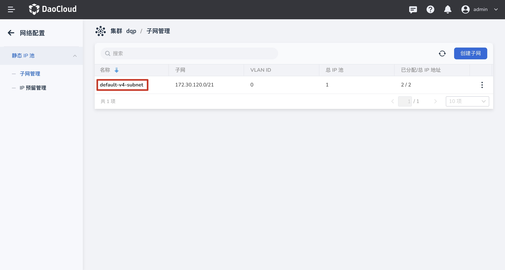
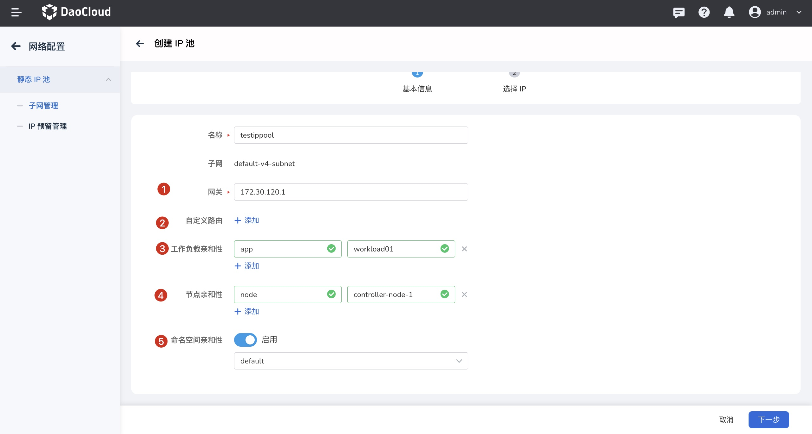
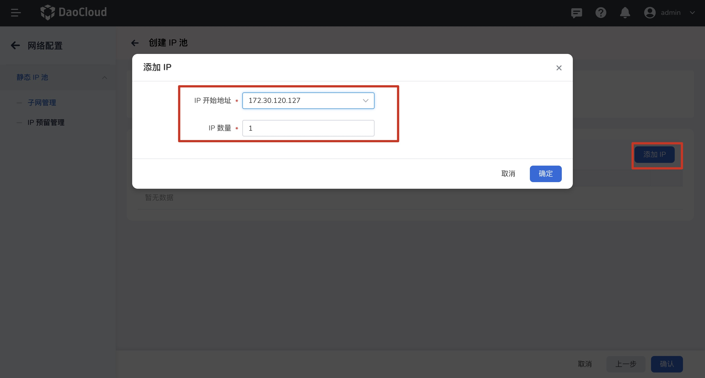

---
hide:
  - toc
---

# 创建子网及 IP 池

本章节介绍在创建工作负载使用 IP 池之前，如何创建子网 及 IP 池。

### 前提条件

1. [SpiderPool 已成功部署。](../../modules/spiderpool/install.md)
2. [Multus 搭配 Macvlan /SRI-OV 已成功部署。](../../modules/multus-underlay/install.md)

### 界面操作

1. 登录平台 UI ，点击`容器管理`进入`集群列表`，选择待使用的集群进入`集群详情`选择`网络配置` 进入网络配置页面。

   

2. 进入`网络配置`，确认待使用子网是否已创建。

      - 如待使用子网已默认创建，可直接`创建 IP 池`。
      - 如待使用子网没有默认创建，可进入页面点击`创建子网`。

      

   ​      参数说明：

   ​     - `IPv4/IPv6 类型`：待创建子网的子网类型
   ​     - `子网`： 已经规划好的子网段，如配合 Macvlan 使用，对应为网络接口/子接口所对应网段，请提前同网络管理员确认
   ​     - `网关`： 输入子网对应网关，请提前同网络同事确认
   ​     - `VLAN ID`: 输入子网所对应的 VLAN ID

3. 点击`下一步` 进入` IP 选择`，输入待使用的 IP 段（上述输入子网内 IP），点击`确认`后，完成子网创建。

    

    **创建 IP 池**（可选）

    - 如需要对 IP 进行严管控，可提前完成 IP 池创建。
    - 如采用粗粒度管控  IP 资源，可不用提前创建 IP 池。

4. 点击待使用的`子网名称`，进入子网详情页面。

    

5. 点击`创建 IP 池`，进入创建页面，输入如下参数。

    - `网关`：`网关`默认继承`子网网关`，可修改。
    - `自定义路由`：当用户有特殊路由需求时，可基于 IP 池粒度的进行自定义。
    - `工作负载亲和性`:输入工作负载标签（如 `app: workload01`），IP 池创建后，仅可被对应的工作负载选择，实现固定 IP 池效果。
    - `节点亲和性`：输入节点标签( 如`node:controller-1`）,IP 池创建后，工作负载 Pod 需要调度到对应节点才能使用创建 的 IP 池。
    - `命名空间亲和性`：开启后可选择对应 命名空间，选择后，只有对应命名空间中的工作负载可使用创建的 IP 池。

    `注`：创建时，不添加任何亲和性创建后的 IP 池为`共享 IP 池`。

    

6. 点击`添加 IP`，选择 `IP 开始地址` 以及加入 IP 池中的 `IP 数量`，点击`确定`，完成 IP 添加，再次点击完成 IP 池创建。

    `获取 IP 规则`：从 `IP 开始地址`依次获取输入对应数量的 IP，IP 段如不是连续 IP，则跳过中间断档 IP，依次往后获取。

    

7. 创建完成后[工作负载即可使用 IP Pool](../../modules/spiderpool/usage.md)

### YAML 创建

**YAML 创建 Subnet**

```yaml
apiVersion: spiderpool.spidernet.io/v1
kind: SpiderSubnet
metadata:
  name: default-v4-subnet
spec:
  gateway: 172.30.120.1
  ipVersion: 4
  ips:
  - 172.30.120.126-172.30.120.127  #已规划子网 IP，可输入IP 段
      #如：72.30.120.126-172.30.120.127 段或单个 IP 如：172.30.120.126
  subnet: 172.30.120.0/21
  vlan: 0
```

使用 Pod 注解 `ipam.spidernet.io/ippool`

**YAML 创建 IPPool**

```yaml
apiVersion: spiderpool.spidernet.io/v1
kind: SpiderIPPool
metadata:
  name: standard-ipv4-ippool
spec:
  ipVersion: 4
  subnet: 172.30.120.0/21
  ips:
  - 172.30.120.126-172.30.120.127      # 已添加至子网内的 IP， 可输入IP 段
         # 如：172.30.120.126-172.30.120.127 段或单个 IP 如：172.30.120.126
```
