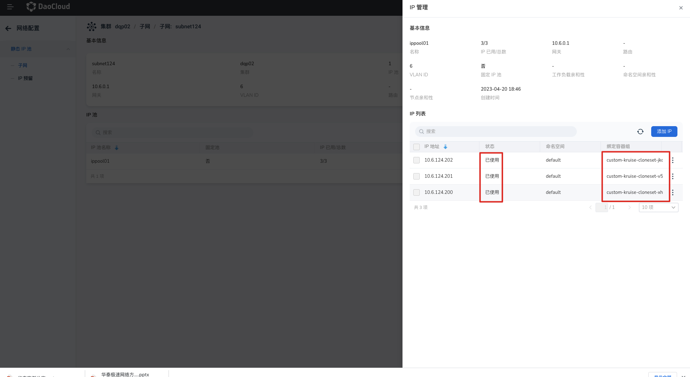

---
hide:
  - toc
---

# 第三方工作负载使用 IP 池

本章节主要介绍结合 Multus 及 Underlay CNI 插件，为自定义工作负载（本文采用 [OpenKruise](https://github.com/openkruise/kruise) 控制器 创建的工作负载 CloneSet） Pod 配置 IP Pool，通过 Spiderpool 进行 Underlay 网络的 IP 的分配和固定。

## 前提条件

1. [SpiderPool 已成功部署](../../modules/spiderpool/install.md)。
2. [Multus 搭配 Macvlan /SRI-OV 已成功部署](../../modules/multus-underlay/install.md)。
3. 如使用手动选择 IP 池，请提前完成[创建 IP 子网和 IP 池](../../modules/spiderpool/createpool.md)。本示例中使用固定 IP 池，请提前完成[创建 固定 IP 池](../../modules/spiderpool/createpool.md)。

## 界面操作

1. 部署自定义资源 `CloneSet`，并在 `Annotation` 中指定默认网络类型，VLAN ID ，子网接口，IP 池信息

    ```
    v1.multus-cni.io/default-network: kube-system/calico
    k8s.v1.cni.cncf.io/networks: kube-system/vlan6
    ipam.spidernet.io/ippools: '[{"interface":"net1","ipv4":["ippool01"]}]'
    ```

    ```
    apiVersion: apps.kruise.io/v1alpha1
    kind: CloneSet
    metadata:
      name: custom-kruise-cloneset
    spec:
      replicas: 3
      selector:
        matchLabels:
          app: custom-kruise-cloneset
      template:
        metadata:
          annotations：
            v1.multus-cni.io/default-network: kube-system/calico
            k8s.v1.cni.cncf.io/networks: kube-system/vlan6
            ipam.spidernet.io/ippools: '[{"interface":"net1","ipv4":["ippool01"]}]'
          labels:
            app: custom-kruise-cloneset
        spec:
          containers:
          - name: custom-kruise-cloneset
            image: busybox
            imagePullPolicy: IfNotPresent
            command: ["/bin/sh", "-c", "trap : TERM INT; sleep infinity & wait"]在`创建无状态负载`页面，完成`基本信息`、`容器配置`、`服务配置`页面的信息输入。然后，进入`高级配置`，点击配置`容器网卡`。
    ```

    

2. 部署后，查看 CloneSet 状态：

    ```
    kubectl get pods -A|grep kruise-clone
    default            custom-kruise-cloneset-jkqtx                                      1/1     Running             0                  44h
    default            custom-kruise-cloneset-v5qz7                                      1/1     Running        0                  44h
    default            custom-kruise-cloneset-xhtq6                                      1/1     Running
    0                  44h
    ```

    

1. 进入`容器平台`-->选择`对应集群`-->点击`容器网络`，找到`对应子网`-->进入子网详情， 查看 IP 使用情况：

    ​	

    
