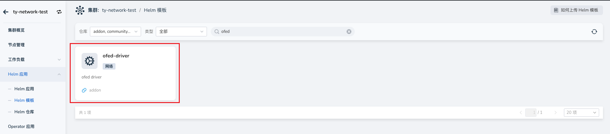
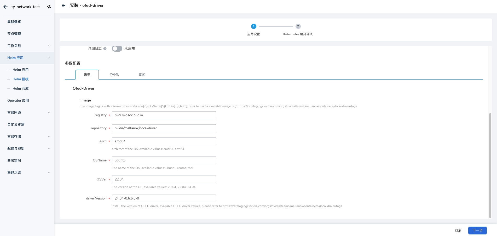
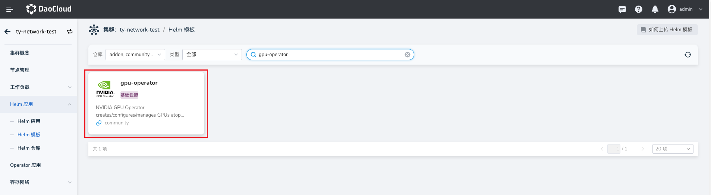
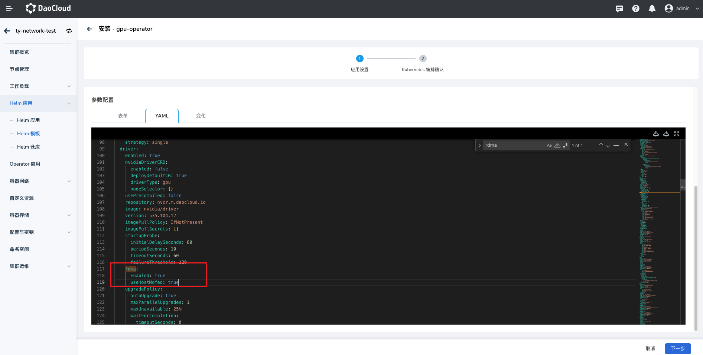
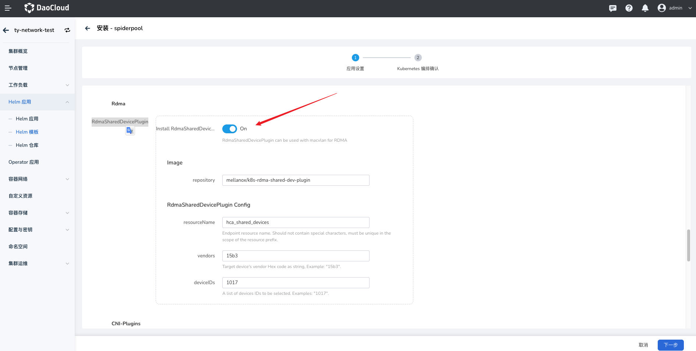
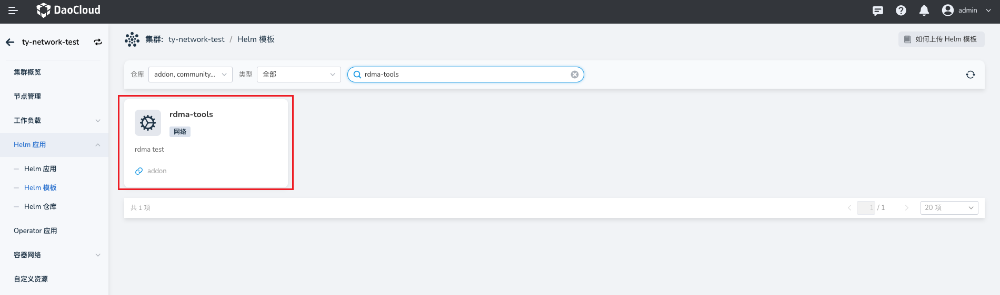
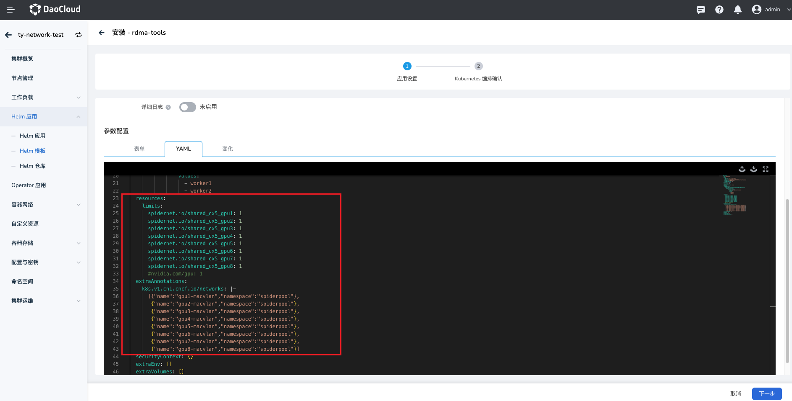

# 在 AI 集群基于 Spiderpool 搭配 Macvlan 技术给容器提供 RDMA 通信能力

本页介绍在建设 AI 集群场景下，如何基于 Spiderpool + Macvlan 技术给容器提供 RDMA 通信能力，适用在 RoCE 网络场景下。

基于 [RDMA shared device plugin](https://github.com/Mellanox/k8s-rdma-shared-dev-plugin), 给容器插入 Macvlan 接口，能够把 master 接口的 RDMA 设备共享给容器使用，因此：

RDMA system 需要工作在 shared 模式下，所有的容器共享使用宿主机上的 master 网卡的 RDMA 设备。它的特点是，每个新启动的容器中，其 RDMA 设备的可用 GID index 总是在递增变换的，不是固定值。

在 Infiniband 的 IPOIB 网卡上不支持创建 Macvlan 接口，因此，本方案只能适用在 RoCE 网络场景下，不能使用在 infiniband 网络场景下。

## 方案

本文将以如下典型的 AI 集群拓扑为例，介绍如何搭建 Spiderpool 给 AI 集群提供 RDMA 通信能力。


集群的网络规划如下：

在节点的 eth0 网卡上运行 calico CNI，来承载 kubernetes 流量。AI workload 将会被分配一个 calico 的缺省网卡，进行控制面通信。

节点上使用具备 RDMA 功能的 Mellanox ConnectX5 网卡来承载 AI 计算的 RDMA 流量，网卡接入到 rail optimized 网络中。AI workload 将会被额外分配所有 RDMA 网卡的 Macvlan 虚拟化接口，确保 GPU 的高速网络通信。

## 安装要求

1. 参考 [Spiderpool安装要求](./system-requirements.md)
2. 主机上准备好 Helm 二进制
3. 安装好 Kubernetes 集群，kubelet 工作在图 1 中的主机 eth0 网卡上
4. 安装 Calico 作为集群的缺省 CNI，使用主机的 eth0 网卡作为 calico 的流量转发网卡。 如果未安装，可参考[官方文档](https://docs.tigera.io/calico/latest/getting-started/kubernetes/) 或参考以下命令安装:

    ```bash
    $ kubectl apply -f https://github.com/projectcalico/calico/blob/master/manifests/calico.yaml
    $ kubectl wait --for=condition=ready -l k8s-app=calico-node  pod -n kube-system 
    # set calico to work on host eth0 
    $ kubectl set env daemonset -n kube-system calico-node IP_AUTODETECTION_METHOD=kubernetes-internal-ip
    # set calico to work on host eth0 
    $ kubectl set env daemonset -n kube-system calico-node IP6_AUTODETECTION_METHOD=kubernetes-internal-ip  
    ```

## 主机准备

1. 安装 RDMA 网卡驱动

    对于 Mellanox 网卡，可下载 NVIDIA OFED 官方驱动 进行主机安装，执行如下安装命令

    ```bash
    # mount /root/MLNX_OFED_LINUX-24.01-0.3.3.1-ubuntu22.04-x86_64.iso /mnt
    # /mnt/mlnxofedinstall --all
    ```

    对于 Mellanox 网卡，也可基于容器化安装驱动，实现对集群主机上所有 Mellanox 网卡批量安装驱动，注意的是，该运行过程中需要访问因特网获取一些安装包。当所有的 ofed pod 进入 ready 状态，表示主机上已经完成了 OFED driver 安装，参考步骤如下：

    1. 进入 __Helm 应用__ -> __Helm 模板__ ，找到并点击 __ofed-driver__

        

    2. 在 __版本选择__ 中选择希望安装的版本，点击 __安装__ 。

    3. 在安装界面，填写所需的安装参数后，点击 __确定__ 。

        

2. 确认网卡支持 Ethernet 工作模式

    本示例环境中，宿主机上接入了 mellanox ConnectX 5 VPI 网卡，查询 RDMA 设备，确认网卡驱动安装完成

    ```bash
    $ rdma link
    link mlx5_0/1 state ACTIVE physical_state LINK_UP netdev ens6f0np0
    link mlx5_1/1 state ACTIVE physical_state LINK_UP netdev ens6f1np1
    ....... 
    ```

    确认网卡的工作模式，如下输出表示网卡工作在 Ethernet 模式下，可实现 RoCE 通信

    ```bash
    $ ibstat mlx5_0 | grep "Link layer"
    Link layer: Ethernet
    ```

    如下输出表示网卡工作在 Infiniband 模式下，可实现 Infiniband 通信

    ```bash
    $ ibstat mlx5_0 | grep "Link layer"
    Link layer: InfiniBand
    ```

    如果网卡没有工作在预期的模式下，请输入如下命令，确认网卡支持配置 LINK_TYPE 参数，如果没有该参数，请更换支持的网卡型号

    ```bash
    $ mst start

    # check the card's PCIE 
    $ lspci -nn | grep Mellanox
        86:00.0 Infiniband controller [0207]: Mellanox Technologies MT27800 Family [ConnectX-5] [15b3:1017]
        86:00.1 Infiniband controller [0207]: Mellanox Technologies MT27800 Family [ConnectX-5] [15b3:1017]
        ....... 

    # check whether the network card supports parameters LINK_TYPE 
    $ mlxconfig -d 86:00.0  q | grep LINK_TYPE
        LINK_TYPE_P1                                IB(1)
    ```

3. 开启 GPUDirect RMDA 功能

    1. 进入 __Helm 应用__ -> __Helm 模板__ ，找到并点击 gpu-operator

        

    2. 在 __版本选择__ 中选择希望安装的版本后，点击 __安装__ 。

    3. 在安装界面，通过 __参数配置__ 选择 __YAML__ 开启 driver.rdma.enabled、driver.rdma.useHostMofed 参数，让 gpu-operator 去安装 [nvidia-peermem](https://network.nvidia.com/products/GPUDirect-RDMA/) 内核模块，启用 GPUDirect RMDA 功能，加速 GPU 和 RDMA 网卡之间的转发性能，其他用默认值，点击 __确定__ ，完成安装。

        

        可在主机上输入如下命令，确认安装成功的内核模块填写所需的安装参数，例如：

        ```bash
        $ lsmod | grep nvidia_peermem
        nvidia_peermem         16384  0
        ```

4. 确认主机上的 RDMA 子系统为 shared 模式，这是 macvlan 场景下提供 RDMA 设备给容器的要求。

    ```bash
    # Check the current operating mode (the Linux RDMA subsystem operates in shared mode by default):
    $ rdma system
    netns shared copy-on-fork on
    ```

## 安装 Spiderpool

1. 安装 Spiderpool 请参考 [Spiderpool 安装文档](./install.md)，注意，在安装时，必须开启 RdmaSharedDevicePlugin 功能，示例如下：

    

    完成后，安装的组件如下:

    ```bash
    $ kubectl get pod -n spiderpool
        spiderpool-agent-9sllh                         1/1     Running     0          1m
        spiderpool-agent-h92bv                         1/1     Running     0          1m
        spiderpool-controller-7df784cdb7-bsfwv         1/1     Running     0          1m
        spiderpool-init                                0/1     Completed   0          1m
        spiderpool-rdma-shared-device-plugin-9xsm9     1/1     Running     0          1m
        spiderpool-rdma-shared-device-plugin-nxvlx     1/1     Running     0          1m
    ```

2. 配置 k8s-rdma-shared-dev-plugin, 识别出每个主机上的 RDMA 共享设备资源

    修改如下 configmap，创建出 8 种 RDMA 共享设备，它们分别亲和每一个 GPU 设备。configmap 的详细配置可参考[官方文档](https://github.com/Mellanox/k8s-rdma-shared-dev-plugin?tab=readme-ov-file#rdma-shared-device-plugin-configurations)

    ```bash
    $ kubectl edit configmap -n spiderpool spiderpool-rdma-shared-device-plugi
    ....
    config.json: |
        {
        "periodicUpdateInterval": 300,
        "configList": [
            {
            "resourcePrefix": "spidernet.io",
            "resourceName": "shared_cx5_gpu1",
            "rdmaHcaMax": 100,
            "selectors": { "ifNames": ["enp11s0f0np0"] }
        },
        ....
        {
            "resourcePrefix": "spidernet.io",
            "resourceName": "shared_cx5_gpu8",
            "rdmaHcaMax": 100,
            "selectors": { "ifNames": ["enp18s0f0np0"] }
        }
        ]
    ```

    完成如上配置后，可查看 node 的可用资源，确认每个节点都正确识别并上报了 8 种 RDMA 设备资源

    ```bash
    $ kubectl get no -o json | jq -r '[.items[] | {name:.metadata.name, allocable:.status.allocatable}]'
        [
        {
            "name": "ai-10-1-16-1",
            "allocable": {
            "cpu": "40",
            "pods": "110",
            "spidernet.io/shared_cx5_gpu1": "100",
            "spidernet.io/shared_cx5_gpu2": "100",
            ...
            "spidernet.io/shared_cx5_gpu8": "100",
            ...
            }
        },
        ...
        ]
    ```

3. 创建 CNI 配置和对应的 ippool 资源

    对于 Ethernet 网络，请创建的 GPU 亲和的 macvlan 网卡配置，参考[创建 multusCR](../../../config/multus-cr.md)，并创建对应的 IP 地址池，参考[创建 IP 池](../../../config/ippool/createpool.md)。如下例子，是配置了 GPU1 亲和的网卡和 IP 地址池。

    ```bash
    $ cat <<EOF | kubectl apply -f -
    apiVersion: spiderpool.spidernet.io/v2beta1
    kind: SpiderIPPool
    metadata:
      name: gpu1-net11
    spec:
      gateway: 172.16.11.254
      subnet: 172.16.11.0/16
      ips:
        - 172.16.11.1-172.16.11.200
    ---
    apiVersion: spiderpool.spidernet.io/v2beta1
    kind: SpiderMultusConfig
    metadata:
      name: gpu1-macvlan
      namespace: spiderpool
    spec:
      cniType: macvlan
      macvlan:
        master: ["enp11s0f0np0"]
        ippools:
          ipv4: ["gpu1-net11"]
    EOF
    ```

## 创建测试应用

1. 在指定节点上创建一组 DaemonSet 应用 如下例子，通过 `annotations v1.multus-cni.io/default-network` 指定使用 calico 的缺省网卡，用于进行控制面通信，`annotations k8s.v1.cni.cncf.io/networks` 接入 8 个 GPU 亲和网卡的网卡，用于 RDMA 通信，并配置 8 种 RDMA resources 资源。

    1. 进入 __Helm 应用__ -> __Helm 模板__ ，找到并点击 rdma-tools

        

    2. 在安装界面，通过 __参数配置__ 选择 __YAML__ ，更新配置如下：

        

        可参考的 Yaml 配置如下：

        ```yaml
        rdma-tools:
          name: rdma-test
          image:
            registry: ghcr.m.daocloud.io
            repository: spidernet-io/rdma-tools
            tag: 12.5.1-2c4f5689f61cb66418a333bd1cf5a147ca6eeaa6
            pullPolicy: IfNotPresent
            imagePullSecrets: []
          hostnetwork: false
          tolerations: []
          nodeSelector:
            kubernetes.io/os: linux
          affinity: 
            nodeAffinity:
              requiredDuringSchedulingIgnoredDuringExecution:
                nodeSelectorTerms:
                  - matchExpressions:
                      - key: kubernetes.io/hostname
                        operator: In
                        values:
                          - worker1
                          - worker2
          resources:
            limits:
              spidernet.io/shared_cx5_gpu1: 1
              spidernet.io/shared_cx5_gpu2: 1
              spidernet.io/shared_cx5_gpu3: 1
              spidernet.io/shared_cx5_gpu4: 1
              spidernet.io/shared_cx5_gpu5: 1
              spidernet.io/shared_cx5_gpu6: 1
              spidernet.io/shared_cx5_gpu7: 1
              spidernet.io/shared_cx5_gpu8: 1
              #nvidia.com/gpu: 1
          extraAnnotations: 
            k8s.v1.cni.cncf.io/networks: |-
              [{"name":"gpu1-macvlan","namespace":"spiderpool"},
               {"name":"gpu2-macvlan","namespace":"spiderpool"},
               {"name":"gpu3-macvlan","namespace":"spiderpool"},
               {"name":"gpu4-macvlan","namespace":"spiderpool"},
               {"name":"gpu5-macvlan","namespace":"spiderpool"},
               {"name":"gpu6-macvlan","namespace":"spiderpool"},
               {"name":"gpu7-macvlan","namespace":"spiderpool"},
               {"name":"gpu8-macvlan","namespace":"spiderpool"}]
          securityContext: {}
          extraEnv: []
          extraVolumes: []
          extraVolumeMounts: []
        ```

        在容器的网络命名空间创建过程中，Spiderpool 会对 macvlan 接口上的网关进行连通性测试，如果如上应用的所有 Pod 都启动成功，说明了每个节点上的 VF 设备的连通性成功，可进行正常的 RDMA 通信。

2. 查看容器的网络命名空间状态

    可进入任一一个 POD 的网络命名空间中，确认具备 9 个网卡

    ```bash
    $ kubectl exec -it rdma-tools-4v8t8  bash
    kubectl exec [POD] [COMMAND] is DEPRECATED and will be removed in a future version. Use kubectl exec [POD] -- [COMMAND] instead.
    root@rdma-tools-4v8t8:/# ip a
    1: lo: <LOOPBACK,UP,LOWER_UP> mtu 65536 qdisc noqueue state UNKNOWN group default qlen 1000
        link/loopback 00:00:00:00:00:00 brd 00:00:00:00:00:00
        inet 127.0.0.1/8 scope host lo
            valid_lft forever preferred_lft forever
        inet6 ::1/128 scope host
            valid_lft forever preferred_lft forever
    2: tunl0@NONE: <NOARP> mtu 1480 qdisc noop state DOWN group default qlen 1000
        link/ipip 0.0.0.0 brd 0.0.0.0
    3: eth0@if356: <BROADCAST,MULTICAST,UP,LOWER_UP> mtu 1480 qdisc noqueue state UP group default qlen 1000
        link/ether ca:39:52:fc:61:cd brd ff:ff:ff:ff:ff:ff link-netnsid 0
        inet 10.233.119.164/32 scope global eth0
            valid_lft forever preferred_lft forever
        inet6 fe80::c839:52ff:fefc:61cd/64 scope link
            valid_lft forever preferred_lft forever
    269: net1: <BROADCAST,MULTICAST,UP,LOWER_UP> mtu 1500 qdisc mq state UP group default qlen 1000
        link/ether 3a:97:49:35:79:95 brd ff:ff:ff:ff:ff:ff
        inet 172.16.11.10/24 brd 10.1.19.255 scope global net1
            valid_lft forever preferred_lft forever
        inet6 fe80::3897:49ff:fe35:7995/64 scope link
            valid_lft forever preferred_lft forever
    239: net2: <BROADCAST,MULTICAST,UP,LOWER_UP> mtu 1500 qdisc mq state UP group default qlen 1000
        link/ether 1e:b6:13:0e:2a:d5 brd ff:ff:ff:ff:ff:ff
        inet 172.16.12.10/24 brd 10.1.19.255 scope global net1
            valid_lft forever preferred_lft forever
        inet6 fe80::1cb6:13ff:fe0e:2ad5/64 scope link
            valid_lft forever preferred_lft forever
    .....
    ```

    查看路由配置，Spiderpool 会自动为每个网卡调谐策略路由，确保每个网卡上收到的外部请求都会从该网卡上返回回复流量

    ```bash
    root@rdma-tools-4v8t8:/# ip rule
    0:  from all lookup local
    32762:  from 172.16.11.10 lookup 107
    32763:  from 172.16.12.10 lookup 106
    32764:  from 172.16.13.10 lookup 105
    32765:  from 172.16.14.10 lookup 104
    32765:  from 172.16.15.10 lookup 103
    32765:  from 172.16.16.10 lookup 102
    32765:  from 172.16.17.10 lookup 101
    32765:  from 172.16.18.10 lookup 100
    32766:  from all lookup main
    32767:  from all lookup default

    root@rdma-tools-4v8t8:/# ip route show table 100
        default via 172.16.11.254 dev net1
    ```

    main 路由中，确保了 calico 网络流量、ClusterIP 流量、本地宿主机通信等流量都会从 calico 网卡转发

    ```bash
    root@rdma-tools-4v8t8:/# ip r show table main
        default via 169.254.1.1 dev eth0
        172.16.11.0/24 dev net1 proto kernel scope link src 172.16.11.10
        172.16.12.0/24 dev net2 proto kernel scope link src 172.16.12.10
        172.16.13.0/24 dev net3 proto kernel scope link src 172.16.13.10
        172.16.14.0/24 dev net4 proto kernel scope link src 172.16.14.10
        172.16.15.0/24 dev net5 proto kernel scope link src 172.16.15.10
        172.16.16.0/24 dev net6 proto kernel scope link src 172.16.16.10
        172.16.17.0/24 dev net7 proto kernel scope link src 172.16.17.10
        172.16.18.0/24 dev net8 proto kernel scope link src 172.16.18.10
        10.233.0.0/18 via 10.1.20.4 dev eth0 src 10.233.119.164
        10.233.64.0/18 via 10.1.20.4 dev eth0 src 10.233.119.164
        10.233.119.128 dev eth0 scope link src 10.233.119.164
        169.254.0.0/16 via 10.1.20.4 dev eth0 src 10.233.119.164
        169.254.1.1 dev eth0 scope link
    ```

    确认具备 8 个 RDMA 设备

    ```bash
    root@rdma-tools-4v8t8:/# rdma link
        link mlx5_27/1 state ACTIVE physical_state LINK_UP netdev net2
        link mlx5_54/1 state ACTIVE physical_state LINK_UP netdev net1
        link mlx5_67/1 state ACTIVE physical_state LINK_UP netdev net4
        link mlx5_98/1 state ACTIVE physical_state LINK_UP netdev net3
        .....
    ```

3. 在跨节点的 Pod 之间，确认 RDMA 收发数据正常

    开启一个终端，进入一个 Pod 启动服务

    ```bash
    # see 8 RDMA devices assigned to the Pod
    $ rdma link

    # Start an RDMA service
    $ ib_read_lat
    ```

    开启一个终端，进入另一个 Pod 访问服务：

    ```bash
    # You should be able to see all RDMA network cards on the host
    $ rdma link
        
    # Successfully access the RDMA service of the other Pod
    $ ib_read_lat 172.91.0.115
    ```
