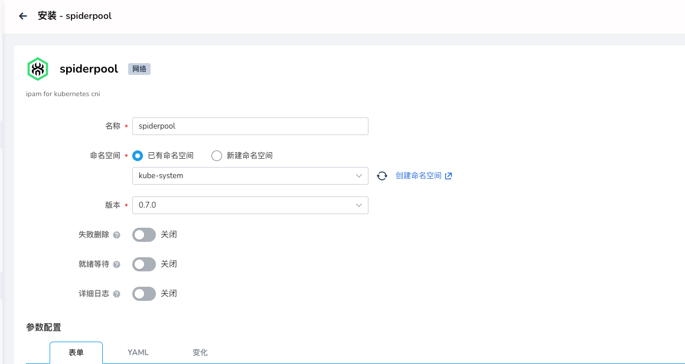
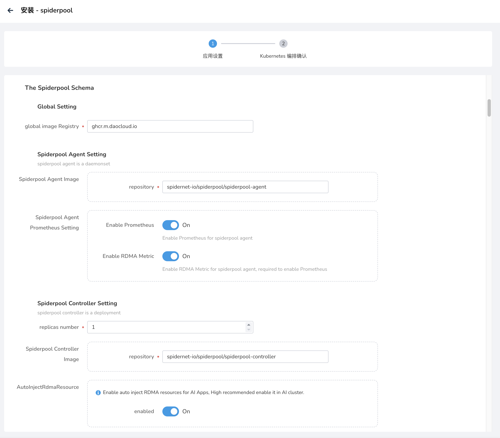
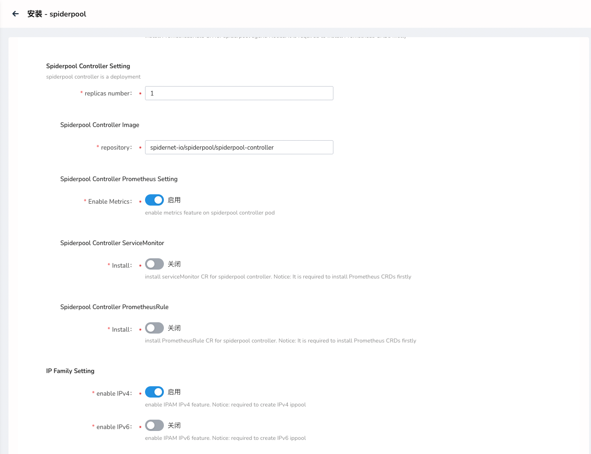
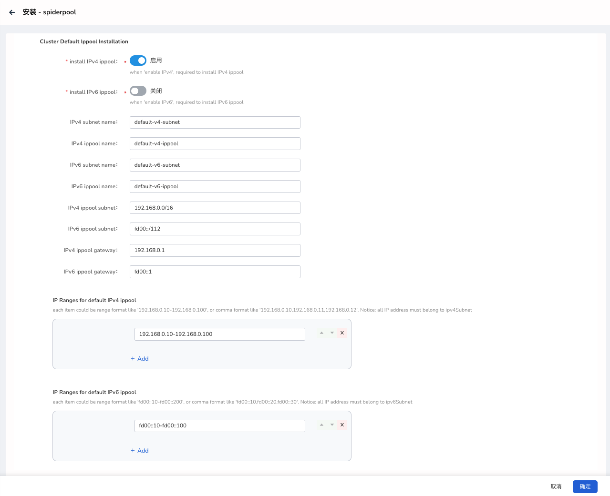
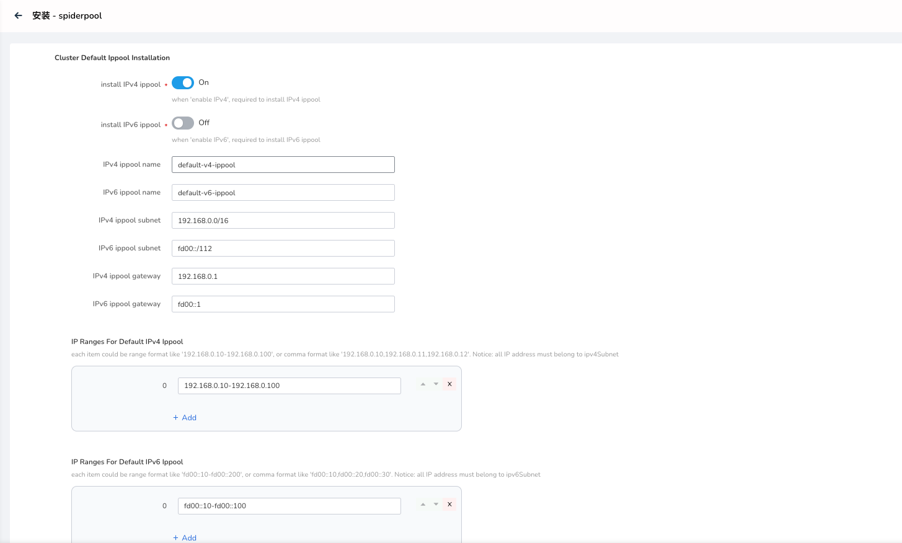

# 安装 Spiderpool

本页介绍如何安装 Spiderpool。

## 前提条件

1. 在 DCE 5.0 集群内使用 SpiderPool，需要结合 [Calico](../../calico/index.md)/[Cillium](../../cilium/index.md)。
2. 建议使用 v0.9.0 及其以上的 Spiderpool 版本，新版 Spiderpool 支持自动安装 [Multus](../../multus-underlay/install.md)，
   安装后可结合 [Multus CR 管理](../../../config/multus-cr.md)使用 Underlay CNI
   （[Macvlan](../../multus-underlay/macvlan.md) 或 [SR-IOV](../../multus-underlay/sriov.md)，并确认待使用的网卡接口和子网。

## 安装步骤

请确认您的集群已成功接入`容器管理`平台，然后执行以下步骤安装 Spiderpool。

1. 在左侧导航栏点击 `容器管理` —> `集群列表`，然后找到准备安装 Spiderpool 的集群名称。

2. 在左侧导航栏中选择 `Helm 应用` -> `Helm 模板`，找到并点击 `spiderpool`。

    

3. 在`版本选择`中选择希望安装的版本，点击`安装`。

4. 在安装界面，填写所需的安装参数。如需要使用 RDMA 资源，更多详情可参考 [RDMA 安装及使用准备](rdmapara.md)

    

    

    上图中的各项参数说明：

    - `namespace`：部署 SpiderPool 组件的命名空间，默认为 `kube-system`。如改为其他 Namespace，界面可能会不可用。
    - `Global Setting` —> `global image Registry`：设置所有镜像的仓库地址，默认已经填写了可用的在线仓库，如果是私有化环境，可修改为私有仓库地址。
    - `Spiderpool Agent Setting` —> `registry`：设置镜像名，可使用默认值。
    - `Spiderpool Agent Setting` —> `Spiderpool Agent Prometheus Setting` -> `Enable Prometheus`: 开启 Spiderpool Agent 的监控指标。
    - `Spiderpool Agent Setting` —> `Spiderpool Agent Prometheus Setting` -> `Enable RDMA Metric`: 开启集群中 RDMA 网络监控指标。需要开启以上一项的 Spiderpool-agent Prometheus 开关。
    - `Spiderpool Controller Setting` -> `replicas number`：设置 Spiderpool Controller 的副本数，主要负责 Spiderpool 的控制器逻辑。

        > 该 Pod 是 hostnetwork 模式，并且在 Pod 之间设置了反亲和性，所以一个 Node 上最多部署一个 Pod。
        > 如果要部署大于 1 的副本数量，请确保集群的节点数充足，否则将导致部分 Pod 调度失败。

    - `Spiderpool Controller Setting` -> `Spiderpool Controller Image` -> `repository`：设置镜像名，可使用默认值。
    - `Spiderpool Controller Setting` -> `AutoInjectRdmaResource`: 开启通过 Webhook 自动为 AI 应用注入 包括 RDMA 网卡和 RDMA 设备资源。
  
    

    上图中的各项参数说明：

    - `Multus Setting` -> `MultusCNI` -> `Install Multus CNI`：启用 Multus 安装。如果您已经安装了 Multus，则可以将其设置为 false。默认为 true。
    - `Multus Setting` -> `MultusCNI` -> `Default CNI Name`：集群默认 CNI 名称。 默认为空，如果该值为空，Spiderpool 将根据 `/etc/cni/net.d/`
       中已有的 CNI conf 文件自动获取默认 CNI, DCE5 集群推荐默认为空。
    - `Multus Setting` -> `Multus Image` -> `repository`：设置 Multus 的镜像仓库地址，默认已经填写了可用的在线仓库，如果是私有化环境，可修改为私有仓库地址。
  
    

    上图中的各项参数说明：

    - `Sriov-Operator` -> `Install Sriov-Operator`：开启安装 Sriov-operator，Sriov-operator 用于帮助安装 sriov-cni，sriov-device-plugin 等组件。
      如果您是在建设 AI 集群场景下，需要基于 SR-IOV 技术给容器提供 RDMA 通信（包括 Roce 和 Infiniband）与加速能力，推荐安装。
      注意: 建议 Sriov-operator 不要和 k8s-rdma-shared-dev-plugin 同时安装。
    - `Sriov-Operator` -> `Image` -> `Operator repository`：设置镜像名，可使用默认值。operator 用于帮助安装所有 sriov 组件。
    - `Sriov-Operator` -> `Image` -> `SriovCni repository`：设置镜像名，可使用默认值。用于帮助安装 sriov-cni CNI 二进制到每个节点。
    - `Sriov-Operator` -> `Image` -> `SriovDevicePlugin repository`：设置镜像名，可使用默认值。用于发现主机上的 srivo device 资源，并上报给 kubelet。
    - `Sriov-Operator` -> `Image` -> `SriovConfigDaemon repository`：设置镜像名，可使用默认值。用于配置主机上的 sriov 网络配置，比如启用 SR-IOV 功能等。
    - `Sriov-Operator` -> `Image` -> `IbSriovCni repository`：设置镜像名，可使用默认值。用于安装 ib-sriov-cni CNI 二进制到每个节点。
    - `Sriov-Operator` -> `Image` -> `ResourcesInjector repository`：设置镜像名，可使用默认值。基于 webHook 可实现自动更新 Pod 的网络资源(主要是 sriov 网络资源)配置。
    - `Sriov-Operator` -> `Image` -> `Webhook repository`：设置镜像名，可使用默认值。webhook 组件完成资源的校验和更新。

    

    上图中的各项参数说明：

    - `Rdma` -> `RdmaSharedDevicePlugin` -> `Install RdmaSharedDevicePlugin`：开启安装 RDMA k8s-shared-dev-plugin 组件。
      并搭配 Macvlan 或 IPVlan CNI 将 rdma 设备共享给容器使用。如果您是在建设 AI 集群，推荐安装。注意: 建议 RdmaSharedDevicePlugin 不要和 Sriov-Operator 同时安装。
    - `Rdma` -> `RdmaSharedDevicePlugin` -> `Image repository`：设置镜像名，可使用默认值。
    - `Rdma` -> `RdmaSharedDevicePlugin` -> `RdmaSharedDevicePlugin Config` -> `resourceName`：配置 k8s-rdma-shared-dev-plugin 资源名称，名称集群内唯一，用于给 Pod 分配 RDMA 资源。
    - `Rdma` -> `RdmaSharedDevicePlugin` -> `RdmaSharedDevicePlugin Config` -> `vendors`：配置 RDMA 共享设备的 vendor，可使用默认值。用于发现主机上的 RDMA 设备。
    - `Rdma` -> `RdmaSharedDevicePlugin` -> `RdmaSharedDevicePlugin Config` -> `deviceIDs`：配置 RDMA 共享设备的 devices ID 列表，可使用默认值。用于发现主机上的 RDMA 设备。
  
    

    上图中的各项参数说明：

    - `CNI-Plugins` -> `Image` -> `repository`：设置镜像名，可使用默认值。
    - `install CNI-Plugins`：开启安装 CNI 插件，给每个节点安装 CNI 二进制文件(macvlan/ipvlan等)。如果你还未安装，则可以将其设置为 true。默认为 false。
    - `IP Family Setting` -> `enable IPv4`：开启 IPv4 支持。若开启，在给 pod 分配 IP 时，会尝试分配 IPv4 地址，否则会导致 Pod 启动失败。
      所以，请开启 `Cluster Defalt Ippool Installation` -> `install IPv4 ippool`，以创建集群的默认 IPv4 池。
    - `IP Family Setting` -> `enable IPv6`：开启 IPv6 支持。若开启，在给 pod 分配 IP 时，会尝试分配 IPv6 地址，否则会导致 Pod 启动失败。
      所以，请开启 `Cluster Default Ippool Installation` -> `install IPv6 ippool`，以创建集群的默认 IPv6 池。

    

    上图中的各项参数说明：

    - `Cluster Default Ippool Installation` -> `install IPv4 ippool`：安装 IPv4 IP 池。
    - `Cluster Default Ippool Installation` -> `install IPv6 ippool`：安装 IPv6 IP 池。
    - `Cluster Default Ippool Installation` -> `IPv4 ippool subnet`：设置默认池中的 IPv4 子网号，请提前规划好可使用的子网及网关，
      例如 `192.168.0.0/16`。如果未开启 `install IPv4 ippool`，请忽略本项。
    - `Cluster Default Ippool Installation` -> `IPv6 ippool subnet`：设置默认池中的 IPv6 子网号，请提前规划好可使用的子网及网关，
      例如 `fd00::/112`。如果未开启 `install IPv6 ippool`，请忽略本项。
    - `Cluster Default Ippool Installation` -> `IPv4 ippool gateway`：设置 IPv4 网关，例如 `192.168.0.1`，
      该 IP 地址务必属于 `IPv4 ippool subnet`。如果未开启 `install IPv4 ippool`，请忽略本项。
    - `Cluster Default Ippool Installation` -> `IPv6 ippool gateway`：设置 IPv6 网关，例如 `fd00::1`，该 IP 地址应属于
      `IPv6 ippool subnet`。如果未开启 `install IPv6 ippool`，请忽略本项。
    - `Cluster Default Ippool Installation` -> `IP Ranges for default IPv4 ippool`：设置哪些 IP 地址可分配给 Pod，
      可设置多个成员，每个成员只支持 2 种输入格式的字符串。

    !!! note

        1. 一种是一段连续的 IP，如 `192.168.0.10-192.168.0.100`。
        2. 一种是单个 IP 地址，如 `192.168.0.200` 。不支持输入 CIDR 格式。

        这些 IP 地址应属于 `IPv4 ippool subnet`。如果未开启 `install IPv4 ippool`，请忽略本项。

    - `Cluster Default Ippool Installation` -> `IP Ranges for default IPv6 ippool`：
      设置哪些 IP 地址可分配给 Pod，可设置多个成员，每个成员只支持 2 种输入格式的字符串。
  
    !!! note

        1. 一种是一段连续的 IP，如 `fd00::10-fd00::100`。
        2. 一种是单个 IP 地址，如 `fd00::200` 设置。不支持输入 CIDR 格式。

        这些 IP 地址应属于 `IPv6 ippool subnet`。如果未开启 `install IPv6 ippool`，请忽略本项。

5. 点击右下角`确定`按钮即可完成安装。完成后，可参考
   [SpiderPool 的使用](../../../config/ippool/ippoolusage.md)进行 IP Pool 的使用。

## AI/RDMA 场景推荐阅读

- [AI/RDMA 网络方案总览](ai-rdma.md)
- [共享 RDMA（Macvlan/IPvlan）](rdma-macvlan.md)
- [独享 RDMA（SR-IOV RoCE）](rdma-sriov-roce.md)
- [独享 RDMA（SR-IOV Infiniband）](rdma-sriov-ib.md)

!!! note

    在安装过程中，可创建默认的 subnet 和 ippool；在安装完成后，在使用界面可创建更多的 subnet 和 ippool。
