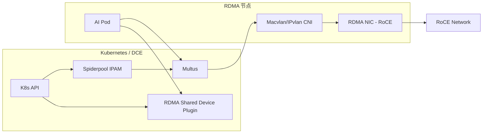

# 共享 RDMA（Macvlan/IPvlan）

本页介绍在 RoCE 场景下，通过 Macvlan/IPvlan 以共享模式为 Pod 提供 RDMA 能力的推荐做法。

## 适用范围

- 仅适用于 **RoCE** 网络（以太网）
- 适合对资源利用率要求高、对隔离要求适中的 AI/计算场景
- 可用于裸金属或虚拟化环境

## 前提条件

- 已完成 Spiderpool 安装（参考 [安装 Spiderpool](install.md)）
- RDMA 网卡已安装驱动（建议参考 [安装 Nvidia OFED 驱动](ofed_driver.md)）
- RDMA 子系统处于 **shared** 模式
- 已规划好 Underlay 子网与网关

> 共享模式仅支持 RoCE，不支持 Infiniband。

## 架构示意



## 配置步骤

### 0. 离线/Addon 准备（推荐）

离线环境建议优先准备 Spiderpool 的 Addon 离线包后再进行安装与升级。

### 1. 主机准备（shared 模式）

在 RDMA 节点上确认 RDMA 子系统处于 shared 模式：

```bash
rdma system
rdma system set netns shared
```

### 2. 启用共享 RDMA 相关组件

在安装 Spiderpool 时建议开启以下选项：

- **RdmaSharedDevicePlugin**：用于暴露共享 RDMA 资源
- **AutoInjectRdmaResource**：为 AI 工作负载自动注入 RDMA 资源（可选）

详细参数可参考 [RDMA 环境准备及安装](rdmapara.md)。

**关键参数建议：**

| 参数 | 建议值 | 说明 |
| --- | --- | --- |
| RdmaSharedDevicePlugin.install | true | 启用共享 RDMA 插件 |
| rdmaSharedDevicePlugin.deviceConfig.resourceName | hca_shared_devices | RDMA 资源名称 |
| rdmaSharedDevicePlugin.deviceConfig.vendors | 15b3 | RDMA 网卡 vendor |
| rdmaSharedDevicePlugin.deviceConfig.deviceIDs | 1017 | RDMA 网卡 deviceID |

### 3. 创建 Multus 配置

为 RDMA 网卡创建对应的 Multus 配置。示例与配置说明请参考 [Multus CR 管理](../../../config/multus-cr.md)。

### 4. 创建 IP 池

根据业务网段创建 IPPool，参考 [创建子网及 IP 池](../../../config/ippool/createpool.md)。

### 5. 创建工作负载并注入 RDMA 资源

为 AI 工作负载添加 RDMA 注解示例：

```yaml
metadata:
  annotations:
    cni.spidernet.io/rdma-resource-inject: "rdma-class-a"
```

> 注解的值应与 Spiderpool 中 RDMA 资源分类保持一致。

## 验证

- 确认 Pod 已分配到期望的 Underlay IP
- 在 Pod 内检查 RDMA 设备是否可见（例如使用 rdma 工具）
- 检查节点上 RDMA 资源是否被正确上报

示例：

```bash
kubectl get node -o json | jq -r '[.items[] | {name:.metadata.name, rdma:.status.allocatable}]'
```

## 运维建议

- 观察 RDMA 指标：[RDMA 指标](../../../config/rdma-metrics.md)
- 使用可视化看板：[RDMA 看板](../rdma-dashboard.md)

## 注意事项

- 共享模式下多个 Pod 共享宿主机 RDMA 设备，隔离性较弱
- RoCE 场景建议提前完成无损网络与 MTU 配置
- 若需更强隔离与性能，建议使用 SR-IOV 方案
