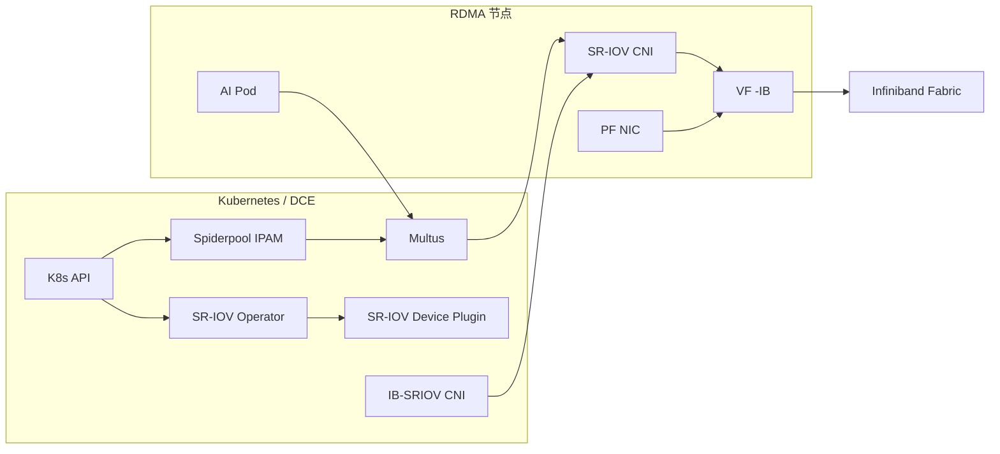

# 独享 RDMA（SR-IOV Infiniband）

本页介绍在 Infiniband Fabric 场景下，通过 SR-IOV 为 Pod 提供独享 RDMA 资源的推荐做法。

## 适用范围

- 仅适用于 **Infiniband** 网络
- 需要高性能、低延迟、强隔离的 AI/HPC 场景
- 依赖 IB Fabric 与 Subnet Manager

## 前提条件

- 集群已部署 Infiniband Fabric，并确保 Subnet Manager（如 OpenSM）工作正常
- RDMA 网卡支持 SR-IOV，并已开启 VF
- RDMA 子系统处于 **exclusive** 模式
- 已完成 Spiderpool 安装（参考 [安装 Spiderpool](install.md)）

## 架构示意



## 配置步骤

### 0. 离线/Addon 准备（推荐）

离线环境建议优先准备 Spiderpool 的 Addon 离线包后再进行安装与升级。

### 1. 主机准备（exclusive 模式）

在 RDMA 节点上设置 exclusive 模式并开启 SR-IOV VF：

```bash
rdma system
rdma system set netns exclusive
```

### 2. 安装并启用 IB SR-IOV 相关组件

在安装 Spiderpool 时建议开启：

- **Sriov-Operator**（用于安装 SR-IOV CNI 与设备插件）
- **IB-SRIOV CNI**（用于 Infiniband 场景）

**关键参数建议：**

| 参数 | 建议值 | 说明 |
| --- | --- | --- |
| SriovOperator.install | true | 启用 SR-IOV Operator |
| sriovDevicePlugin.resourceName | rdma_ib_sriov | SR-IOV 资源名 |
| ibSriovCni.install | true | 启用 IB-SRIOV CNI |

### 3. 配置 SR-IOV 节点策略

为 IB 网卡创建 SR-IOV 节点策略，定义 VF 与资源名称。参考 [SR-IOV 节点策略](../../../config/sriov-node-policy.md)。

### 4. 创建 Multus 配置

为 IB 网络创建 Multus 配置，参考 [Multus CR 管理](../../../config/multus-cr.md)。

### 5. 创建 IP 池

根据业务网段创建 IPPool，参考 [创建子网及 IP 池](../../../config/ippool/createpool.md)。

### 6. 创建工作负载

按需绑定 IB 资源与网络配置，确保 Pod 获取到期望的 IB 资源。

## 验证

- Pod 是否获取到期望的 Underlay IP
- Pod 内是否可见 IB 设备与 RDMA 资源
- Subnet Manager 是否稳定工作

示例：

```bash
kubectl get sriovnetworknodepolicy -n kube-system
kubectl get node -o json | jq -r '[.items[] | {name:.metadata.name, rdma:.status.allocatable}]'
```

## 运维建议

- 观察 RDMA 指标：[RDMA 指标](../../../config/rdma-metrics.md)
- 使用可视化看板：[RDMA 看板](../rdma-dashboard.md)

## 注意事项

- IB 场景对硬件与网络环境要求更高
- 避免与共享 RDMA 插件混用
- 可结合监控面板持续观察 RDMA 指标
