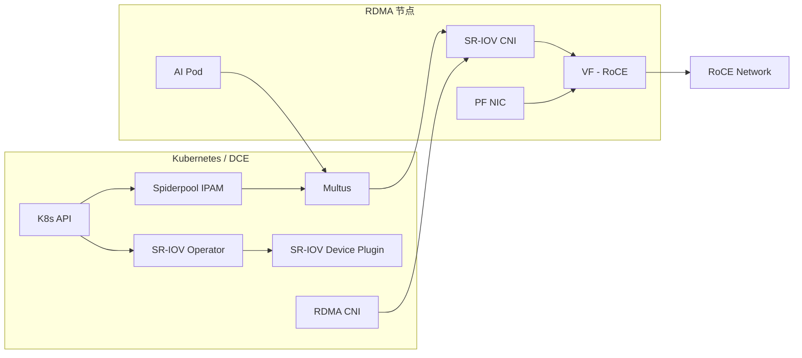

# 独享 RDMA（SR-IOV RoCE）

本页介绍在 RoCE 场景下，通过 SR-IOV 为 Pod 提供独享 RDMA 资源的推荐做法。

## 适用范围

- 仅适用于 **RoCE** 网络（以太网）
- 需要更强隔离与更高性能的 AI/计算场景
- 依赖网卡 SR-IOV 能力与裸金属部署

## 前提条件

- RDMA 网卡支持 SR-IOV，并已开启 VF
- RDMA 子系统处于 **exclusive** 模式
- 已完成 Spiderpool 安装（参考 [安装 Spiderpool](install.md)）
- 已规划好 Underlay 子网与网关

## 架构示意



## 配置步骤

### 0. 离线/Addon 准备（推荐）

离线环境建议优先准备 Spiderpool 的 Addon 离线包后再进行安装与升级。

### 1. 主机准备（exclusive 模式）

在 RDMA 节点上设置 exclusive 模式并开启 SR-IOV VF：

```bash
rdma system
rdma system set netns exclusive
```

如需持久化，可按主机操作系统规范配置 ib_core 参数，并重启生效。

### 2. 安装并启用 SR-IOV 相关组件

在安装 Spiderpool 时建议开启：

- **Sriov-Operator**（用于安装 SR-IOV CNI 与设备插件）
- **RDMA CNI**（用于 RDMA 设备隔离）

> 注意：SR-IOV 方案不建议与共享 RDMA 插件同时启用。

**关键参数建议：**

| 参数 | 建议值 | 说明 |
| --- | --- | --- |
| SriovOperator.install | true | 启用 SR-IOV Operator |
| sriovDevicePlugin.resourceName | rdma_sriov | SR-IOV 资源名 |
| rdmaCNI.install | true | 启用 RDMA CNI |

### 3. 配置 SR-IOV 节点策略

为节点创建 SR-IOV 节点策略，定义可用 VF 与资源名称。参考 [SR-IOV 节点策略](../../../config/sriov-node-policy.md)。

### 4. 创建 Multus 配置

为 SR-IOV 网络创建 Multus 配置，参考 [Multus CR 管理](../../../config/multus-cr.md)。

### 5. 创建 IP 池

根据业务网段创建 IPPool，参考 [创建子网及 IP 池](../../../config/ippool/createpool.md)。

### 6. 创建工作负载并绑定 SR-IOV 资源

为工作负载指定对应的网络与资源配置（示例见 Multus 与 SR-IOV 文档）。

## 验证

- Pod 是否获取到期望的 Underlay IP
- Pod 内是否可见独享的 RDMA 设备
- 节点上 VF 与资源上报是否符合预期

示例：

```bash
kubectl get sriovnetworknodepolicy -n kube-system
kubectl get node -o json | jq -r '[.items[] | {name:.metadata.name, rdma:.status.allocatable}]'
```

## 运维建议

- 观察 RDMA 指标：[RDMA 指标](../../../config/rdma-metrics.md)
- 使用可视化看板：[RDMA 看板](../rdma-dashboard.md)

## 注意事项

- SR-IOV 方案依赖硬件与 BIOS 配置
- RoCE 建议提前完成无损网络与 MTU 规划
- 若需要更高资源利用率，优先考虑共享 RDMA 方案
