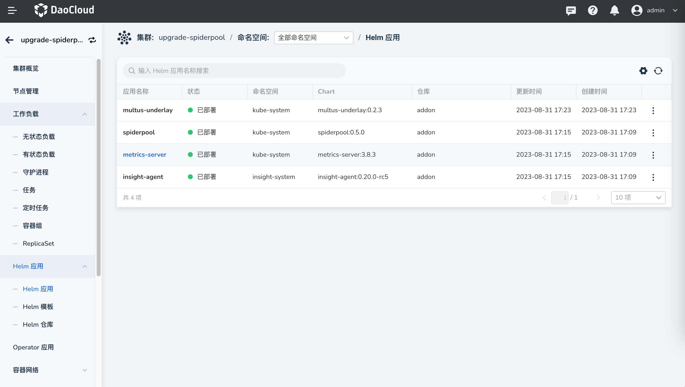
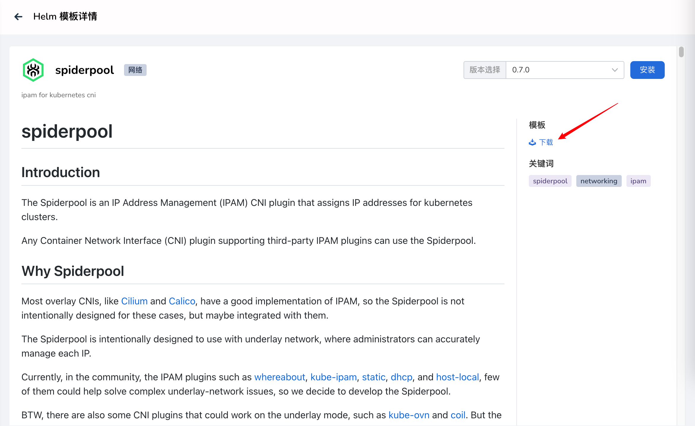
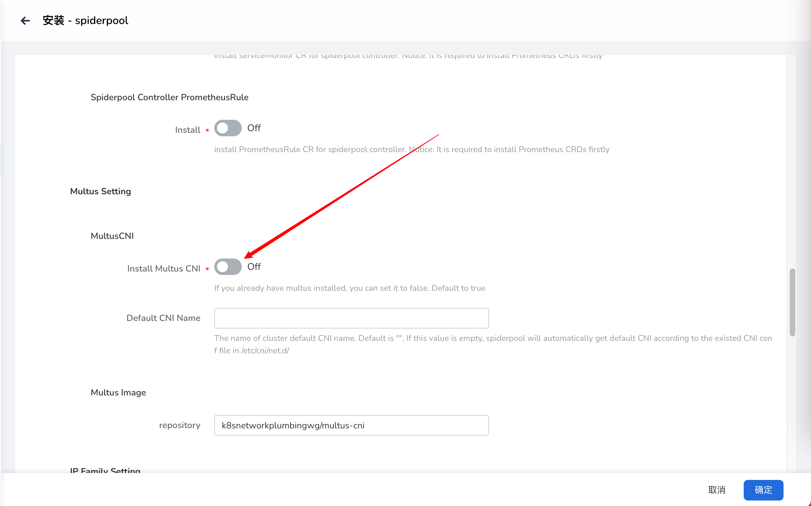
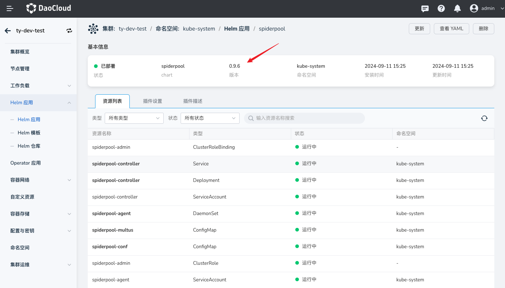
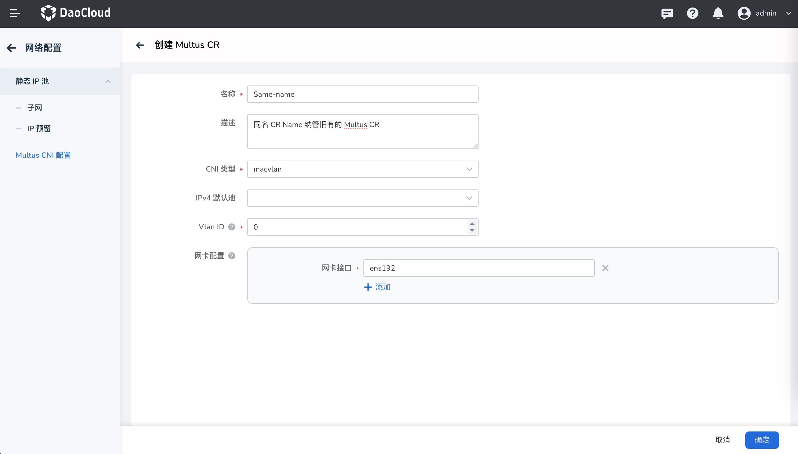

# 升级

本页说明如何将 DCE 5.0 的旧版本 Spiderpool（小于或等于v0.5.0），升级到新版本 v0.7.0。

## 前提条件

1. 一套 Kubernetes 集群
2. 已安装 helm

## 升级环境

DCE 5.0 中已部署 v0.5.0 或者其他更低版本的 Spiderpool



## 步骤

### 获取 chart 包

1. 通过如下方式，获取 Chart 包

    - 参考如下方式，通过 DCE 5.0 界面下载 v0.7.0 的 chart 包

    

2. 上传并解压 Chart 包到环境中

    ```bash
    ~# tar -xvf spiderpool-0.7.0.tgz -C /root/spiderpool
    ```

### 删除 spiderpool-init

新版本中引入了 Spidercoordinators 插件，Spidercoordinators 的默认配置将在 spiderpool-init 被创建时自动下发，在进行升级前，请先删除该 Pod。通过 helm upgrade 更新时，会自动创建 spiderpool-init Pod，并下发创建 coordinator 的默认配置。

```bash
[root@controller-node-1 ~]# kubectl get po -n kube-system spiderpool-init
NAME              READY   STATUS      RESTARTS   AGE
spiderpool-init   0/1     Completed   0          49m
[root@controller-node-1 ~]# kubectl delete po -n kube-system spiderpool-init
pod "spiderpool-init" deleted
```

### 更新 CRD

通过 kubectl apply 更新 spiderpool v0.7.0 版本所有的 CRD。

```bash
[root@controller-node-1 crds]# ls
spiderpool.spidernet.io_spidercoordinators.yaml  spiderpool.spidernet.io_spiderippools.yaml        spiderpool.spidernet.io_spiderreservedips.yaml
spiderpool.spidernet.io_spiderendpoints.yaml     spiderpool.spidernet.io_spidermultusconfigs.yaml  spiderpool.spidernet.io_spidersubnets.yaml

[root@controller-node-1 crds]# ls | grep '\.yaml$' | xargs -I {} kubectl apply -f {}
customresourcedefinition.apiextensions.k8s.io/spidercoordinators.spiderpool.spidernet.io created
customresourcedefinition.apiextensions.k8s.io/spiderendpoints.spiderpool.spidernet.io configured
customresourcedefinition.apiextensions.k8s.io/spiderippools.spiderpool.spidernet.io configured
customresourcedefinition.apiextensions.k8s.io/spidermultusconfigs.spiderpool.spidernet.io created
customresourcedefinition.apiextensions.k8s.io/spiderreservedips.spiderpool.spidernet.io configured
customresourcedefinition.apiextensions.k8s.io/spidersubnets.spiderpool.spidernet.io configured
```

### 通过 DCE 5.0 界面升级

通过 5.0 界面升级，在之前的版本中 Spiderpool 会搭配 Multus-underlay 插件使用，而新版本的 Spiderpool 中已经集成了 Multus 插件，在界面进行更新操作时，请关闭「安装 multus」按钮，避免重复安装，如下图所示。点击更新，等待更新完成。



### 验证

升级后检查版本正常。



在新版本的 Spiderpool 中，提供了 SpiderMultusConfig CR来自动管理 Multus NetworkAttachmentDefinition CR 。如果您的集群中存在旧的 Multus CR，在新版本由于创建机制的不同，UI 中并不会显示出来您旧有的 MUltus CR，你可以通过界面创建同名的 Multus CR 进行纳管，并不会影响您原有功能的使用。注意，界面上所填写的 `Vlan ID`、`网卡接口`等值，需要与您原本的 Multus CR 中保持完全一致。


