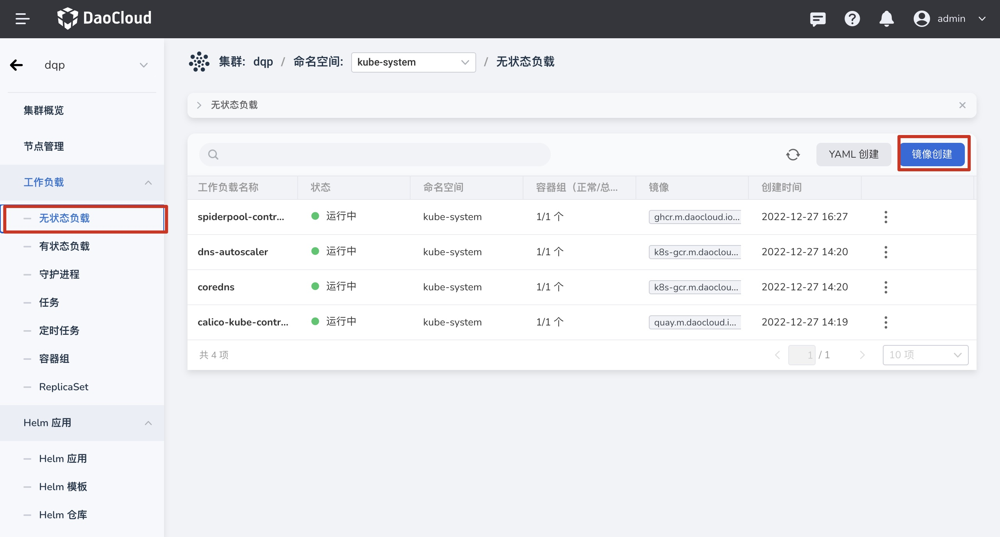
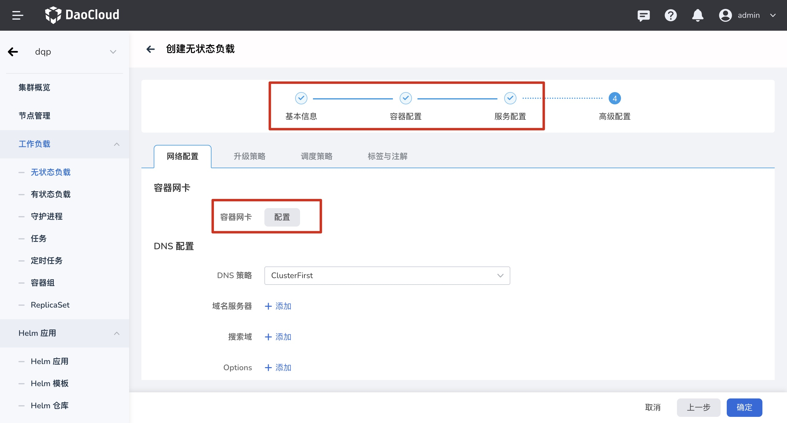
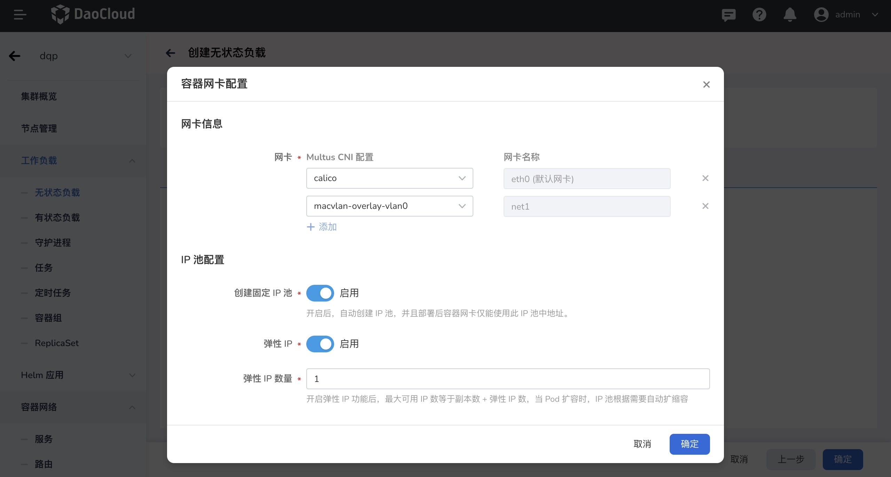
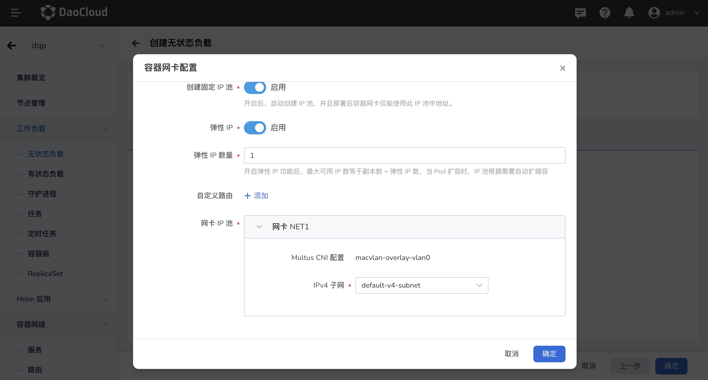
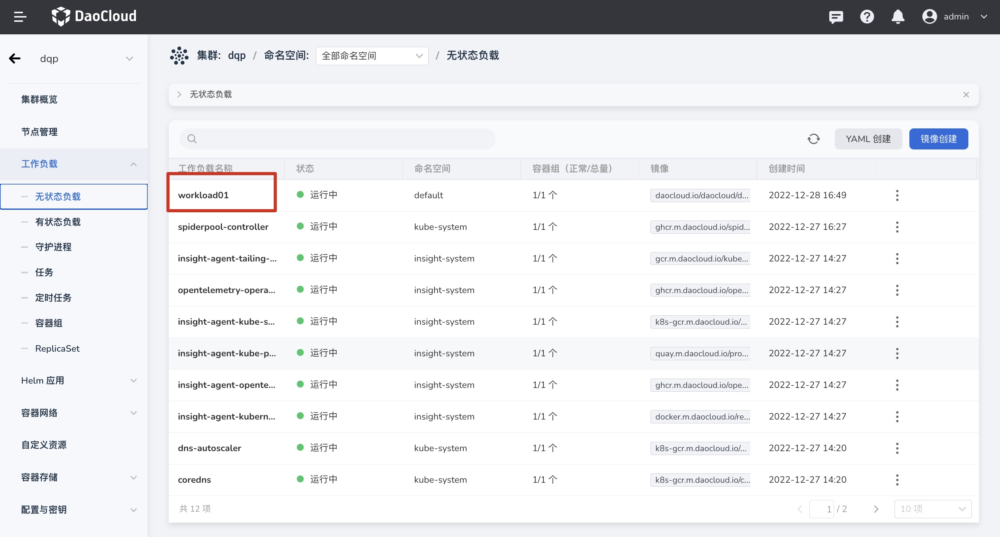
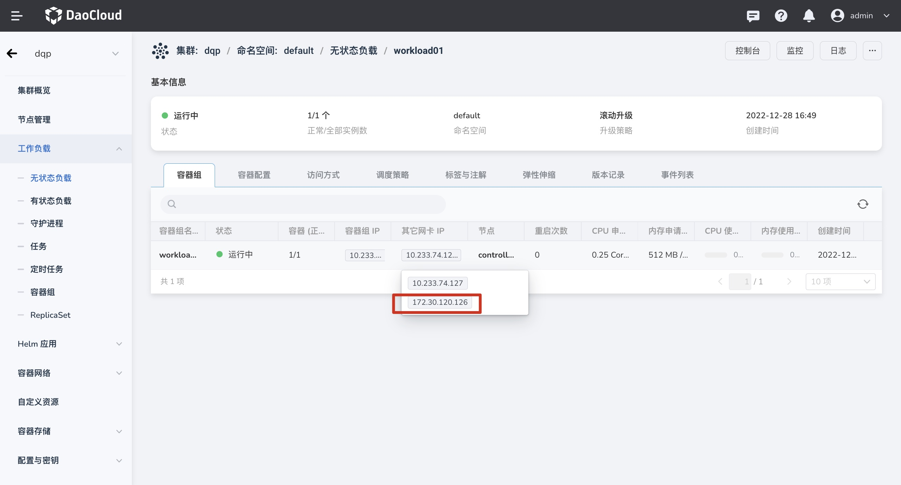

---
hide:
  - toc
---

# 工作负载使用  IP 池

本章节主要介绍结合 Multus 及 Underlay CNI 插件，为 工作负载 Pod 配置多网卡，并通过 Spiderpool 进行Underlay 网络的 IP 的分配和固定。主要介绍内容如下：

1. Pod 设置多容器网卡
2. 工作负载使用 IP 池
3.  工作负载使用 固定 IP 池
4. 工作负载使用自动创建固定 IP 池

### 前提

1. [SpiderPool 已成功部署。](../../modules/spiderpool/install.md)
2. [Multus 搭配 Macvlan /SRI-OV 已成功部署。](../../modules/multus-underlay/install.md)
3. 如使用手动选择 IP 池，请提前完成[IP 子网和 IP 池已创建](../../modules/spiderpool/createpool.md)。如使用自动创建固定 IP 池，只需要提前完成[ IP 池已创建](../../modules/spiderpool/createpool.md)

### 界面操作

1. 登录平台 UI ，点击`容器管理`进入`集群列表`，点击对应集群名称进入`集群详情`，选择`无状态负载` 列表，点击`镜像创建`。

   

2. 进入界面创建工作负载页面,完成`基本信息`，`容器配置`，`服务配置`等信息输入，进入`高级配置`点击配置`容器网卡`。

   

3. 进入`容器配置`页面，完成相关参数输入，点击`确认`完成创建。

   `网卡信息`: 如创建的应用容器需要使用多张网卡（如一张东西向通信，一张南北向通信），可以添加多网卡。

   -  eth0(默认网卡)：默认为 Overlay CNI，Calico/Cilium。

   - net1: 可选择 Underlay CNI 配置，如 Macvlan/SRI-OV ，本文示例为 Macvlan 

   `IP 池配置`：Underlay CNI IP 分配的规则

   - `创建固定 IP 池`： 开启后，只需要为新增的容器网卡（net1,net2,net3）选择对应子网，工作负载部署时自动创建固定 IP 池，部署后容器网卡仅能使用此 IP 池中的地址。
   - `弹性 IP`: 开启后，IP 池中的 IP 数量会根据设置 的 弹性  IP 数量变动，最大可用 IP 数等于 Pod 副本数+ 弹性 IP 数量，Pod 扩容时，IP 池跟随进行扩容。
   - `自定义路由`：当应用创建有特殊路由需求时，可自定义添加路由。
   - `网卡 IP 池`：选择对应 网卡 待使用的 子网或对应IP 池。

   **手动选择已有的 IP 池**

   手动选择 IP 池需要提前 创建 IP 池，可选择 IP 池范围为：`共享 IP 池，`，添加了当前`应用亲和性的 IP 池`，添加了当前`命名空间亲和性的 IP 池`。

   

   **自动创建固定 IP 池**

   仅需要选择 对应的 子网，自动创建固定 IP 池

   

   

4. 创建完工作负载后，可点击对应 工作负载“workload01”查看工作负载 Pod 使用 IP 。

   

   


### YAML 使用

1. 使用 Pod 注解 `ipam.spidernet.io/ippool` 选择从 IP 池 `testingippool` 分配 IP，创建这个 Deployment。

    ```yaml
    apiVersion: apps/v1
    kind: Deployment
    metadata:
      name: workload01
    spec:
      replicas: 3
      selector:
        matchLabels:
          app: workload01
      template:
        metadata:
          annotations:
            ipam.spidernet.io/ippool: |-
              {
                "ipv4": ["testingippool"]
              }
          labels:
            app: workload01
        spec:
          containers:
          - name: workload01
            image: busybox
            imagePullPolicy: IfNotPresent
            command: ["/bin/sh", "-c", "trap : TERM INT; sleep infinity & wait"]
    ```

2. 由 Deployment `workload01` 所控制的 Pod 均从 IP 池 `testingippool` 分配 IP 地址且成功运行。

    ```bash
    kubectl get se
    NAME                                      INTERFACE   IPV4POOL               IPV4              IPV6POOL   IPV6   NODE            CREATETION TIME
    workload01-6967dcd8df-8b6zp   eth0        standard-ipv4-ippool   172.18.41.47/24                     spider-worker   7s
    standard-ippool-deploy-6967dcd8df-cvq79   eth0        standard-ipv4-ippool   172.18.41.50/24                     spider-worker   7s
    standard-ippool-deploy-6967dcd8df-s58x9   eth0        standard-ipv4-ippool   172.18.41.41/24                     spider-worker   7s
    ```
