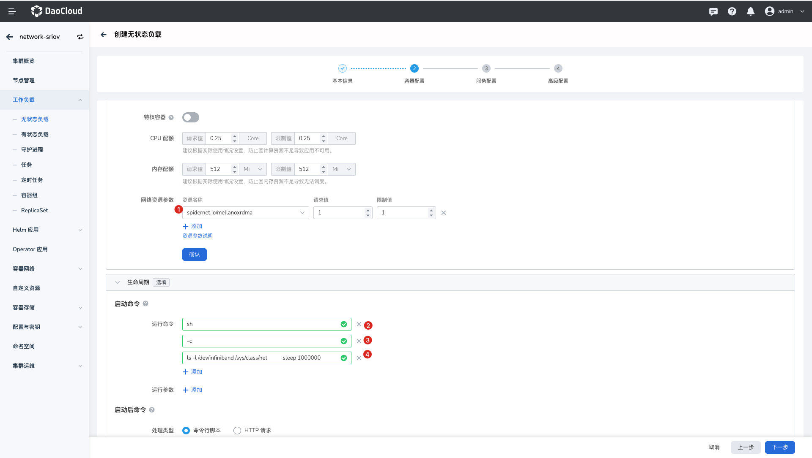
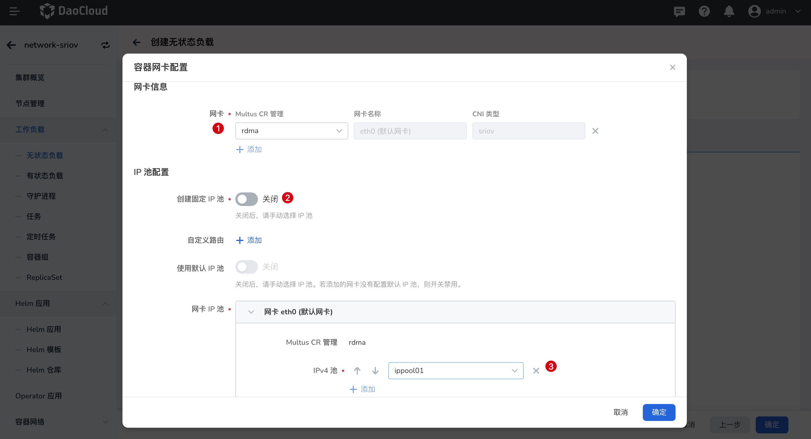

# 工作负载使用 RDMA

本章节主要介绍介绍工作负载如何配置并使用 RDMA 资源。

!!! note

    本章内容基于 SR-IOV 使用 RoCE 网卡为例。为方便测试 RDMA，配置镜像需使用：
    docker.io/mellanox/rping-test，且运行 sh 命令，防止操作过程中 Pod 异常退出，详情参考下文。

## 前提条件

- [已成功部署 SpiderPool](../../modules/spiderpool/install.md)
- [已完成 RDMA 安装及使用前准备](rdmapara.md)
- [已创建 Multus CR](../../config/multus-cr.md)
- [已创建 IP Pool](createpool.md)

## 界面操作

1. 登录平台 UI，在左侧导航栏点击`容器管理`->`集群列表`，找到对应集群。然后，在左侧导航栏选择`无状态负载`，点击`镜像创建`。

    

1. 在`创建无状态负载`页面，镜像使用 `docker.io/mellanox/rping-test`。`Replica` 设置为 `2`，部署一组跨节点 Pod。

1. 填写`基本信息`，进入`容器配置`输入如下信息。
   
    

    - `网络资源参数`：
      
        - 基于 Macvlan/VLAN CNI 使用 RDMA 时，资源名称为 [RDMA 安装及使用准备](rdmapara.md) 中创建 Spiderpool 时自定义名称，详情参考 [基于 Macvlan/IPVLAN 共享 ROCE 网卡](rdmapara.md/#基于-macvlan-ipvlan-共享-roce-网卡)

        - 基于 SRIOV CNI 使用 RDMA 时，资源名称为 `SriovNetworkNodePolicy` 中定义的 `resourceName` 。详情参考 [基于 SRI-OV使用 ROCE 网卡 ](rdmapara.md/#基于-sr-iov-使用-roce-网卡)。
    
        示例中的`spidernet.io/mellnoxrdma` 为 **基于 SRIOV 使用 RoCE 网卡** 的示例。请求值和限制值目前保持一致，输入值不大于最大可用值。
        
    - `运行命令`：为防止 Pod 启动异常退出， 添加如下运行命令:
    
        ```
        - sh
        - -c
        - |
          ls -l /dev/infiniband /sys/class/net
          sleep 1000000
       ```
    
1. 完成`容器配置`、`服务配置`页面的信息输入后。然后，进入`高级配置`，点击配置`容器网卡`。

    

1. 选择[已创建的 Multus CR](../../config/multus-cr.md)，关闭创建固定 IP 池功能，选择[已创建 IP Pool](createpool.md)，点击`确定`，完成创建。

    
