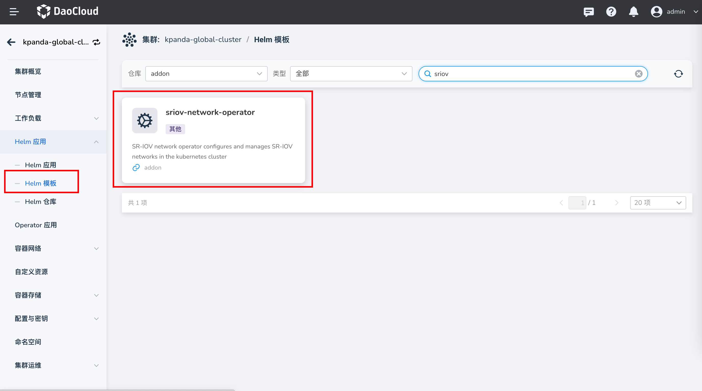
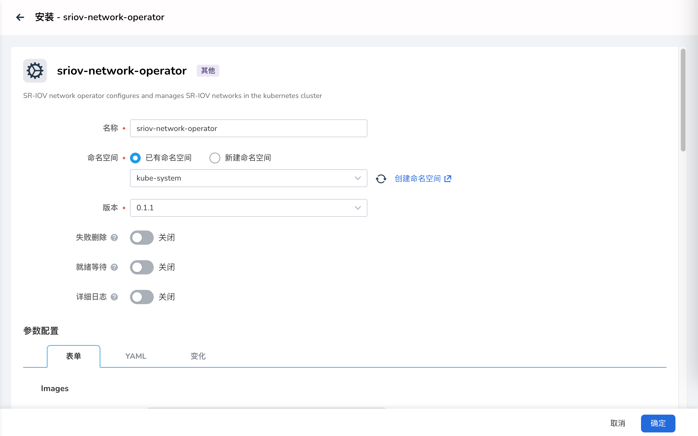
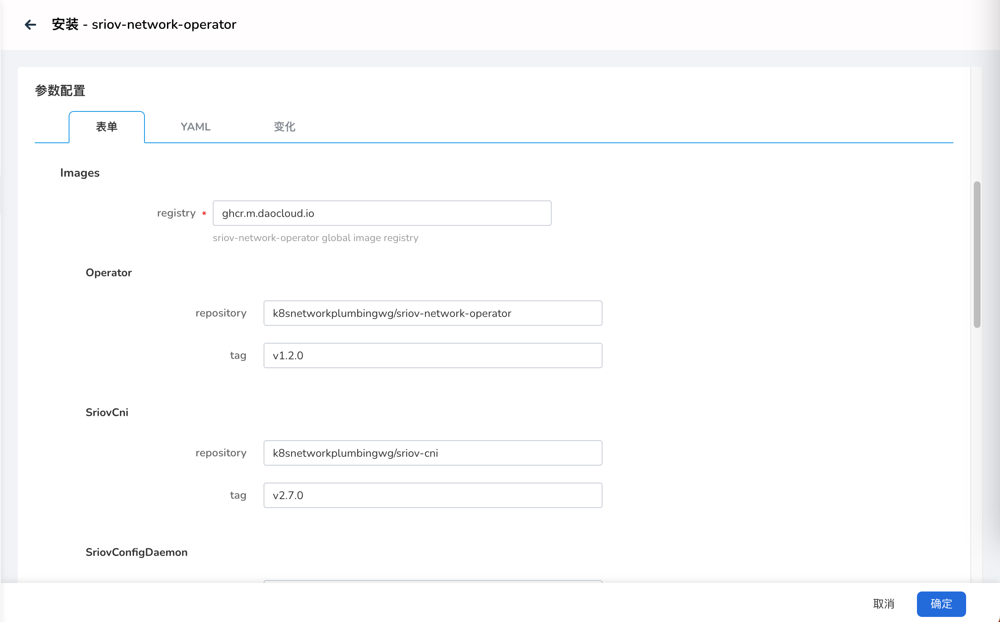
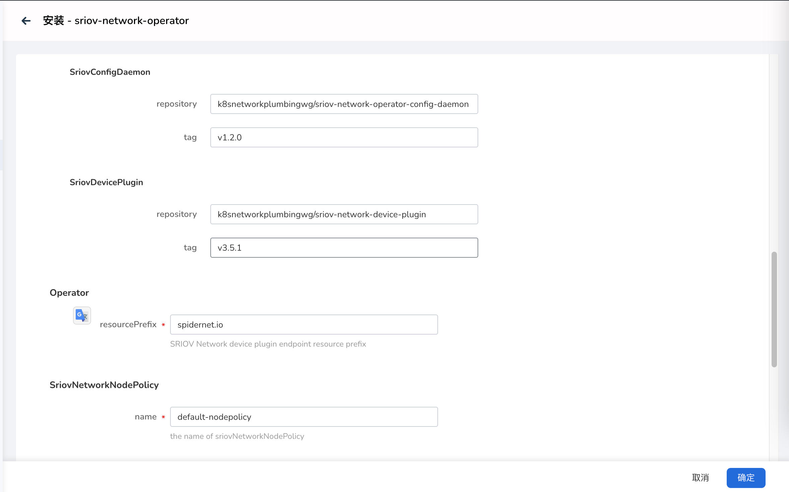
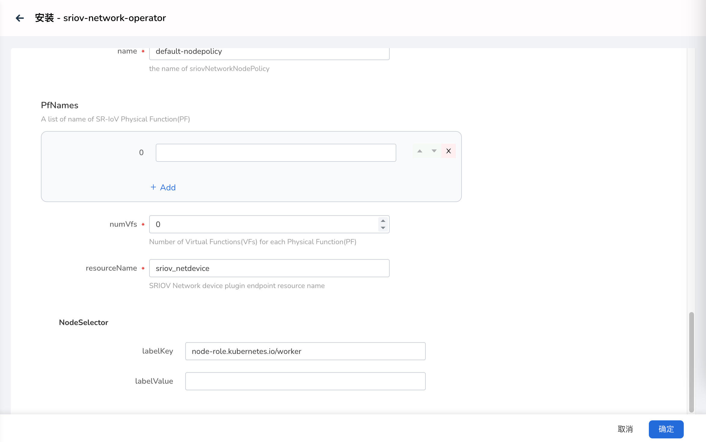

# 安装 sriov-network-operator

本页介绍如何安装 sriov-network-operator。

## 前提条件

1. 在 DCE 5.0 集群内使用 sriov-network-operator。推荐结合 Spiderpool，安装 `Spiderpool` 请参考 [Install Spiderpool](../spiderpool/install.md)。

## 安装步骤

请确认您的集群已成功接入`容器管理`平台，然后执行以下步骤安装 sriov-network-operator。

1. 在左侧导航栏点击 `容器管理` —> `集群列表`，然后找到准备安装 sriov-network-operator 的集群名称。

2. 在左侧导航栏中选择 `Helm 应用` -> `Helm 模板`，找到并点击 `sriov-network-operator`。

    

3. 在`版本选择`中选择希望安装的版本，点击`安装`。

4. 在安装界面，填写所需的安装参数。

    

    

    上图中的各项参数说明：

    - `namespace`：部署 sriov-network-operator 组件的命名空间，默认为 `kube-system`。

    - `Images` —> `registry`：设置所有镜像的仓库地址，默认已经填写了可用的在线仓库，如果是私有化环境，可修改为私有仓库地址。

    - `Images` —> `Operator` -> `repository`：设置 Operator 的镜像名，保持默认即可。

    - `Images` —> `Operator` -> `tag`：设置 Operator 的镜像版本，保持默认即可。

    - `Images` —> `SriovCni` -> `repository`：设置 SriovCni 的镜像名，保持默认即可。

    - `Images` —> `SriovCni` -> `tag`：设置 SriovCni 的镜像版本，保持默认即可。

    

    上图中的各项参数说明：

    - `Images` —> `SriovConfigDaemon` -> `repository`：设置 SriovConfigDaemon 的镜像名，保持默认即可。

    - `Images` —> `SriovConfigDaemon` -> `tag`：设置 SriovConfigDaemon 的镜像版本，保持默认即可。

    - `Images` —> `SriovDevicePlugin` -> `repository`：设置 SriovDevicePlugin 的镜像名，保持默认即可。

    - `Images` —> `SriovDevicePlugin` -> `tag`：设置 SriovDevicePlugin 的镜像版本，保持默认即可。

    - `Operator` —> `resourcePrefix`：SRIOV 网络设备插件端点资源前缀。

    - `SriovNetworkNodePolicy` —> `name`：SRIOV 网络节点策略的名称。

    

    上图中的各项参数说明：

    - `pfNames`：SR-IOV 物理功能（PF）名称列表。

    - `pfNames` -> `numVfs`：每个物理功能 (PF) 的虚拟功能 (VF) 数量。

    - `pfNames` -> `resourceName`：SRIOV 网络设备插件端点资源名称。

    - `NodeSelector` -> `labelKey`：NodeSelector 标签的键。

    - `NodeSelector` -> `labelValue`：NodeSelector 标签的值。

5. 点击右下角`确定`按钮即可完成安装。
