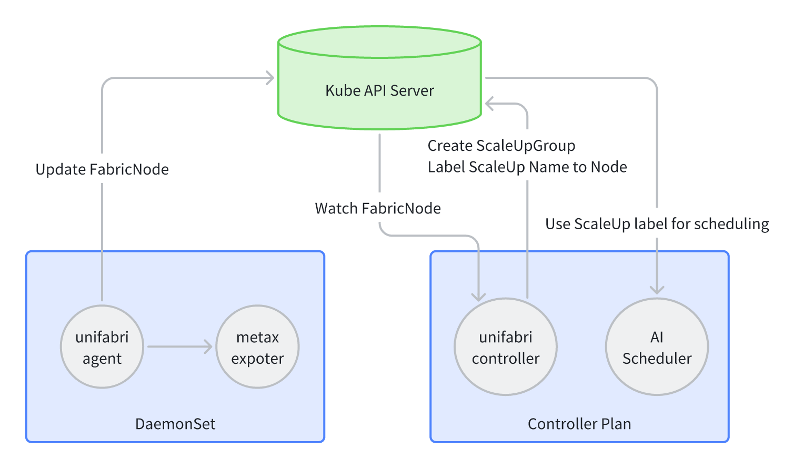

# ScaleUP 使用文档

## 功能介绍

Unifabric 具备 ScaleUP 网络拓扑识别功能，打开该选项后，可以通过 `ScaleUpGroup` CRD 查看集群中的超级节点（ScaleUP）组信息。
同时，节点上会自动打上 `dce.unifabric.io/scaleup-group` 标签，标签值为所属的 ScaleUP 组名称。这样在调度机器学习任务时，可以通过该标签更好地利用 ScaleUP 组。

## 基本要求

1. 当前仅支持沐曦 Metax 作为 ScaleUP 的数据源。
2. 确保 Metax 沐曦的指标采集器（metax-mx-exporter）已正确部署并运行。MXMACA 版本大于 MXMACA‑C500‑Driver‑2.31.1.17，mx-exporter 大于 0.11.1。

    ```shell
    # 1. 确保 metax-mx-exporter Pod 正在运行；
    kubectl get pods -A | grep metax-mx-exporter

    # 2. 确认接口返回中包含 `mx_server_info` 指标
    curl 10.233.98.214:8000/metrics -s | grep mx_server_info`，确认接口返回中包含 `mx_server_info`

    # 如果未找到该指标，请检查 metax-mx-exporter Pod 的运行状态，并确保能够正常访问 Metax 的指标端点。
    ```

3. 检查 unifabric 的 helm 安装参数，确保并配置好 unifabric 的 ScaleUp 发现。默认 helm chart 关闭该功能。

    ```yaml
    agent:
      config:
        scaleUpDiscovery:
          metax:
            # -- 设置为 true
            enable: ture
            # -- 填写 Metax exporter 的 URL
            metricsURL: http://127.0.0.1:30089/metrics
    ```

## 工作流程



1. Agent 上报邻居信息，每个节点上的 Agent 定期采集 Metax 邻居指标，并更新对应的 FabricNode `status.scaleUp.metaxNeighbors` 邻居信息
    1. 对于 Metax，每个节点上报 2 个邻居信息，4 个节点互联形成一个 ScaleUP
    1. 如果 Metax 邻居指标为空（请求 Metax exporter 成功返回为空），则会清空 FabricNode 的邻居信息
2. Controller Watch 所有 FabricNode，计算邻居关系，识别出超级节点 ScaleUP
    1. 对于 Metax 满足 4 个节点的拓扑，创建 ScaleUpGroup，并更新 Node 的 Label
    1. 对于没有节点不满足 Metax 节点的拓扑，不创建 ScaleUpGroup，继续等待节点就绪
3. 对于已经创建好的 ScaleUpGroup
    1. 如果节点离线，删除对应的 ScaleUpGroup 的成员，并更新 ScaleUpGroup 的状态，ScaleUpGroup 的 Name 不变
    1. 如果节点更新，节点名称不变，拓扑恢复，更新 ScaleUpGroup 的状态，ScaleUpGroup 的 Name 不变
    1. 如果节点更新，节点名称发生变化，拓扑恢复，更新 ScaleUpGroup 的状态，ScaleUpGroup 的 Name 发生变化
4. ScaleUpGroup 的 Name 是通过 hash(node1,node2,...) 计算出来的

## 如何使用

1. 确认节点都按照物理拓扑，被 ScaleUpGroup 分组。

    ```shell
    $ kubectl get scaleupgroups.unifabric.io
    NAME      NODES                                                         HEALTHY    Total
    2e08c64   sh-cube-gpu-13,sh-cube-gpu-14,sh-cube-gpu-15,sh-cube-gpu-16   true       4
    ```

    对于沐曦 metax link 的 ScaleUpGroup，需要确认 HEALTHY 为 true，Total 为 4。
    如果不满足该条件，说明 ScaleUpGroup 组内的节点没有按照物理拓扑连接，FabricNode 的邻居信息可能不正确，请检查 Metax 的指标采集器是否正确运行，或者节点的 Metax 连接是否正确。具体可以参考 [问题排查](#_5) 章节。

2. 对于同一个 ScaleUpGroup 下的节点确认 Node 被打上了 `dce.unifabric.io/scaleup-group` Label。

    ```shell
    kubectl get nodes --show-labels | grep scaleup
    ```

    只有 ScaleUpGroup 组内的节点 Healthy 为 true 的节点，才会被打上该标签。如果没有打上该标签，说明 ScaleUpGroup 组内的节点没有按照物理拓扑连接，FabricNode 的邻居信息可能不正确，请检查 Metax 的指标采集器是否正确运行，或者节点的 Metax 连接是否正确。具体可以参考[问题排查](#_5)。

3. 在调度机器学习任务时，使用标签 `dce.unifabric.io/scaleup-group`，以便更好的利用 ScaleUpGroup。

## 问题排查

1. 检查 `FabricNode` 资源的 `status` 字段，确认是否正确收集到了 Metax 邻居信息。

    ```shell
    $ kubectl get fabricnodes -o yaml
    apiVersion: unifabric.io/v1beta1
    kind: FabricNode
    metadata:
      creationTimestamp: "2025-09-15T12:06:30Z"
      generation: 1
      name: sh-cube-gpu-13
      resourceVersion: "15140810"
      uid: 6a48faa0-1234-47fa-811a-202c169187df
    spec: {}
    status:
      scaleUp:
        metaxNeighbors:
        - direction: "Y"
          kind: local
          uuid: 1b0c2fa6-1dd2-11b2-01cc-b51e3bd74330
        - direction: X
          kind: remote
          uuid: 1ad2e412-1dd2-11b2-01cc-cb1e3bd74330
        - direction: "Y"
          kind: remote
          uuid: 1ae13bca-1dd2-11b2-01cc-1b8b3bd74330
        scaleUpHealthy: true
    ```

    每个 FabricNode 应该包含 2 个 Metax 邻居信息（direction 分别为 X 和 Y），如果没有，说明 Metax 的指标采集器可能没有正确运行，或者节点的 Metax 连接有问题。

2. 检查 mx-exporter 的，确保指标数据正确。

    ```shell
    curl <metax-exporter-url>/metrics | grep mx_server_info
    ```

3. 查看 mx-exporter 的日志，确认是否有错误信息。
  
    ```shell
    kubectl logs <metax-exporter-pod-name> -n <namespace>
    ```
