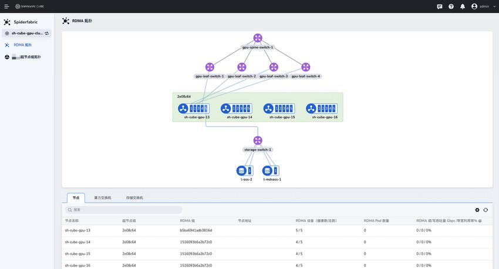
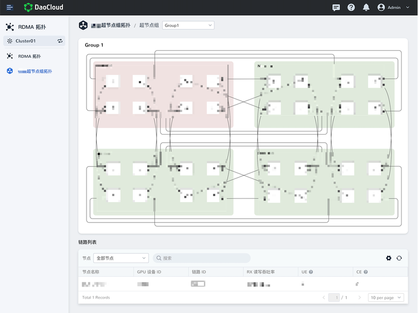
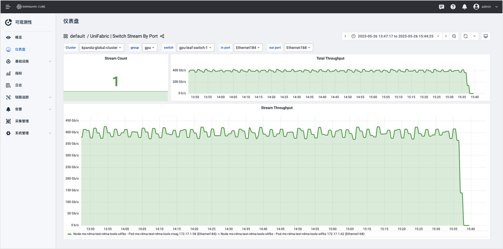

---
hide:
  - toc
---

# Unifabric 概述

**Unifabric** 是一款面向 **高性能计算（HPC）与 AI 云平台** 的 **RDMA 网络可观测性与自动化运维平台** 。它专为
RDMA 网络环境（如 RoCE）设计，帮助用户实现从底层链路到上层计算节点的 **网络拓扑可视化、性能监控分析与智能诊断** 。

Unifabric 致力于解决 RDMA 网络“看不见、查不出、调不准”的痛点，助力用户：

- 全局掌握网络拓扑结构与实时状态  
- 快速定位延迟、丢包、拥塞等性能瓶颈  
- 构建稳定、高效、可扩展的 RDMA 网络基础设施  

## 快速部署

Unifabric 基于 Kubernetes 原生架构，提供标准 Helm Chart，支持在任意兼容 Kubernetes 集群中快速部署。

平台由两部分组成：

| 组件 | 职责 |
|------|------|
| **Controller** | 负责拓扑构建与交换机数据采集 |
| **Agent** | 部署在每台主机上，采集节点 RDMA 状态与链路信息 |

## 核心能力一览

### 1. RDMA 网络全景拓扑

- **自动构建 Spine-Leaf-节点 分层拓扑**
- 动态展示交换机、计算节点、存储设备之间的连接关系
- 支持链路健康状态实时变更，断链自动感知

### 2. 超节点组可视化

- 支持按逻辑超节点分组展示 GPU 计算集群内部结构
- 展示组内节点间 GPU RDMA 网络拓扑
- 支持点击链路查看性能指标，辅助问题定位

### 3. 网络监控与链路分析

- 实时采集交换机端口状态、带宽、利用率、错误码等指标
- 支持查看链路的 RX/TX 带宽、拥塞（CE）、错误（UE）等数据
- 提供链路性能分析视图，支持链路历史趋势分析

### 4. 自动分组与智能诊断

- 基于 LLDP + RDMA 拓扑，自动将网络结构一致的节点分组
- 检测链路异常、网卡状态异常、节点间链路不一致等问题
- 支持节点健康度评估与标签标注，辅助调度系统优化资源使用

### 5. 网络感知智能调度

- 基于自动识别的网络拓扑和超节点分组信息，智能调度到最优的节点组合。
- 当集群中出现网络故障（如链路中断、网卡故障、交换机故障）时，自动调整调度策略，避免在故障区域放置新任务。
- 通过标准化的 API 接口，将调度能力暴露给上层应用和调度框架。

## 功能亮点总览

| 模块 | 能力描述 |
|------|-----------|
| **拓扑可视化** | 分层展示 Spine / Leaf / 计算节点 / 存储设备拓扑 |
| **链路状态自动感知** | 实时更新网络连接状态，断链自动隐藏 |
| **节点监控** | 展示 GPU 节点状态、RDMA 网卡数量、带宽使用情况 |
| **交换机监控** | 支持算力交换机与存储交换机的端口状态、带宽、利用率展示 |
| **链路性能分析** | 查看任意链路的实时带宽、CE/UE 错误、互联 GPU 信息 |
| **超节点组视图** | 展示组内节点互联结构，支持点击查看链路详情 |
| **多集群支持** | 支持多 Kubernetes 集群统一接入和跨集群网络视图 |
| **Grafana 集成** | 内置监控仪表盘，支持自定义图表与指标查询 |
| **自动分组** | 基于网络拓扑自动将节点划分为可调度分组 |
| **故障诊断辅助** | 发现链路异常、交换机端口异常、节点连接不一致问题 |
| **智能调度** | 基于自动识别的拓扑与超节点信息，推荐最优节点组合 |
| **标准接口** | 提供 API 接口，与 K8s 插件无缝集成，实现能力向上层架构的快速开放 |

## 应用场景

Unifabric 适用于以下典型场景：

- **AI 模型训练平台**：监控 GPU 节点间通信链路，提升训练效率  
- **高性能计算集群（HPC）**：及时发现网络瓶颈，保障计算任务稳定运行  
- **RDMA 存储接入场景**：监控 GPU 与存储设备之间的 RDMA 通道健康性  
- **多租户 AI 云平台**：支持多集群资源同步接入，统一展示网络状态  

## 为什么选择 Unifabric？

- **专为 RDMA 网络打造**，支持 RoCE 协议和 LLDP 拓扑发现  
- **全生命周期可观测性**：从节点、链路、交换机到拓扑自动识别  
- **Kubernetes 原生集成**：支持 CRD 管理，自动化运维  
- **丰富的监控指标**：内置 Prometheus & Grafana 支持  
- **智能分组与诊断引擎**：助力网络性能调优和资源调度优化  

## 下一步？

**想了解如何部署？**
请查看[安装指南](./install.md)

**想了解如何采集和监控链路指标？**
查看[延时监控使用指南](./features/RdmaLatencyDetection.md)
