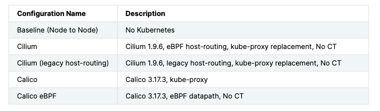
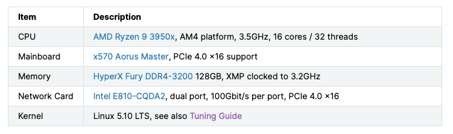
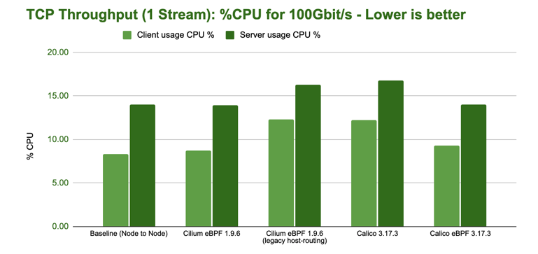
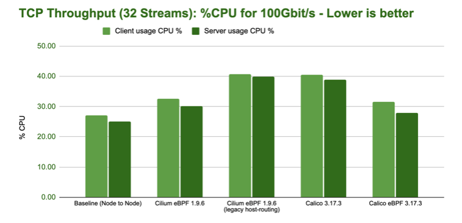
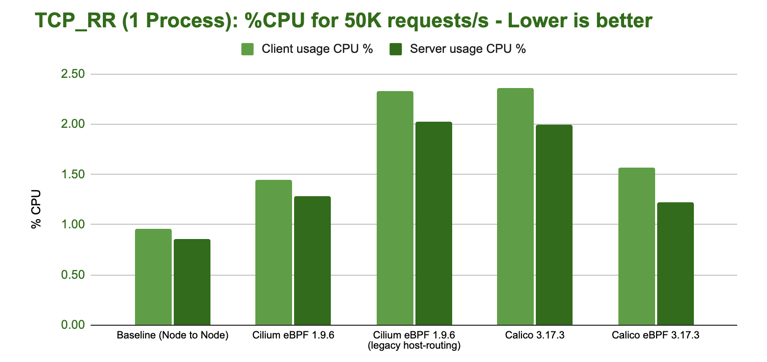

# Cilium 在 Pod 跨节点通信场景下的性能测试

本页介绍 Cilium 在 Pod 跨节点通信场景下的性能测试结果。

Cilium 官方提供的[测试报告](https://docs.cilium.io/en/v1.13/operations/performance/benchmark/)显示，Cilium 基于 eBPF 技术提升了跨节点 Pod 间的访问性能。该测试基于裸金属机器和 100G 网络链接下，对 Cilium 做了最大的配置调优，测试其极限的网络性能
对 Cilium 的调优，具体包括：

- 未配置任何隧道模式，使用 host routing 转发节点间的 Pod 数据

- 关闭了宿主机的 iptables 连接跟踪

## 测试对象

## 测试环境配置

## 测试工具及指标

测试使用 netperf 用来生成工作负载和收集指标。测试指标如下：

- 吞吐量（Throughput）

    通过单个 TCP 连接的最大传输速率和 32 个并发 TCP 连接的总传输速率。

- 请求/响应速率（Request/Response Rate, TCP_RR）

    通过单个 TCP 连接和 32 个并发 TCP 连接每秒可传输的请求/响应信息数量。

## 测试一

TCP 单流，测试两个跨节点 Pod 之间的 TCP 吞吐量：

客户端和服务端的 CPU 开销：

## 测试二

32 核 CPU，32 并发 TCP 链接，测试两个跨节点 Pod 之间的 TCP 吞吐量

客户端和服务端的 CPU 开销：

## 测试三

基于 TCP_RR 模式，模拟测试 7 层访问，其行为是在同一个 TCP 连接中，不断重复“发送 1 个请求，等待一个回复”

在 Pod 只有 1 核 CPU 的情况下，测试两个跨节点 Pod 之间的 TCP_RR 表现：

客户端和服务端的 CPU 开销：

## 测试四

在 Pod 只有 32 核 CPU 的情况下，测试两个跨节点 Pod 之间的 TCP_RR 表现：

客户端和服务端的 CPU 开销：

