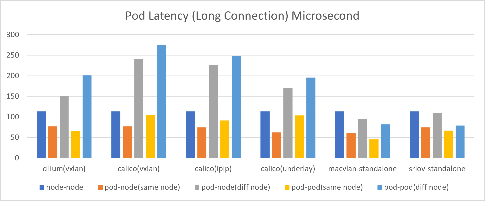

# 网络 CNI 性能测试报告

本测试报告覆盖 Cilium、Calico 及 Macvlan 三种 CNI 的性能测试。

## 测试背景

### 测试环境

|型号|CPU|内存|网卡|系统|节点 IP|
|--|--|--|--|--|--|
|Dell PowerEdge R620|Intel(R) Xeon(R) CPU E5-2620 0 @ 2.00GHz  * 2|4G 1333M * 4|Mellanox cx5 物理网卡带宽|Ubuntu 22.04|10.20.0.11|
|Dell PowerEdge R620|Intel(R) Xeon(R) CPU E5-2620 0 @ 2.00GHz  * 2|4G 1333M * 4|Mellanox cx5|Ubuntu 22.04|10.20.0.12|

### 测试 CNI 类型

本测试主要覆盖三种类型的 CNI：Cilium、Calico 及 Macvlan，并基于如下模式进行测试：

- Cilium
    - cilium (vxlan 模式)
- Calico
    - calico (vxlan 模式)
    - calico (underlay 模式)
    - callico (ipip 模式)
- Macvlan-Standalone

### 测试用例

本测试包括以下九种测试用例：

- 节点之间
- Pod 和 Pod 所在的节点之间
- Pod 和跨节点的节点之间
- Pod 和同节点的 Pod 之间
- Pod 和跨节点的 Pod 之间
- 节点和 Service 通信，Service 对应的 Endpoint 在此节点上
- 节点和 Service 通信，Service 对应的 Endpoint 在其他节点上
- Pod 和 Service 通信，Service 对应的 Endpoint 和此 Pod 在相同的节点
- Pod 和 Service 通信，Service 对应的 Endpoint 和此 Pod 在不同的节点

### 测试指标

- Pod 吞吐量（Pod 和节点之间 )
- Service 吞吐量 (Service 和节点之间)
- 时延-长连接(Pod 和节点之间)
- 时延-短连接(Pod 和节点之间)

### 测试工具及命令

本测试使用 netperf 工具进行性能测试，不同指标的测试命令如下：

- 吞吐量

    ```shell
    netperf -t TCP_STREAM -H <serverIP> -p <serverPort> -l 60 -- -m 1024
    iperf3 -c <serverIP> -i 1 -t 60
    ```

- 时延-长连接

    ```shell
    netperf -t TCP_RR -H <serverIP> -p <serverPort> -l 60 -- -r 1024 -O "MIN_LATENCY,MAX_LATENCY,P50_LATENCY,P90_LATENCY,P99_LATENCY,MEAN_LATENCY,STDDEV_LATENCY"
    ```

- 时延-短链接

    ```shell
    netperf -t TCP_CRR -H <serverIP> -p <serverPort> -l 60 -- -r 1024 -O "MIN_LATENCY,MAX_LATENCY,P50_LATENCY,P90_LATENCY,P99_LATENCY,MEAN_LATENCY,STDDEV_LATENCY"
    ```

## 测试结果

针对四种测试指标，不同 CNI 模式在不同测试用例中的测试结果如下所示：

### 图表结论

- Pod 吞吐量

    

    |测试用例|结论|
    |----|----|
    |Pod 和节点间，位于同节点| macvlan-standalone 吞吐量最大，cilium vxlan 最小|
    |Pod 和节点间，位于不同节点|Calico-ipip、calico-underlay 和 macvlan-standalone 性能较好，calico-vxlan、cilium-vxlan 较差|
    |Pod 和 Pod 间，位于同节点|macvlan 性能最好，cilium 次之，calico 三种模式表现相近，性能都较差|
    |Pod 和 Pod 间，位于不同节点|macvlan 性能最好，cilium-vxlan 次之，calico 较差|

- Service 吞吐量

    
    
    |测试用例|结论|
    |----|----|
    |Service 和节点间, 位于同节点|macvlan 性能最好，cilium 次之，calico 三种模式表现相近，性能都较差|
    |Service 和节点间, 位于不同节点|macvlan、calico-ipip、calico-underlay、cilium-vxlan 性能相近，calico-vxlan 较差|
    |Service 和 Pod 间，位于同节点|macvlan 性能最好，cilium 次之，calico 三种模式表现相近，性能都较差|
    |Service 和 Pod 间，位于不同节点|macvlan 和 cilium 性能较好，calico 较差|

- Pod 长时延

    

    |测试用例|结论|
    |----|----|
    |Pod 和 节点间，位于相同节点|5 种 CNI 模式性能表现相近，macvlan 时延最小|
    |Pod 和节点间，位于不同节点|macvlan 性能最好，cilium-vxlan 次之，calico-vxlan 时延最大|
    |Pod 和 Pod 间，位于同节点|macvlan 性能最好，cilium 次之，calico 三种模式表现相近，性能相对较差|
    |Pod 和 Pod 间，位于不同节点|macvlan 性能最好，calico-underlay 次之，calico-vxlan 最差|

- Pod 短链接

    

    |测试用例|结论|
    |----|----|
    |Pod 和节点间，位于相同节点|5种 cni模式相差不大，macvlan和calico-underlay时延最小|
    |Pod 和节点间，位于不同节点|macvlan 性能最好，cilium-vxlan 次之，calico-vxlan 时延最大|
    |Pod 和 Pod 间，位于同节点|macvlan 性能最好，cilium 次之，calico 三种模式表现相近，性能相对较差|
    |Pod 和 Pod 间，位于不同节点|macvlan 性能最好，calico-underlay 次之，calico-vxlan 最差|

### 详细数据

- Pod 相关吞吐量（Gbits/sec）

    |测试用例|cilium(vxlan)|calico(vxlan)|calico(ipip)|calico(underlay)|macvlan-standalone|sriov-standalone|
    |--|----|--|----|----|----|----|
    |节点间|9.16|9.16|	9.16|	9.16|	9.16|	9.16|
    |Pod 和节点间，位于相同节点|	12.6|	13.8|	14.23|	14.2|	16.4|	15.8|
    |Pod 和节点间，位于不同节点|	3.02|	1.57|	8.24|	9.2|	9.15|	9.09|
    |Pod 和 Pod 间，位于同节点|	15.3|	10.2|	10.33|	10.27|	22.2|	14.1|
    |Pod 和 Pod 间，位于不同节点|	8.30|	1.37|	4.51|	3.89|	9.18|	9.21|

- Service 相关吞吐量（Gbits/sec）

    |测试用例|cilium(vxlan)|calico(vxlan)|calico(ipip)|calico(underlay)|macvlan-standalone|sriov-standalone|
    |--|----|--|----|----|----|----|
    |Service 和节点间，位于同节点|	8.30|	12|	11.77|	12.07|	16.6|	15.8|
    |Service 和节点间，位于不同节点|	7.41|	1.23|	8.57|	9.037|	9.14|	9.10|
    |Service 和 Pod 间，位于同节点|	15.8|	10.2|	10|	10.17|	20.2|	15.6|
    |Service 和 Pod 间，位于不同节点|	8.27|	1.3|	4.81|	3.49|	9.15|	16.3|

- netpref 时延（长连接）（Microseconds）

    |测试用例|cilium(vxlan)|calico(vxlan)|calico(ipip)|calico(underlay)|macvlan-standalone|sriov-standalone|
    |--|----|--|----|----|----|----|
    |节点间|	113.27|	113.27|	113.27|	113.27|	113.27|	113.27|
    |Pod 和节点间，位于相同节点|	76.76|	76.81|	74.55|	62.27|	61.25|	74.34|
    |Pod 和节点间，位于不同节点|	150.26|	241.46|	225.68|	170.23|	95.76|	109.77|
    |Pod 和 Pod 间，位于同节点|	65.62|	104.82|	91.44|	103.71|	45.47|	66.74|
    |Pod 和 Pod 间，位于不同节点|	201.27|	275.22|	248.72|	195.61|	81.74|	78.83|

- netpref 时延（短连接）（Microseconds）

    |测试用例|cilium(vxlan)|calico(vxlan)|calico(ipip)|calico(underlay)|macvlan-standalone|sriov-standalone|
    |--|----|--|----|----|----|----|
    |节点间|	439.04|	439.04|	439.04|	439.04|	439.04|	439.04|
    |Pod 和节点间，位于相同节点|	259.92|	230.65|	226.26|	203.63	|187.41	|225.66|
    |Pod 和节点间，位于不同节点|	613.59|	803.80|	767.08|	587.53|	358.48|	413.77|
    |Pod 和 Pod 间，位于同节点|	198.99|	982.92|	265.07|	277.75|	127.48|	275.52|
    |Pod 和 Pod 间，位于不同节点|	789.32|	940.65|	857.6|	628.21|	290.59	|284.16|
