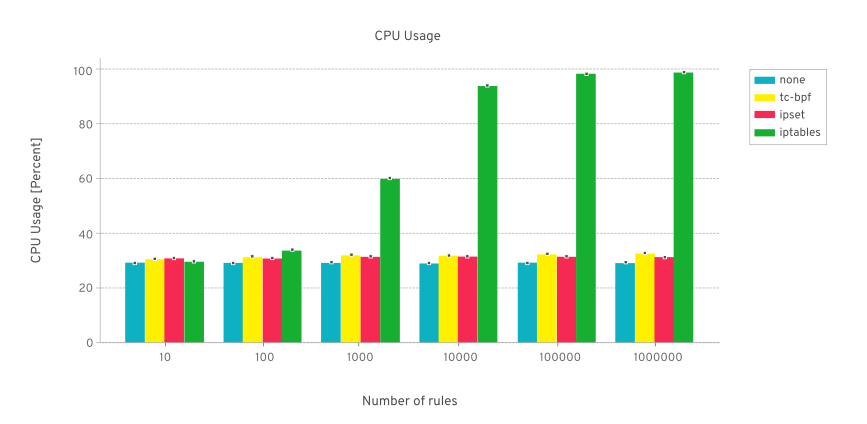

# 基于 eBPF 技术实施网络策略场景下的性能测试

[有关测试](https://kinvolk.io/blog/2020/09/performance-benchmark-analysis-of-egress-filtering-on-linux/)表明，基于 eBPF 技术实施 Pod 间访问通信的安全策略，对性能带来了一定的提升，尤其随着安全策略数量增加，其提升效果更加明显。本页介绍基于 eBPF 技术实施网络策略场景下的性能测试结果。

## 测试对象

在测试中，对几种实施安全策略的方案进行了比较：

- 基于 iptables 进行数据包过滤，这种方案被 Calico 等项目所采用
- 基于 ipset 进行数据包过滤
- 基于 eBPF 技术进行数据包过滤

## 测试方案

    在 2 个裸金属节点上，应用进行跨节点访问，在客户端 egress 方向实施安装过滤策略，最终，测试几个方案在过滤策略匹配过程中，对数据包的访问延时和吞吐量带来了多少的降低影响。

## 测试结果

- 在 TCP 吞吐量测试场景下，结果如下图所示。其中，当存在上万条过滤规则的规模下，iptables 方案给数据包的吞吐量带来了较大的降低：

    

- 当存在上千条过滤规则的规模下，iptables 方案对主机的 CPU 产生了较大的开销：

    

- 当存在上千条过滤规则的规模下，iptables 方案对应用的访问延时带来了较大的负担

    

## 结论

基于 eBPF 技术来实施网络安全策略时，即使安装了上万条规则，其对应用的通信性能也没有带来较大的干扰，比传统的基于 iptables 方案有更优的性能表现。
