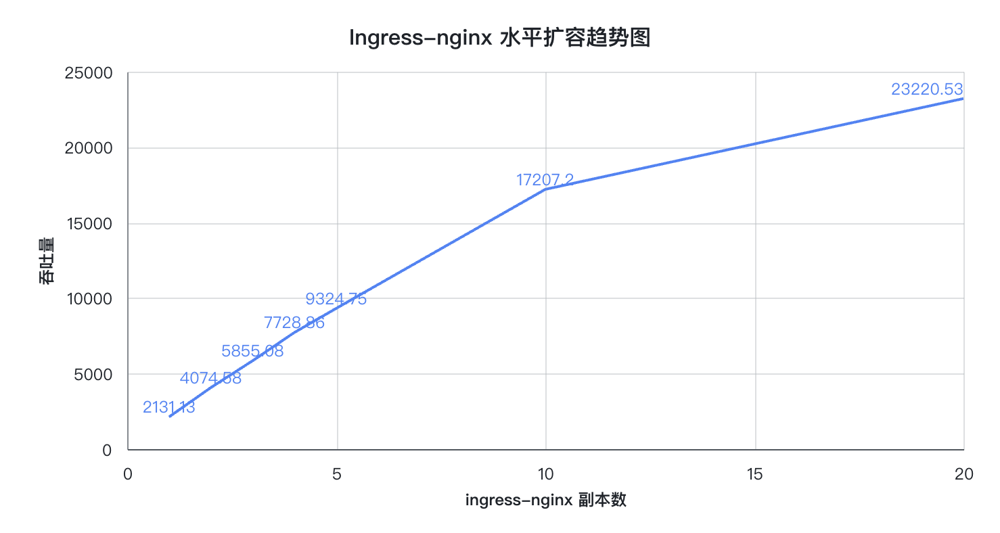

# Ingress 性能测试

## 测试背景

- 验证 ingress-nginx 水平扩容后吞吐量可以线性增长

## 测试结论

- **随着 ingress-nginx 副本数增加，吞吐量可以线性增长，ingress-nginx 具有良好的水平扩展能力。**

### Ingress-nginx 副本数与吞吐量表格数据

| Ingress-nginx 副本数 | （wrk）Requests/sec |
| :------------------: | :-----------------: |
|          1           |       2131.13       |
|          2           |       4074.58       |
|          3           |       5855.08       |
|          4           |       7728.86       |
|          5           |       9324.75       |
|          10          |      17207.20       |
|          20          |      23220.53       |

### Ingress-nginx 副本数与吞吐量折线图



## 测试环境

|                 |   节点 IP   | CPU/内存                                 |                 CPU 型号                 | kubernetes 版本 |
| --------------- | :---------: | ---------------------------------------- | :--------------------------------------: | --------------- |
| kubernetes 集群 | 10.6.168.71 | 8c/16g                                   | Intel(R) Xeon(R) Gold 5118 CPU @ 2.30GHz | v1.25.3         |
| 测试客户端      | 10.7.168.73 | 8c/16g                                   | Intel(R) Xeon(R) Gold 5118 CPU @ 2.30GHz |                 |
| 10.7.168.74     |   8c/16g    | Intel(R) Xeon(R) Gold 5118 CPU @ 2.30GHz |                                          |                 |
| 10.6.169.10     |   8c/16g    | Intel(R) Xeon(R) Gold 5118 CPU @ 2.30GHz |                                          |                 |

## 测试步骤

1. dce 5 界面安装 ingress-nginx
2. 创建测试应用，应用副本数 20，规避后端业务存在瓶颈。
3. 创建测试 service 与应用绑定。
4. 创建应用的 ingress 并且设置域名 `[test.ingress.io](http://test.ingress.io)`
5. 使用 wrk、ab 等测试工具，测试水平扩展后的 ingress-nginx 的吞吐量，使用命令如下：

```go
## wrk
./wrk -t12 -c1200 -d30s  http://test.ingress.io:31184
## ab
ab -c 100 -n 10000 http://test.ingress.io:31184/
```

## 测试数据

### ingress-nginx 副本数为 1 时

 **ingress-nginx 副本为 1 时，wrk 测试结果**

``` go
~# ./wrk -t12 -c1200 -d30s  http://test.ingress.io:31184
Running 30s test @ http://test.ingress.io:31184  
  12 threads and 1200 connections  
  Thread Stats   Avg      Stdev     Max   +/- Stdev    
    Latency   466.64ms  111.83ms   1.54s    76.18%   
    Req/Sec   181.26    129.12     1.25k    65.92%  
  64099 requests in 30.08s, 50.80MB read  
  Socket errors: connect 191, read 0, write 0, timeout 42 
Requests/sec:   2131.13 
Transfer/sec:      1.69MB
```

**ingress-nginx 副本为 1 时，ab 测试结果**

```go
~# ab -c 100 -n 10000 http://test.ingress.io:31184/ 
This is ApacheBench, Version 2.3 <$Revision: 1430300 $> 
Copyright 1996 Adam Twiss, Zeus Technology Ltd, http://www.zeustech.net/
Licensed to The Apache Software Foundation, http://www.apache.org/ 

Benchmarking test.ingress.io (be patient) 
Completed 1000 requests
Completed 2000 requests 
Completed 3000 requests 
Completed 4000 requests 
Completed 5000 requests 
Completed 6000 requests 
Completed 7000 requests 
Completed 8000 requests 
Completed 9000 requests 
Completed 10000 requests 
Finished 10000 requests 


Server Software: Server Hostname:        test.ingress.io 
Server Port:            31184 

Document Path:          / 
Document Length:        615 bytes

Concurrency Level:      100
Time taken for tests:   5.565 seconds 
Complete requests:      10000 
Failed requests:        0 
Write errors:           0 
Total transferred:      8260000 bytes
HTML transferred:       6150000 bytes 
Requests per second:    1796.93 [#/sec] (mean)
Time per request:       55.650 [ms] (mean) 
Time per request:       0.557 [ms] (mean, across all concurrent requests) 
Transfer rate:          1449.48 [Kbytes/sec] received
Connection Times (ms)             
              min  mean[+/-sd] median   max 
Connect:        1    4  36.1      2    1008
Processing:     5   51  30.8     68     291 
Waiting:        2   51  30.7     67     291
Total:          9   55  47.2     70    1074 

Percentage of the requests served within a certain time (ms) 
  50%     70  
  66%     75  
  75%     78  
  80%     80  
  90%     90  
  95%     96  
  98%    104  
  99%    106 
  100%   1074 (longest request)
```

### ingress-nginx 副本数为 2 时

**ingress-nginx 副本为 2 时，wrk 测试结果**

```go
~# ./wrk -t12 -c1200 -d30s  http://test.ingress.io:31184

Running 30s test @ http://test.ingress.io:31184  
  12 threads and 1200 connections  
  Thread Stats   Avg      Stdev     Max   +/- Stdev   
    Latency   243.90ms   64.90ms 673.46ms   83.18%    
    Req/Sec   345.34    162.15     0.90k    64.77%  
  122511 requests in 30.07s, 97.09MB read  Socket errors: connect 191, read 0, write 0, timeout 0
Requests/sec:   4074.58
Transfer/sec:      3.23MB
```

**ingress-nginx 副本为 2 时，ab 测试结果**

```go
~# ab -c 100 -n 10000 http://test.ingress.io:31184/
This is ApacheBench, Version 2.3 <$Revision: 1430300 $>
Copyright 1996 Adam Twiss, Zeus Technology Ltd, http://www.zeustech.net/
Licensed to The Apache Software Foundation, http://www.apache.org/
 
Benchmarking test.ingress.io (be patient)
Completed 1000 requests
Completed 2000 requests
Completed 3000 requests
Completed 4000 requests
Completed 5000 requests
Completed 6000 requests
Completed 7000 requests
Completed 8000 requests
Completed 9000 requests
Completed 10000 requests
Finished 10000 requests
 
 
Server Software:
Server Hostname:        test.ingress.io
Server Port:            31184
 
Document Path:          /
Document Length:        615 bytes
 
Concurrency Level:      100
Time taken for tests:   3.973 seconds
Complete requests:      10000
Failed requests:        0
Write errors:           0
Total transferred:      8260000 bytes
HTML transferred:       6150000 bytes
Requests per second:    2516.84 [#/sec] (mean)
Time per request:       39.732 [ms] (mean)
Time per request:       0.397 [ms] (mean, across all concurrent requests)
Transfer rate:          2030.19 [Kbytes/sec] received
 
Connection Times (ms)
              min  mean[+/-sd] median   max
Connect:        0    2   2.0      1      23
Processing:     1   38  36.7     18     179
Waiting:        1   38  36.6     17     179
Total:          1   40  36.4     20     181
 
Percentage of the requests served within a certain time (ms)
  50%     20
  66%     62
  75%     73
  80%     80
  90%     90
  95%     98
  98%    109
  99%    150
 100%    181 (longest request)
```

### ingress-nginx 副本数为 3 时

**ingress-nginx 副本为 3 时，wrk 测试结果**

```go
~# ./wrk -t12 -c1200 -d30s  http://test.ingress.io:31184
 
Running 30s test @ http://test.ingress.io:31184
  12 threads and 1200 connections
  Thread Stats   Avg      Stdev     Max   +/- Stdev
    Latency   171.98ms   64.12ms 647.62ms   79.58%
    Req/Sec   490.86    178.76     1.74k    63.17%
  176147 requests in 30.08s, 139.60MB read
  Socket errors: connect 191, read 0, write 0, timeout 0
Requests/sec:   5855.08
Transfer/sec:      4.64MB
```

**ingress-nginx 副本为 3 时，ab 测试结果**

```go
~# ab -c 100 -n 10000 http://test.ingress.io:31184/
This is ApacheBench, Version 2.3 <$Revision: 1430300 $>
Copyright 1996 Adam Twiss, Zeus Technology Ltd, http://www.zeustech.net/
Licensed to The Apache Software Foundation, http://www.apache.org/
 
Benchmarking test.ingress.io (be patient)
Completed 1000 requests
Completed 2000 requests
Completed 3000 requests
Completed 4000 requests
Completed 5000 requests
Completed 6000 requests
Completed 7000 requests
Completed 8000 requests
Completed 9000 requests
Completed 10000 requests
Finished 10000 requests
 
 
Server Software:
Server Hostname:        test.ingress.io
Server Port:            31184
 
Document Path:          /
Document Length:        615 bytes
 
Concurrency Level:      100
Time taken for tests:   2.891 seconds
Complete requests:      10000
Failed requests:        0
Write errors:           0
Total transferred:      8260000 bytes
HTML transferred:       6150000 bytes
Requests per second:    3458.76 [#/sec] (mean)
Time per request:       28.912 [ms] (mean)
Time per request:       0.289 [ms] (mean, across all concurrent requests)
Transfer rate:          2789.98 [Kbytes/sec] received
 
Connection Times (ms)
             min  mean[+/-sd] median   max
Connect:        0    2   1.6      2      14
Processing:     1   26  27.4     12     228
Waiting:        1   25  26.9     11     222
Total:          2   28  27.3     15     229
 
Percentage of the requests served within a certain time (ms)
  50%     15
  66%     23
  75%     48
  80%     61
  90%     72
  95%     81
  98%     91
  99%     96
 100%    229 (longest request)
```

### ingress-nginx 副本数为 4 时

**ingress-nginx 副本为 4 时，wrk 测试结果**

```go
~# ./wrk -t12 -c600 -d30s  http://test.ingress.io:31184
 
Running 30s test @ http://test.ingress.io:31184
  12 threads and 1200 connections
  Thread Stats   Avg      Stdev     Max   +/- Stdev
    Latency   130.15ms   46.34ms 604.71ms   79.02%
    Req/Sec   647.39    240.09     1.39k    61.94%
  232523 requests in 30.09s, 184.28MB read
  Socket errors: connect 191, read 0, write 0, timeout 0
Requests/sec:   7728.86
Transfer/sec:      6.13MB
```

**ingress-nginx 副本为 4 时，ab 测试结果**

```go
~# ab -c 100 -n 10000 http://test.ingress.io:31184/
This is ApacheBench, Version 2.3 <$Revision: 1430300 $>
Copyright 1996 Adam Twiss, Zeus Technology Ltd, http://www.zeustech.net/
Licensed to The Apache Software Foundation, http://www.apache.org/
 
Benchmarking test.ingress.io (be patient)
Completed 1000 requests
Completed 2000 requests
Completed 3000 requests
Completed 4000 requests
Completed 5000 requests
Completed 6000 requests
Completed 7000 requests
Completed 8000 requests
Completed 9000 requests
Completed 10000 requests
Finished 10000 requests
 
 
Server Software:
Server Hostname:        test.ingress.io
Server Port:            31184
 
Document Path:          /
Document Length:        615 bytes
 
Concurrency Level:      100
Time taken for tests:   2.623 seconds
Complete requests:      10000
Failed requests:        0
Write errors:           0
Total transferred:      8260000 bytes
HTML transferred:       6150000 bytes
Requests per second:    3811.72 [#/sec] (mean)
Time per request:       26.235 [ms] (mean)
Time per request:       0.262 [ms] (mean, across all concurrent requests)
Transfer rate:          3074.68 [Kbytes/sec] received

Connection Times (ms)
              min  mean[+/-sd] median   max
Connect:        0    3  10.2      2    1003
Processing:     1   23  26.4      9     211
Waiting:        1   22  26.1      8     208
Total:          1   26  28.5     13    1066
 
Percentage of the requests served within a certain time (ms)
  50%     13
  66%     21
  75%     37
  80%     51
  90%     72
  95%     83
  98%     90
  99%     95
 100%   1066 (longest request)
```

### ingress-nginx 副本数为 5 时

**ingress-nginx 副本为 5 时，wrk 测试结果**

```go
~# ./wrk -t12 -c1200 -d30s  http://test.ingress.io:31184
 
Running 30s test @ http://test.ingress.io:31184
  12 threads and 1200 connections
  Thread Stats   Avg      Stdev     Max   +/- Stdev
    Latency   109.75ms   54.72ms   1.47s    73.83%
    Req/Sec     0.85k   262.16     3.38k    74.91%
  280662 requests in 30.10s, 222.43MB read
  Socket errors: connect 191, read 0, write 0, timeout 0
Requests/sec:   9324.75
Transfer/sec:      7.39MB
```

**ingress-nginx 副本为 5 时，ab 测试结果**

```go
~# ab -c 100 -n 10000 http://test.ingress.io:31184/
This is ApacheBench, Version 2.3 <$Revision: 1430300 $>
Copyright 1996 Adam Twiss, Zeus Technology Ltd, http://www.zeustech.net/
Licensed to The Apache Software Foundation, http://www.apache.org/
 
Benchmarking test.ingress.io (be patient)
Completed 1000 requests
Completed 2000 requests
Completed 3000 requests
Completed 4000 requests
Completed 5000 requests
Completed 6000 requests
Completed 7000 requests
Completed 8000 requests
Completed 9000 requests
Completed 10000 requests
Finished 10000 requests
 
 
Server Software:
Server Hostname:        test.ingress.io
Server Port:            31184
 
Document Path:          /
Document Length:        615 bytes
 
Concurrency Level:      100
Time taken for tests:   2.355 seconds
Complete requests:      10000
Failed requests:        0
Write errors:           0
Total transferred:      8260000 bytes
HTML transferred:       6150000 bytes
Requests per second:    4246.91 [#/sec] (mean)
Time per request:       23.547 [ms] (mean)
Time per request:       0.235 [ms] (mean, across all concurrent requests)
Transfer rate:          3425.73 [Kbytes/sec] received
 
Connection Times (ms)
              min  mean[+/-sd] median   max
Connect:        0    4  26.6      3    1006
Processing:     1   18  23.3      9     249
Waiting:        1   17  22.1      8     243
Total:          1   22  35.4     13    1027
 
Percentage of the requests served within a certain time (ms)
  50%     13
  66%     18
  75%     25
  80%     31
  90%     52
  95%     65
  98%     77
  99%     89
 100%   1027 (longest request)
```

### ingress-nginx 副本数为 10 时

**ingress-nginx 副本为 10 时, wrk 测试结果**

```go
~# ./wrk -t12 -c1200 -d30s  http://test.ingress.io:31184  
 
Running 30s test @ http://test.ingress.io:31184
  12 threads and 1200 connections
  Thread Stats   Avg      Stdev     Max   +/- Stdev
    Latency    59.75ms   38.89ms   1.05s    76.35%
    Req/Sec     1.44k   549.06     3.01k    72.06%
  517819 requests in 30.09s, 410.37MB read
  Socket errors: connect 191, read 0, write 0, timeout 0
Requests/sec:  17207.20
Transfer/sec:     13.64MB
```

**ingress-nginx 副本为 10 时, ab 测试结果**

```go
~# ab -c 100 -n 10000 http://test.ingress.io:31184/
 
This is ApacheBench, Version 2.3 <$Revision: 1430300 $>
Copyright 1996 Adam Twiss, Zeus Technology Ltd, http://www.zeustech.net/
Licensed to The Apache Software Foundation, http://www.apache.org/
 
Benchmarking test.ingress.io (be patient)
Completed 1000 requests
Completed 2000 requests
Completed 3000 requests
Completed 4000 requests
Completed 5000 requests
Completed 6000 requests
Completed 7000 requests
Completed 8000 requests
Completed 9000 requests
Completed 10000 requests
Finished 10000 requests
 
 
Server Software:
Server Hostname:        test.ingress.io
Server Port:            31184
 
Document Path:          /
Document Length:        615 bytes
 
Concurrency Level:      100
Time taken for tests:   1.590 seconds
Complete requests:      10000
Failed requests:        0
Write errors:           0
Total transferred:      8260000 bytes
HTML transferred:       6150000 bytes
Requests per second:    6290.10 [#/sec] (mean)
Time per request:       15.898 [ms] (mean)
Time per request:       0.159 [ms] (mean, across all concurrent requests)
Transfer rate:          5073.85 [Kbytes/sec] received
 
Connection Times (ms)
              min  mean[+/-sd] median   max
Connect:        0    4   2.3      4      20
Processing:     1   12  13.4      8     117
Waiting:        1   11  13.3      7     117
Total:          1   16  13.9     12     118
 
Percentage of the requests served within a certain time (ms)
  50%     12
  66%     15
  75%     17
  80%     19
  90%     26
  95%     40
  98%     68
  99%     84
 100%    118 (longest request)
```

### ingress-nginx 副本数为 20 时

**ingress-nginx 副本为 20 时, wrk 测试结果**

```go
~# ./wrk -t12 -c1200 -d30s  http://test.ingress.io:31184
 
Running 30s test @ http://test.ingress.io:31184
  12 threads and 1200 connections
  Thread Stats   Avg      Stdev     Max   +/- Stdev
    Latency    51.35ms   66.84ms   1.96s    93.46%
    Req/Sec     1.95k   617.99     3.73k    62.16%
  698662 requests in 30.09s, 553.69MB read
  Socket errors: connect 191, read 0, write 0, timeout 22
Requests/sec:  23220.53
Transfer/sec:     18.40MB
```

**ingress-nginx 副本为 20 时, ab 测试结果**

```go
~# ab -c 100 -n 10000 http://test.ingress.io:31184/
This is ApacheBench, Version 2.3 <$Revision: 1430300 $>
Copyright 1996 Adam Twiss, Zeus Technology Ltd, http://www.zeustech.net/
Licensed to The Apache Software Foundation, http://www.apache.org/
 
Benchmarking test.ingress.io (be patient)
Completed 1000 requests
Completed 2000 requests
Completed 3000 requests
Completed 4000 requests
Completed 5000 requests
Completed 6000 requests
Completed 7000 requests
Completed 8000 requests
Completed 9000 requests
Completed 10000 requests
Finished 10000 requests
 
 
Server Software:
Server Hostname:        test.ingress.io
Server Port:            31184
 
Document Path:          /
Document Length:        615 bytes
 
Concurrency Level:      100
Time taken for tests:   1.395 seconds
Complete requests:      10000
Failed requests:        0
Write errors:           0
Total transferred:      8260000 bytes
HTML transferred:       6150000 bytes
Requests per second:    7167.67 [#/sec] (mean)
Time per request:       13.952 [ms] (mean)
Time per request:       0.140 [ms] (mean, across all concurrent requests)
Transfer rate:          5781.73 [Kbytes/sec] received
 
Connection Times (ms)
              min  mean[+/-sd] median   max
Connect:        0    3   1.8      3      18
Processing:     1   11  10.6      8     229
Waiting:        1   10  10.1      7     229
Total:          2   14  10.7     11     231
 
Percentage of the requests served within a certain time (ms)
  50%     11
  66%     14
  75%     16
  80%     17
  90%     23
  95%     30
  98%     43
  99%     53
 100%    231 (longest request)
```
