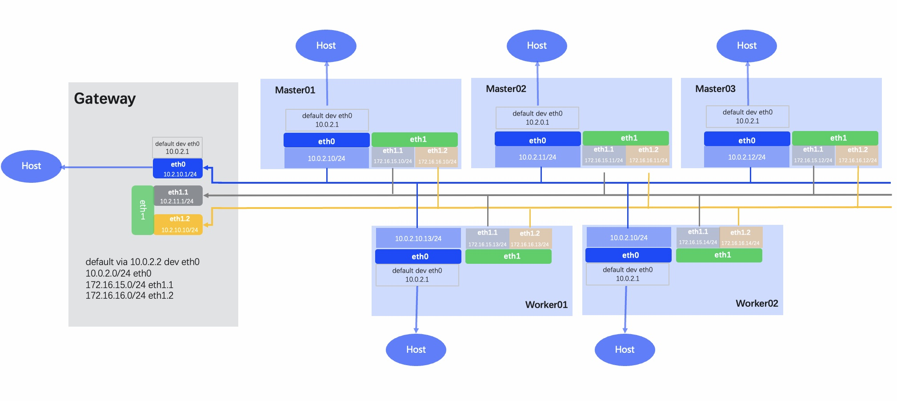

---
hide:
  - toc
---

# 网络规划

基于 Overlay CNI + Underlay CNI [网卡规划](./ethplan.md)的最佳实践，集群的网络规划示意图如下：

**规划说明**：

- 在此规划中默认 CNI 为 Calico/Cilium，需要配合安装 Multus-underlay、Spiderpool 等组件。
- 建议所有节点都具备多张物理网卡且网卡名称一致。
- eth0 为主机默认路由所在网卡，网关指向 Gateway 主机，由该主机转发到外部网络。
  主要用途为：节点间的通讯、K8s 管理网卡、Calico Pod 通信。
- eth1 为 Underlay 业务网卡，无需设置 IP 地址。
  基于 eth1 创建 VLAN 子接口 (eth1.1, eth1.2)，对应网段如 172.16.15.0/24 和 172.16.16.0/24。
  创建的业务应用 Pod 使用对应网段地址，可满足多 VLAN 多子网场景。
