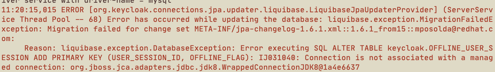
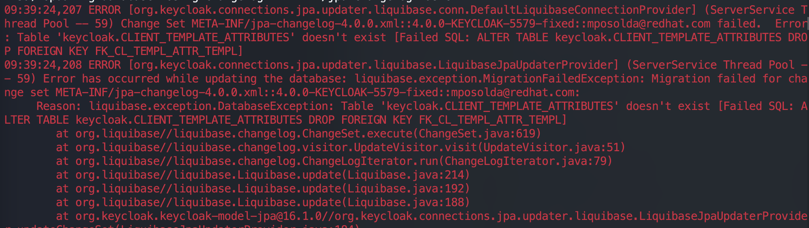

# keycloak 无法启动

数据库是 MySQL，检查 keycloak database 编码是否是 UTF8。

检查 keycloak 到数据库的网络，检查数据库资源（包括但不限于 resource limit、存储空间、物理机资源）是否充足

（仅限第一次安装全局管理时）MySQL 已就绪，无报错。在安装全局管理后 keycloak 仍然无法启动（> 10 次）。

    

    1. 检查 MySQL 资源占用是否到达 limit 限制
    2. 检查 MySQL 中 database keycloak table 的数量是不是 92
    3. 删除 keycloak database 并创建，提示 `CREATE DATABASE IF NOT EXISTS keycloak CHARACTER SET utf8`；重启 keycloak Pod。
