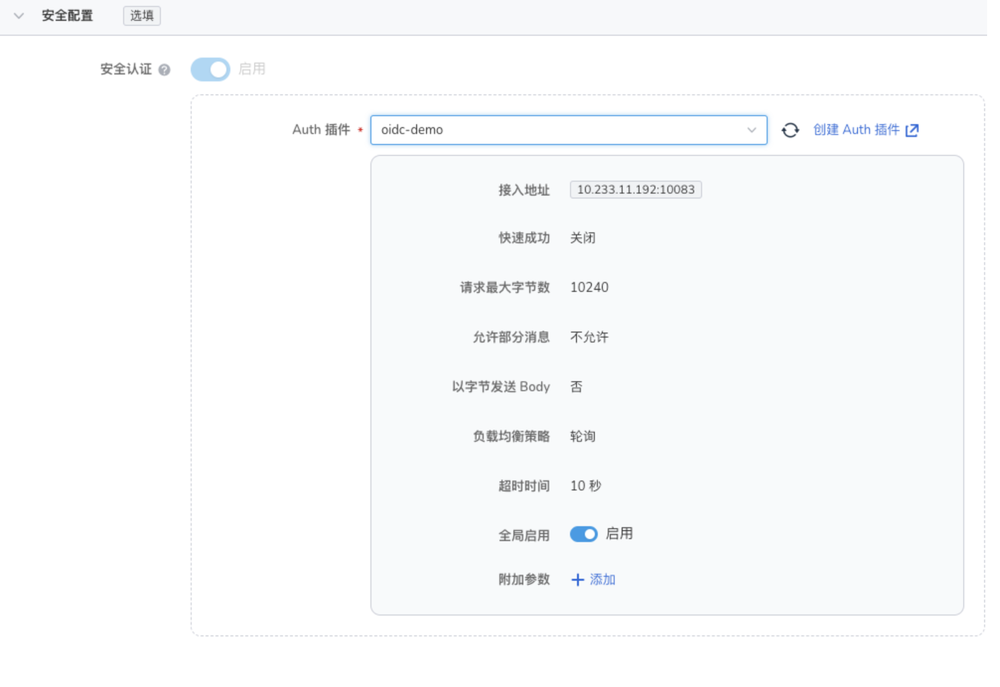

# 微服务网关认证服务器 - 接入 OIDC认证

微服务引擎网关的OIDC认证服务demo包含两个部分。
1. 认证服务，代码仓库地址：<https://github.com/projectsesame/contour-authserver>
2. 身份提供商(以下简称ldp)，代码仓库地址：<https://github.com/projectsesame/dex>

部署 ldp 服务，根据 dex-all-in-one.yaml 文件中的内容将其部署在k8s集群中。
环境变量中 DEX_ISSUER 地址为 ldp 服务的 nodeport 或 loadbalance 地址+ /dex，该服务必须暴露为对外访问；
环境变量中 DEX_STATIC_CLIENT_REDIRECT_URI 是允许客户端重定向的地址列表，格式为：http(s)://+域名+port+redirectPath，其中path为稍后需要部署的认证服务的 redirectPath。
其他环境变量不建议修改，想要尝试的可以参考文件 config.docker.yaml 修改并重新构建镜像。
部署成功后可以开始部署认证服务，根据 auth-oidc-all-in-one.yaml 文件中的内容将其部署在k8s集群中，其中configMap中的部分内容需要根据自身环境来配置，以下是各个配置项的含义：

| 参数名称     | 参数类型 | 参数含义          | 参数示例                                 | 备注                                                         |
| ------------ | -------- | ----------------- | ---------------------------------------- | ------------------------------------------------------------ |
| address      | 字符串   | 提供服务的地址    | :10083                                   | 表明任何地址均可以通过10083端口访问该服务端口需要和service相同 |
| issuerURL    | string   | Identify Provider | `http://10.6.222.22:30051/dex`           | 填写 *ldp* 服务nodePort或loadBalance的地址+/dex示例中是通过nodePort方式访问 |
| clientID     | string   | 客户端ID          | `example-app`                            | 客户端id和密钥示例应用为写死的状态                           |
| clientSecret | string   | 客户端密钥        | `ZXhhbXBsZS1hcHAtc2VjcmV0`               |                                                              |
| scopes       | []string | 访问权限范围      | openid，profile，email，offline_access`` |                                                              |
| redirectURL  | string   | 重定向回调地址    | https://yangyang.daocloud.io:30443       | 示例中为 https://+ 域名 +https 端口                              |
| redirectPath | string   | 重定向路径        | /oauth2/callback                         | 需要保证网关 api 配置中该路径也包含在认证路径中                |

以上配置项在该 demo的 issuerURL、redirectURL 中，这两个需要根据部署环境进行修改，其他参数不建议修改！以下文档均已上述示例配置的内容为例进行说明。

当这两项服务均部署成功后可以通过微服务引擎的网页进行后续配置。以下是配置步骤：

1. 创建插件

    

2. 选择网关并创建域名，并选中刚刚第一步创建的安全认证插件

    

    

3. 创建api，并选择刚刚创建的域名

    

4. api创建成功后通过通过浏览器访问访问刚才创建的api

访问<https://yangyang.daocloud.io:30443/>

由于我们对域名配置了认证服务，因为页面会跳转到ldp服务的登陆页面。图片右侧显示了跳转的过程.
示例代码中用户名为：admin@example.com，密码为：password。

    

登陆后显示授权页面，点击Grant Access

    

经过一些跳转后可以正常访问后端接口

    

至此使用微服务引擎实现OIDC认证的完整逻辑已经完成。