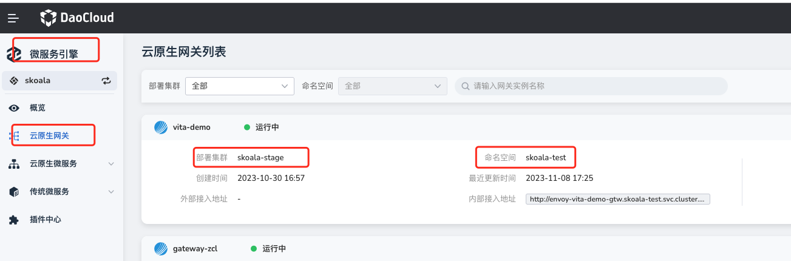
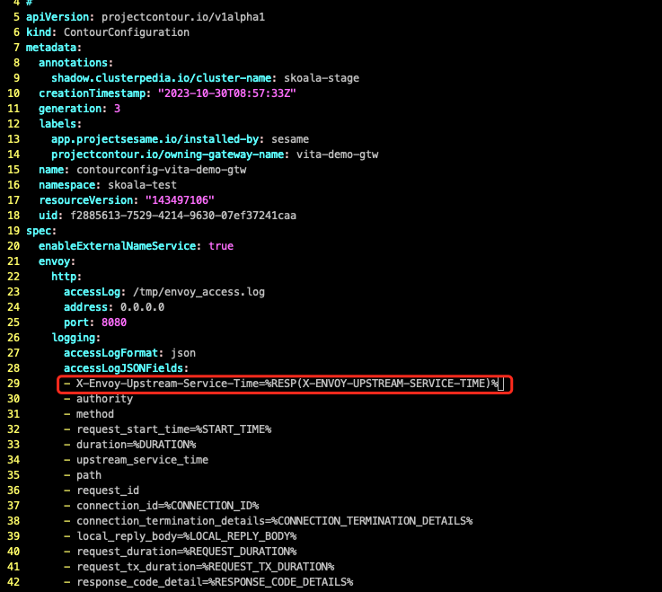
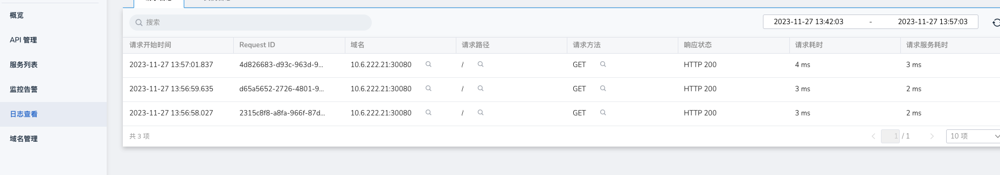
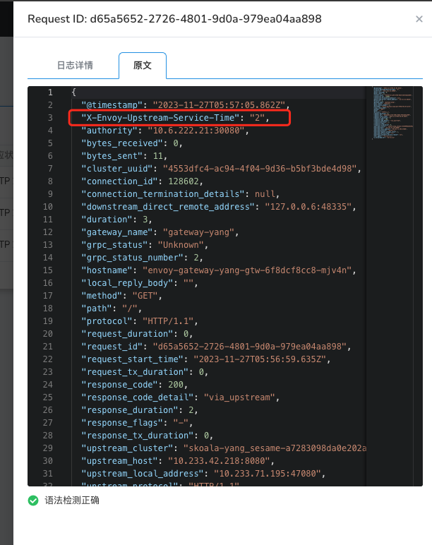

# 网关请求日志添加自定义属性

skoala的网关底层使用的是contour作为控制面下发配置给envoy，其中请求日志的记录字段也会作为一项配置由contour下发给envoy，因此只需要在contour的配置文件中增加响应的需要记录的字段即可。

具体步骤如下：

1. 进入微服务引擎——云原生网关列表，找到需要修改配置的网关所在的集群和命名空间。

    

2. 在网关所在的集群和命名空间查询自定义 cr ContourConfiguration。

    ```shell
    kubectl get contourconfig -n skoala-test

    NAME                          AGE
    contourconfig-vita-demo-gtw   21d
    ```

3. 编辑第二步查询到的cr资源，在.spec.envoy.logging.accessLogJSONFields中增加想要记录的日志字段属性，例如想要增加一个日志字段为响应头的X-Envoy-Upstream-Service-Time字段，可以增加一行 X-Envoy-Upstream-Service-Time=%RESP(X-ENVOY-UPSTREAM-SERVICE-TIME)% 即可。

    ```shell
    kubectl edit contourconfig -n skoala-test
    ```

    编辑前:

    

    编辑后：

    

4. 重启contour组件(不会对流量造成中断)

    ```shell
    kubectl get pods -n skoala-test | grep contour | awk '{print $1}' | xargs kubectl delete pod -n skoala-test

    pod "contour-vita-demo-gtw-785f495bdf-n7knb" deleted
    pod "contour-vita-demo-gtw-b5fcc57bb-pbssx" deleted
    ```
5. pod启动成功后通过网关api访问接口，通过网关日志观察日志记录字段

    

    选择某一条日志，查看原文

    

    可以看到自定义的响应头已经增加到了日志记录中。


!!! note

    注意：该功能适用于微服务引擎0.29.0及以后版本


