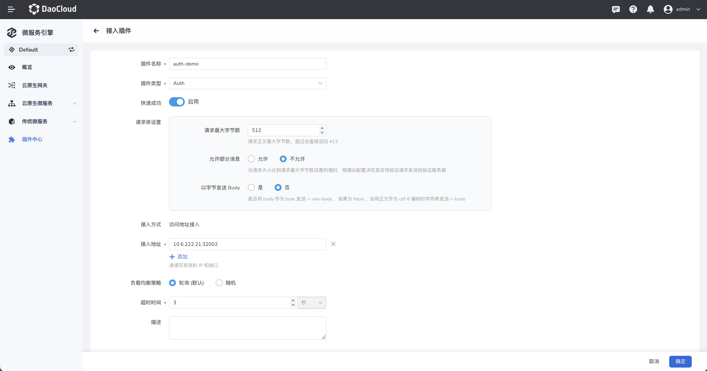
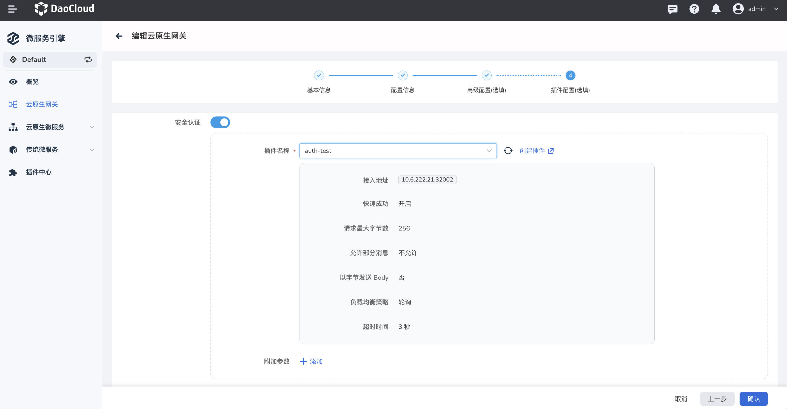
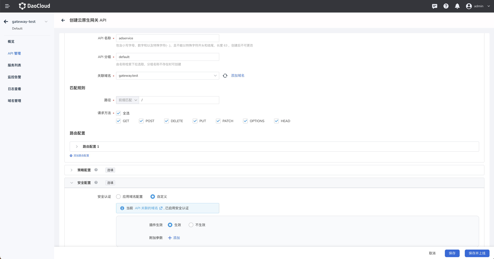
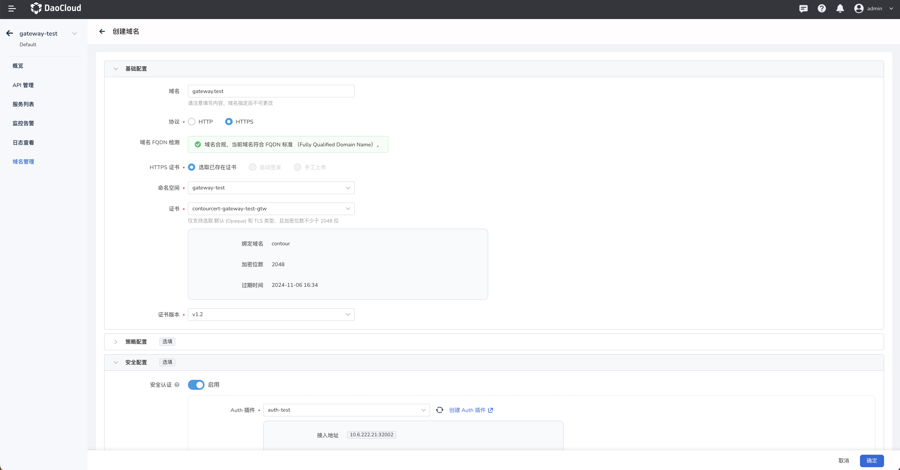

# 微服务网关接入认证服务器

微服务网关支持接入第三方认证服务器。

## 前提条件

- [创建一个集群](../../kpanda/user-guide/clusters/create-cluster.md)或[接入一个集群](../../kpanda/user-guide/clusters/integrate-cluster.md)
- [创建一个网关](../gateway/index.md)

## 配置认证服务器

### 使用默认的认证服务器

1. 将认证服务器的代码模板克隆到本地。

    ```
    git clone https://github.com/projectsesame/envoy-authz-java
    ```

2. 直接使用 [envoy-authz-java.yaml](https://github.com/projectsesame/envoy-authz-java/blob/main/envoy-authz-java.yaml)
   以及文件下的默认镜像。

    ```
    kubectl apply -f envoy-authz-java.yaml
    ```

    默认镜像：

    - release.daocloud.io/skoala/demo/envoy-authz-java:0.1.0

3. 模板为简单的路径判断，当访问路径为 `/` 时通过认证，其余路径为拒绝访问。

### 使用自定义的认证服务器

1. 将认证服务器的代码模板克隆到本地。

    ```
    git clone https://github.com/projectsesame/envoy-authz-java
    ```

    该项目分为两个子模块：

    - API 模块是 envoy 的 `protobuf` 文件的定义（无需修改）
    - authz-grpc-server 模块是认证服务器的认证逻辑处理地址（在这里填写认证逻辑）
    - release.daocloud.io/skoala/demo/envoy-authz-java:0.1.0

2. 使用如下命令编译 API 模块，解决类找不到的问题

    ```bash
    mvn clean package
    ```

3. 成功编译之后，在 check 方法中编写自定义的认证逻辑。

    - check 方法在 envoy-authz-java/authz-grpc-server/src/main/java/envoy/projectsesame/io/authzgrpcserver/AuthzService.java
    - 模板为简单的路径判断，当访问路径为 `/` 时通过认证，其余路径为拒绝访问。

4. 代码编写完成之后，使用 Docker 打包镜像。

    代码模板仓库中已存在 Dockerfile 文件，可以直接使用该模板构建镜像。

5. 将镜像地址填入 [envoy-authz-java.yaml](https://github.com/projectsesame/envoy-authz-java/blob/main/all-in-one-contour.yaml) 文件中的 Deployment 下的 `spec/template/spec/containers/image` 字段。

    

## 接入认证服务器

1. 在网关所在的集群内创建以下资源。使用 `kubectl apply` 命令基于
   [envoy-authz-java.yaml](https://github.com/projectsesame/envoy-authz-java/blob/main/envoy-authz-java.yaml)
   文件可以一次性快速创建下述三项资源。

    - 认证服务器的 Deployment
    - 认证服务器的 Service
    - 认证服务器的 ExtensionService

2. 在插件中心接入一个 Auth 插件

    接入地址填写步骤1部署的应用的外部访问地址，注意该应用的访问协议为 GRPC

    


## 配置认证服务器

### 认证服务器配置在网关层面

!!! note

    HTTP 和 HTTPS 域名都支持安全认证，如需使用 HTTPS 域名，网关需要开启 HTTPS。

1. 网关配置认证服务器。

    

2. 创建 `HTTP` 或者 `HTTPS` 域名，以 HTTP 域名为例，此时创建的域名都是默认开启安全认证的，并且无法关闭。

    

3. 在网关下创建一个 API，`关联域名`填写刚才新创建的域名，匹配路径为 `/`，并开启`安全认证`，并将 API 上线。API 默认状态是应用域名的安全认证配置，也可以自定义插件的生效与否和附加参数。

    

4. 现在即可通过认证服务器访问该 API 了。

   - 访问 `/`，请求通过。

        ```bash
        [root@node ~]# curl -H 'header: true' http://gateway.test:30000/
        adservice-springcloud: hello world!
        ```

    - 访问 `/test1`，请求被拦截。

        ```bash
        [root@node ~]# curl -H 'header: true' http://gateway.test:30000/test1
        No permission
        ```

### 认证服务器配置在域名或 API 层面

!!! note

    只有 HTTPS 域名支持安全认证，网关需要开启 HTTPS。

1. 创建 `HTTPS` 域名，并手动配置安全认证。

    

2. 在网关下创建一个 API，`关联域名`填写刚才新创建的域名，匹配路径为 `/`，并开启`安全认证`，并将 API 上线。API 默认状态是应用域名的安全认证配置，也可以自定义插件的生效与否和附加参数。

    

3. 现在即可通过认证服务器访问该 API 了。

   - 访问 `/`，请求通过。

        ```bash
        [root@node ~]# curl -k -H 'header: true' https://gateway.test:30001/
        adservice-springcloud: hello world!
        ```

   - 访问 `/test1`，请求被拦截。

        ```bash
        [root@node ~]# curl -k -H 'header: true' https://gateway.test:30001/test1
        No permission
        ```
