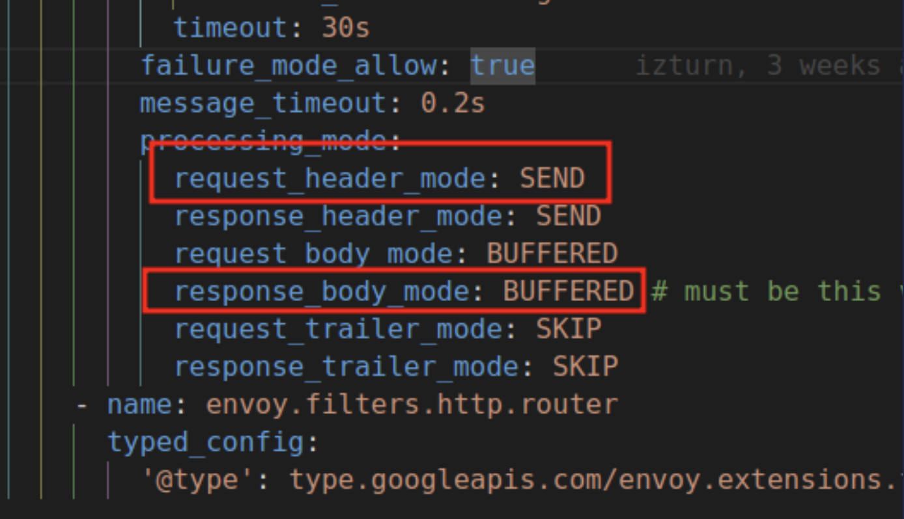

# 云原生自定义插件示例: envoy-extproc-caching-demo-go

[Envoy-extproc-method-conv-demo-go](https://github.com/projectsesame/envoy-extproc-method-conv-demo-go)是一个基于[envoy-extproc-sdk-go](https://github.com/wrossmorrow/envoy-extproc-sdk-go)实现的,用以展示如何在Go语言中使用Envoy提供的[ext_proc](https://www.envoyproxy.io/docs/envoy/latest/configuration/http/http_filters/ext_proc_filter)功能的示例.

## 功能

主要功能是使用一个非持久化存储来缓存由Downstream发起的GET请求的应答,针对某个path的第一次请求将由Upstream响应并被Caching缓存;
之后所有针对此Path的请求,将由Caching直接应答,而不再路由到Upstream,直到Caching重启.以达到响应体缓存的目的.

## 前置条件

- 安装Envoy (Version >= v1.29).
- 安装Go (Verson >= v1.21) 如果只是运行,可跳过此步.
- 支持 HTTP Method:GET的目标服务(以下简称Upstream),且假设其支持以下route:  

    ```console
    /*  
    /no-extproc
    ```

## 编译

进入项目根目录(如果只是运行,可跳过此步).

```go
go build . -o extproc
```

## 运行

Envoy：

```bash
envoy -c ./envoy.yaml # 此文件位于项目根目录.
```

Caching：

- 裸金属
    
    ```bash
    ./extproc caching --log-stream --log-phases
    ```

- k8s

    ```bash
    kubectl apply -f ./deployment.yaml # 此文件位于项目根目录.
    ```

Curl：

```bash
curl 127.0.0.1:8000/no-extproc  # Caching不会作用于此route,每次请求都将由Upstream应答.
curl 127.0.0.1:8000/abc  # 第一次请求将由Upstream应答,并被Caching缓存,后续针对/abc的请求将会由Caching直接应答.
```

## 参数说明

- log-stream: 是否输出关于请求/响应流的日志.  
- log-phases: 是否输出各处理阶段的日志.   
- update-extproc-header: 是否在响应头中添加此插件的名字.   
- update-duration-header: 在结束流时,响应头中添加总处理时间.  

**以上参数默认均为false.**  

- payload-limit 32: 请求体最大允许长度为32字节.

## 注意事项

1. 此示例只支持HTTP Method: GET.

2. processing_mode 的配置项中的 **request_header_mode** 及 **response_body_mode** 必须配置为 **下图** 红框中的选项  

    
