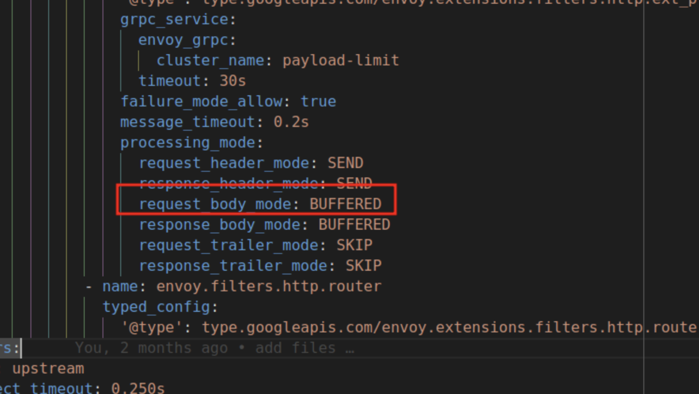

# 云原生自定义插件示例: envoy-extproc-payloadlimit-demo-go

[Envoy-extproc-payloadlimit-demo-go](https://github.com/projectsesame/envoy-extproc-payloadlimit-demo-go)
是一个基于 [envoy-extproc-sdk-go](https://github.com/wrossmorrow/envoy-extproc-sdk-go)
实现的，用以展示如何在 Go 语言中使用 Envoy 提供的
[ext_proc](https://www.envoyproxy.io/docs/envoy/latest/configuration/http/http_filters/ext_proc_filter) 功能的示例。

## 功能

它的主要功能是在将 Downstream 提交的请求体路由到 Upstream 之前，先审核其大小，如果其大于准许发送的最大值，将直接应答 413，以达到限制请求体大小的目的。

## 前置条件

- 安装 Envoy (Version >= v1.29)
- 安装 Go (Verson >= v1.21)。如果只是运行，可跳过此步
- 支持 HTTP Method:POST 的目标服务（以下简称 Upstream），且假设其支持以下 route：

    - `/*`
    - `/no-extproc`

## 编译

进入项目根目录(如果只是运行,可跳过此步).

```bash
go build . -o extproc
```

## 运行

- Envoy

    ```bash
    envoy -c ./envoy.yaml # (1)!
    ```

    1. 此文件位于项目根目录

- Caching

    - 裸金属

        ```bash
        ./extproc payload-limit --log-stream --log-phases payload-limit 32
        ```

    - K8s

        ```bash
        kubectl apply -f ./deployment.yaml # (1)!
        ```

        1. 此文件位于项目根目录

- curl

    ```bash
    curl -XPOST 127.0.0.1:8000/no-extproc  # (1)!
    ```

    1. payload-limit 不会作用于此 route，无论请求体大小，请求都会路由到 Upstream

    以命令行参数 **payload-limit 32** 为例：

    ```bash
    curl -XPOST  -H "Content-Type: application/json" -d '{"key1":"value1", "key2":"value2"}' 127.0.0.1:8000/bar
    ```

    如果请求体小于 32 字节，将会正常路由到 Upstream，否则由 Payload-limit 直接以状态码 :413 响应。

## 参数说明

- log-stream：是否输出关于请求/响应流的日志
- log-phases：是否输出各处理阶段的日志
- update-extproc-header：是否在响应头中添加此插件的名字
- update-duration-header：在结束流时，响应头中添加总处理时间

**以上参数默认均为 false。**

- payload-limit 32：请求体最大允许长度为32字节

## 注意事项

1. 此命令行参数中的前4个为全局配置参数,即所有基于 [envoy-extproc-sdk-go](https://github.com/wrossmorrow/envoy-extproc-sdk-go)
   实现的插件都会默认支持它们；而 **payload-limit 32** 为插件 (envoy-extproc-payloadlimit-demo-go) 特定之参数，由此插件解析与使用。

2. processing_mode 的配置项中的 **request_body_mode** 必须配置为 **下图** 红框中的选项：
 
    
