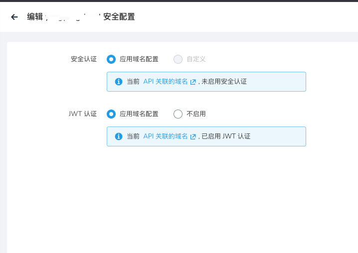

# 微服务网关的 JWT 功能

微服务引擎网关支持 JWT 验证。下面介绍如何使用此功能。

## 前提条件

- [创建一个集群](../../kpanda/user-guide/clusters/create-cluster.md)或[接入一个集群](../../kpanda/user-guide/clusters/integrate-cluster.md)
- [创建一个网关](../gateway/index.md)
- 准备一个 Token 和用于验证 Token 的 JWKS 应用。如果尚且没有 JWKS 应用，可以参考[创建 JWKS 应用](#jwks)创建一个。

## 操作步骤

1. 在插件中心接入一个 JWT 插件

    - 插件名称：唯一的 JWKS 的名称，用于标识具体的 JWT 策略，必填
    - 插件类型：选择 JWT
    - JWKS 缓存时间：JWKS 在内存中的缓存时间，在缓存有效期内不会重复请求 JWKS 服务器地址
    - Token 透传：是否将 JWT 的 Token 信息发送到后端服务
    - JWKS 缓存时间：返回 JWKS 内容的 JWT 服务的完整 FQDN 地址，必填
    - Issuer：Token 颁发者认证，不填则不进行校验  
    - Audiences：Token 的受众，不填则不进行校验
    - 接入地址：返回 JWKS 内容的 JWT 服务的完整 FQDN 地址，必填
    - 超时时间：JWKS 服务器的响应超时时间，超过超时时间获取 JWKS 失败
    - 描述：插件的描述信息
    
    
   

2. 参考[创建域名](../gateway/domain/index.md)创建协议为 `https` 的域名，在域名的安全策略中启用 `JWT 认证`，
   并选择上一步创建的 JWT 插件。下方会回显出选择的 JWT 插件的配置信息。

    

3. 参考[添加 API](../gateway/api/index.md) 创建 API 并选择刚刚使用了 JWT 插件的域名。
   默认情况下如果 API 使用的域名使用了 JWT 插件，API也会启用 JWT 认证，但是在 API 级别可以禁用当前 API的 JWT 认证；
   如果 API 使用的域名未使用 JWT 插件，API 级别不可以开启 JWT 的认证。

    

    

4. 带上 Token 访问验证，如果访问成功说明 JWT 策略配置成功

    

## 创建 JWKS 应用

如果当前环境中尚没有 JWKS 应用，可以参考以下流程部署一个应用。

1. 将 JWKS 生成器代码下载到本地。

    ```git
    git clone https://github.com/projectsesame/jwks-generator
    ```

2. 在本地运行 JWKS 生成器。

    ```bash
    mvn package -DskipTests && java -jar target/ROOT.war
    ```

    访问 <http://localhost:8080>，如果出现下方界面说明 JWKS 生成器已经在本地成功运行起来。

    

3. 参考下方说明填写信息，点击 __Generate__ 生成 JWKS 内容。

    - KeySize：生成 secret 的大小，输入 256
    - KeyUse：用途，选择签名
    - Algorithm：算法，选择 HS256
    - KeyID：可选项，JWKS 有多个值时的匹配参数

        

4. 复制上图中 `k` 字段的取值，访问 <https://jwt.io>，生成 Token。

    - 算法选择 HS256
    - 将复制好的 k 值粘贴到 secret 里面，并勾选 `secret base64 encoded`

    

5. 基于 [YAML 模板](https://github.com/projectsesame/enovy-remote-jwks-go/blob/main/all-in-one.yaml)创建
   YAML 文件，然后使用 `kubectl apply` 命令安装 JWKS 应用：

    - 将 `namespace` 修改为网关所在的命名空间，在本例中使用 `envoy-yang`
    - 将 `jwks.json` 修改为上述第三步生成的 JWKS 内容

    

    ??? note "点击查看本例中配置的 YAML 文件"

        ```yaml title="all-in-one.yaml"
        apiVersion: apps/v1
        kind: Deployment
        metadata:
          labels:
            app: remote-jwks-go
          name: remote-jwks-go
          namespace: envoy-yang
        spec:
          selector:
            matchLabels:
              app: remote-jwks-go
          template:
            metadata:
              labels:
                app: remote-jwks-go
            spec:
              containers:
                - args:
                    - jwks
                    - -c
                    - /app/jwks.json
                  command:
                    - main
                  image: release-ci.daocloud.io/skoala/demo/remote-jwks-go:0.1.0
                  imagePullPolicy: IfNotPresent
                  name: remote-jwks-go
                  ports:
                    - containerPort: 8080
                      name: http
                      protocol: TCP
                  volumeMounts:
                    - name: config
                      mountPath: /app/jwks.json
                      subPath: jwks.json
              volumes:
                - name: config
                  configMap:
                    name: jwks-config
              restartPolicy: Always
              securityContext:
                runAsNonRoot: true
                runAsUser: 65534
                runAsGroup: 65534

        ---
        apiVersion: v1
        kind: Service
        metadata:
          name: remote-jwks-go
          namespace: envoy-yang
          labels:
            app: remote-jwks-go
        spec:
          type: NodePort
          ports:
            - port: 8080
              targetPort: http
              protocol: TCP
              name: http
          selector:
            app: remote-jwks-go

        ---
        apiVersion: v1
        kind: ConfigMap
        metadata:
          name: jwks-config
          namespace: envoy-yang
          labels:
            app: remote-jwks-go
        data:
          jwks.json: |+
            {
              "keys": [
                {
                "kty": "oct",
                "use": "sig",
                "k": "veb4HPc6oaEAsCikZ7rzTKmu9LkOU4LpDUKBxFjnBcc",
                "alg": "HS256"
            }
              ]
            }
        ```

6. 访问应用的 `8080` 端口，出现 `success` 说明应用安装成功。

    JWKS 地址应为 `网关访问地址/jwks` 构成，例如 `http://13.5.245.34:31456/jwks`

    > 在微服务引擎的网关概览页面可以查看网关的访问地址。

    
