# Nacos 对接 LDAP 进行用户管理

Nacos 在 DCE 5.0 微服务引擎中名为注册中心。
本文说明如何通过 Nacos 对接 LDAP（Lightweight Directory Access Protocol，轻量级目录访问协议）来管理用户。

## 在 Kubernetes 上部署 LDAP

先部署 ldap.yaml

```shell
kubectl apply -f ldap.yaml
```

```yaml title="ldap.yaml"
apiVersion: apps/v1
kind: Deployment
metadata:
  name: ldap
  labels:
    app: ldap
spec:
  replicas: 1
  selector:
    matchLabels:
      app: ldap
  template:
    metadata:
      labels:
        app: ldap
    spec:
      containers:
        - name: ldap
          image: docker.m.daocloud.io/osixia/openldap:latest
          volumeMounts:
            - name: ldap-data
              mountPath: /var/lib/ldap
            - name: ldap-config
              mountPath: /etc/ldap/slapd.d
            - name: ldap-certs
              mountPath: /container/service/slapd/assets/certs
          ports:
            - containerPort: 389
              name: openldap
          env:
            - name: LDAP_LOG_LEVEL
              value: "256"
            - name: LDAP_ORGANISATION
              value: "Example Inc."
            - name: LDAP_DOMAIN
              value: "example.org"
            - name: LDAP_ADMIN_PASSWORD
              value: "admin"
            - name: LDAP_CONFIG_PASSWORD
              value: "config"
            - name: LDAP_READONLY_USER
              value: "false"
            - name: LDAP_READONLY_USER_USERNAME
              value: "readonly"
            - name: LDAP_READONLY_USER_PASSWORD
              value: "readonly"
            - name: LDAP_RFC2307BIS_SCHEMA
              value: "false"
            - name: LDAP_BACKEND
              value: "mdb"
            - name: LDAP_TLS
              value: "true"
            - name: LDAP_TLS_CRT_FILENAME
              value: "ldap.crt"
            - name: LDAP_TLS_KEY_FILENAME
              value: "ldap.key"
            - name: LDAP_TLS_CA_CRT_FILENAME
              value: "ca.crt"
            - name: LDAP_TLS_ENFORCE
              value: "false"
            - name: LDAP_TLS_CIPHER_SUITE
              value: "SECURE256:+SECURE128:-VERS-TLS-ALL:+VERS-TLS1.2:-RSA:-DHE-DSS:-CAMELLIA-128-CBC:-CAMELLIA-256-CBC"
            - name: LDAP_TLS_VERIFY_CLIENT
              value: "demand"
            - name: LDAP_REPLICATION
              value: "false"
            - name: LDAP_REPLICATION_CONFIG_SYNCPROV
              value: "binddn=\"cn=admin,cn=config\" bindmethod=simple credentials=$LDAP_CONFIG_PASSWORD searchbase=\"cn=config\" type=refreshAndPersist retry=\"60 +\" timeout=1 starttls=critical"
            - name: LDAP_REPLICATION_DB_SYNCPROV
              value: "binddn=\"cn=admin,$LDAP_BASE_DN\" bindmethod=simple credentials=$LDAP_ADMIN_PASSWORD searchbase=\"$LDAP_BASE_DN\" type=refreshAndPersist interval=00:00:00:10 retry=\"60 +\" timeout=1 starttls=critical"
            - name: LDAP_REPLICATION_HOSTS
              value: "#PYTHON2BASH:['ldap://ldap-one-service', 'ldap://ldap-two-service']"
            - name: KEEP_EXISTING_CONFIG
              value: "false"
            - name: LDAP_REMOVE_CONFIG_AFTER_SETUP
              value: "true"
            - name: LDAP_SSL_HELPER_PREFIX
              value: "ldap"
      volumes:
        - name: ldap-data
          hostPath:
            path: "/data/ldap/db"
        - name: ldap-config
          hostPath:
            path: "/data/ldap/config"
        - name: ldap-certs
          hostPath:
            path: "/data/ldap/certs"
---
apiVersion: v1
kind: Service
metadata:
  labels:
    app: ldap
  name: ldap-service
spec:
  ports:
    - port: 389
  type: NodePort
  selector:
    app: ldap
```

再部署 phpadmin.yaml：<a id="phpadmin" />

```shell
kubectl apply -f phpadmin.yaml
```

```yaml title="phpadmin.yaml"
apiVersion: apps/v1
kind: Deployment
metadata:
  annotations:
    kompose.cmd: kompose convert -f docker-compose.yml
    kompose.version: 1.16.0 (0c01309)
  creationTimestamp: null
  labels:
    io.kompose.service: phpldapadmin
  name: phpldapadmin
spec:
  replicas: 1
  selector:
    matchLabels:
      io.kompose.service: phpldapadmin
  template:
    metadata:
      creationTimestamp: null
      labels:
        io.kompose.service: phpldapadmin
    spec:
      containers:
      - env:
        - name: PHPLDAPADMIN_HTTPS
          value: "false"
        - name: PHPLDAPADMIN_LDAP_HOSTS
          value: ldap-service
        image: docker.m.daocloud.io/osixia/phpldapadmin:latest
        name: phpldapadmin
        ports:
        - containerPort: 80
      restartPolicy: Always
---
apiVersion: v1
kind: Service
metadata:
  annotations:
    kompose.cmd: kompose convert -f docker-compose.yml
    kompose.version: 1.16.0 (0c01309)
  labels:
    io.kompose.service: phpldapadmin
  name: phpldapadmin
spec:
  ports:
  - name: "8080"
    port: 8080
    targetPort: 80
  type: NodePort
  selector:
    io.kompose.service: phpldapadmin
```

## 部署 Nacos

在一台虚拟机上部署 Nacos。

1. 下载安装包

    ```shell
    cd /opt
    wget https://github.com/alibaba/nacos/releases/download/2.3.2/nacos-server-2.3.2.tar.gz
    ```

1. 配置 LDAP

    ```shell
    tar -zxvf nacos-server-2.3.2.tar.gz
    cd nacos/conf/
    ```

    编辑 application.properties 文件，开启认真并配置 ldap 连接信息：

    ```config title="application.properties"
    nacos.core.auth.system.type=ldap
    nacos.core.auth.enabled=true
    nacos.core.auth.server.identity.key=DefaultIdentityKey
    nacos.core.auth.server.identity.value=DefaultIdentityValue
    nacos.core.auth.plugin.nacos.token.secret.key=RGFvY2xvdWRTa29hbGFOYWNvc0F1dGhTZWNyZXRLZXk=
    nacos.core.auth.ldap.url=ldap://10.6.176.50:30326   # 上一步安装的 ldap 连接地址，节点 ip:389 映射端口
    nacos.core.auth.ldap.basedc=dc=example,dc=org
    nacos.core.auth.ldap.userDn=cn=admin,${nacos.core.auth.ldap.basedc}
    nacos.core.auth.ldap.password=admin
    nacos.core.auth.ldap.userdn=cn={0},dc=example,dc=org
    nacos.core.auth.ldap.filter.prefix=uid
    nacos.core.auth.ldap.case.sensitive=true
    nacos.core.auth.ldap.ignore.partial.result.exception=false
    ```

1. 启动 Nacos

    ```shell
    cd ../bin
    ./startup.sh -m standalone
    ```

    启动后可通过 8848 端口页面访问 Nacos，如 `http://10.6.222.10:8848/nacos`

    用户名密码为：nacos/nacos

1. 微服务部署 nacos-ldap.yaml

    ```shell
    kubectl apply -f nacos-ldap.yaml
    ```

    ```yaml title="nacos-ldap.yaml"
    apiVersion: nacos.io/v1alpha1
    kind: Nacos
    metadata:
      labels:
        sidecar.istio.io/inject: 'false'
        skoala.io/type: nacos
      name: nacos-ldap
      namespace: skoala-demo
    spec:
      certification:
        enabled: true
        ldap:
          admin: admin    # login DN 中的 cn 值，如 login DN 为 "cn=admin,dc=example,dc=org" 时，该值为 admin
          basedc: dc=example,dc=org   # ldap 的 basedc
          password: admin     # ldap 的管理账号密码
          url: ldap://10.6.176.50:30326   # ldap 地址
        token: RGFvY2xvdWRTa29hbGFOYWNvc0F1dGhTZWNyZXRLZXk=
        token_expire_seconds: '18000'
        type: ldap
      database:
        mysqlDb: nacosjvm
        mysqlHost: 10.6.222.10
        mysqlPassword: dangerous
        mysqlPort: '3306'
        mysqlUser: root
        type: mysql
      image: docker.m.daocloud.io/nacos/nacos-server:v2.3.2-slim
      jvm_percentage: 0.75
      mysqlInitImage: docker.m.daocloud.io/arey/mysql-client:latest
      replicas: 1
      resources:
        limits:
          cpu: '1'
          memory: 2Gi
        requests:
          cpu: 500m
          memory: 500Mi
      serviceType: NodePort
      type: standalone
      volume:
        requests:
          storage: 1Gi
        storageClass: default
    ```

## 用户管理

通过 LDAP 创建用户：

1. 页面访问 phpLDAPadmin

    URL 为[前文部署的 phpadmin 的地址](#phpadmin)：`节点IP:8080映射端口`

    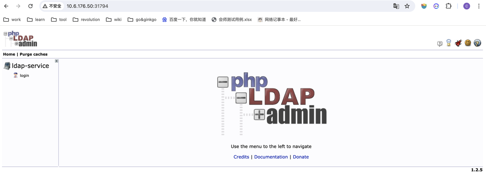

1. 登录 phpLDAPadmin

    点击左侧 **login** 登录：

    - Login DN 为 cn=admin,dc=example,dc=org
    - Password 为 admin

    输入 Login DN 和 Password 后，点击 **Authenticate**

    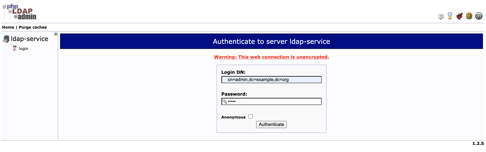

    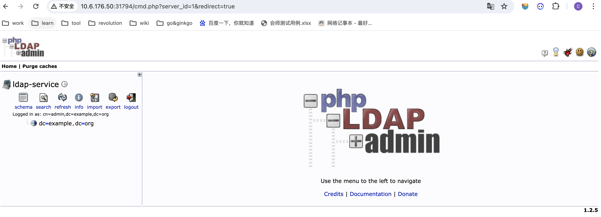

1. 创建用户组和用户

    1. 点击左侧 **dc=example,dc=org** 后再点击 **Create a child entry** ，
       选择 **Generic: Organisational Unit** 创建 Group 分组

        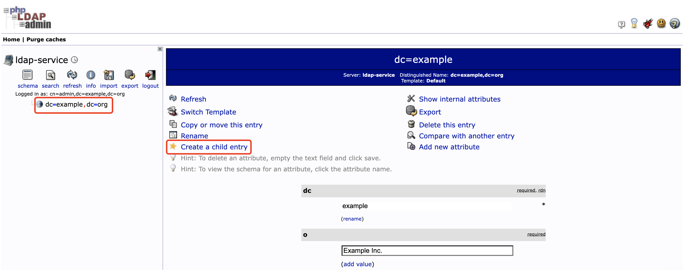
        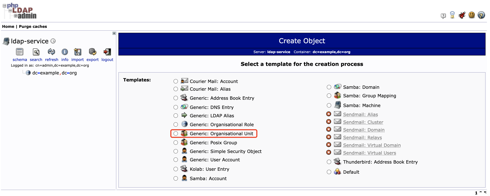
        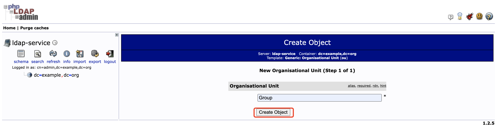
        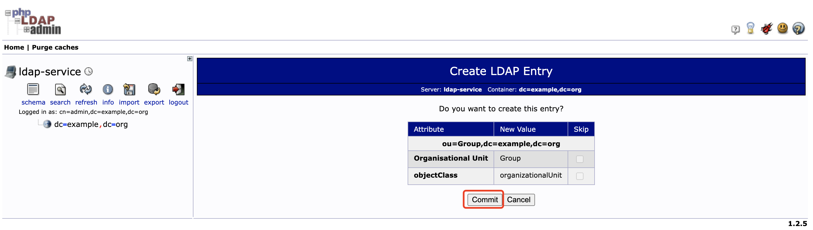

    1. 在 **ou=Group** 下创建用户组 nacos

        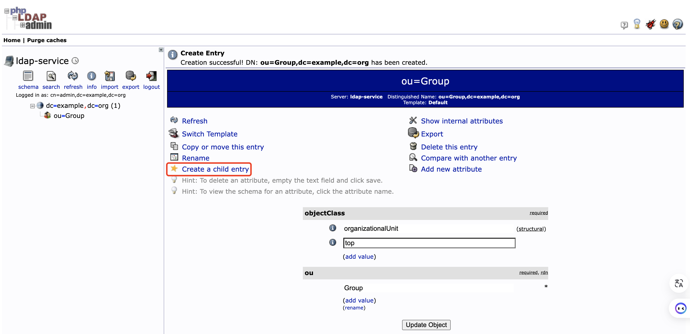
        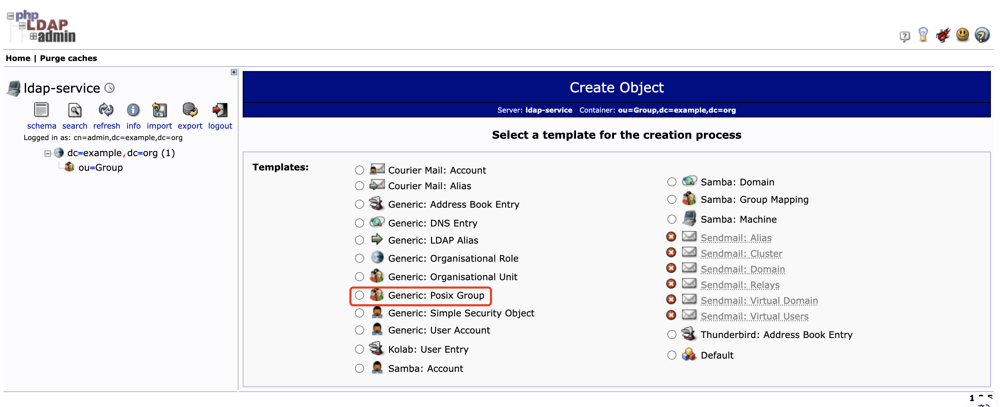
        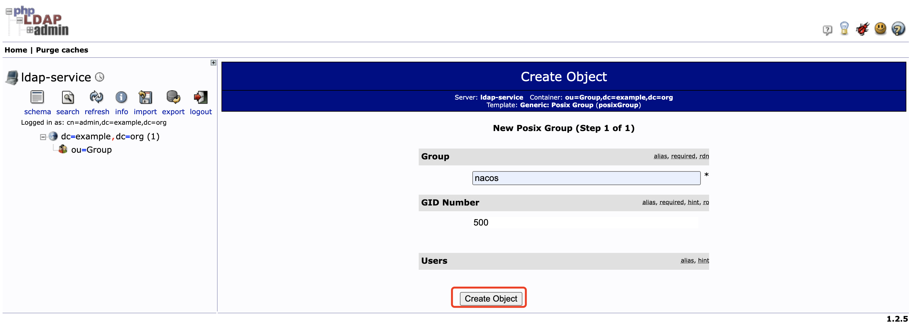
        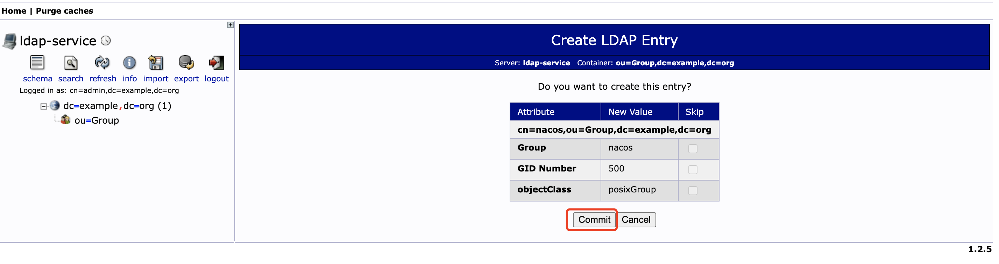

    1. 同样点击左侧 **dc=example,dc=org** 后再点击 **Create a child entry** ，
       选择 **Generic: Organisational Unit** 创建 People 分组

        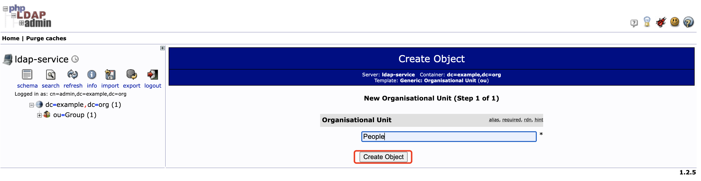
        

    1. 在 **ou=People** 下创建用户 bob

        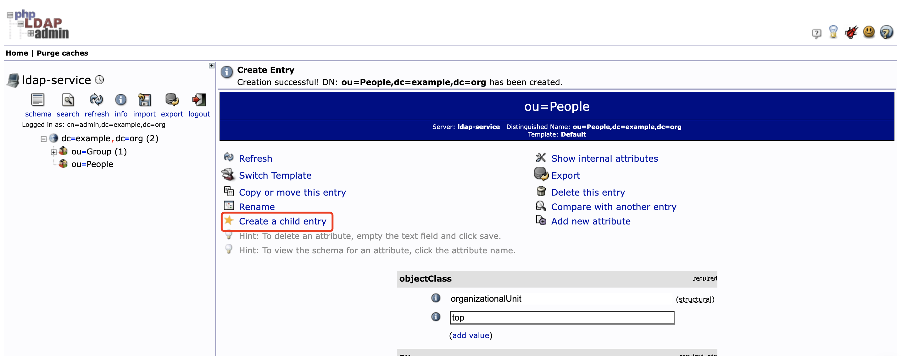
        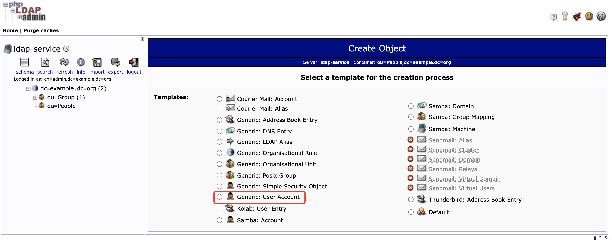

    1. 参照下图填写参数：

        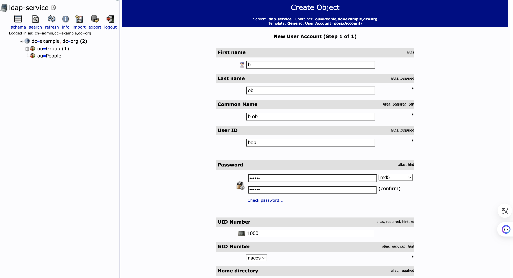
        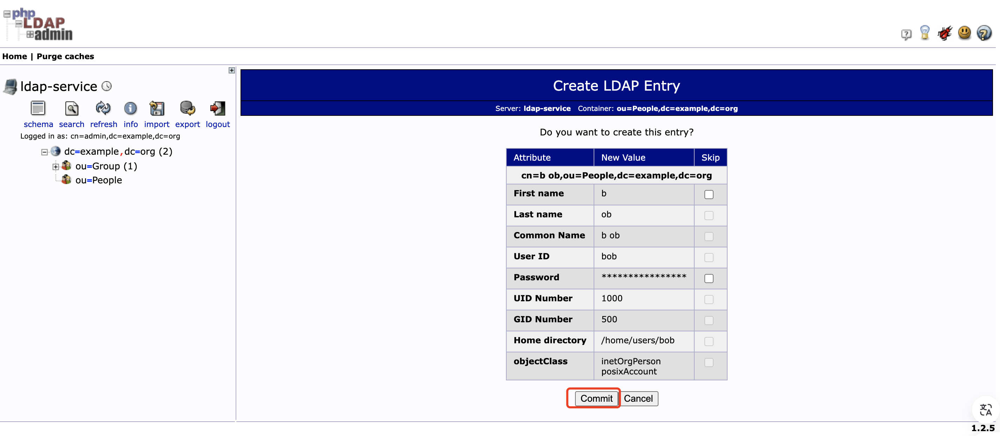
        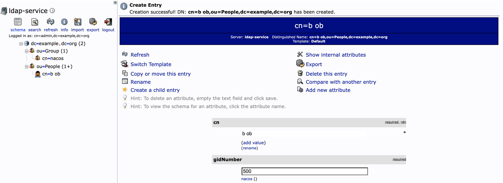

        - first name 为 b
        - last name 为 ob
        - 密码设为 123456
        - GID number 选择 nacos

    然后点击 **Create Object** ，再点击 **Commit**

1. 在 Nacos 进行用户授权

    1. 使用 LDAP 创建的用户 bob，登录 Nacos 页面

        用户名/密码为：bob/123456

        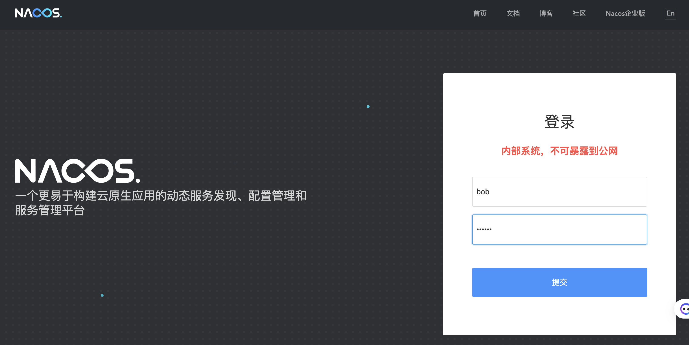

        登录后用户名变成 LDAP_bob，此后可使用 LDAP_bob 作为用户名进行登录。

        但要注意 LDAP_bob 的密码为 nacos，而不是 123456；bob 登录时密码仍为 123456

        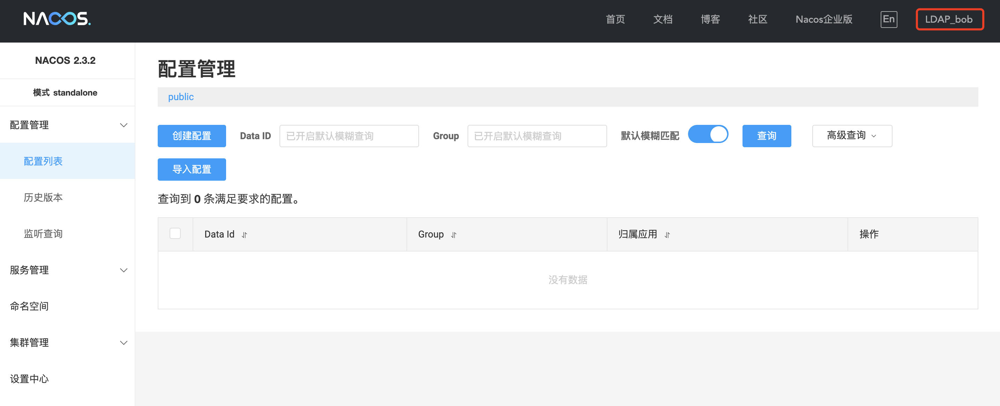

    1. 给 LDAP_bob 用户授权

        1. 重新以用户 nacos 登录 nacos 页面，进入 **权限控制** -> **用户列表** 页面可看到 LDAP_bob 用户

            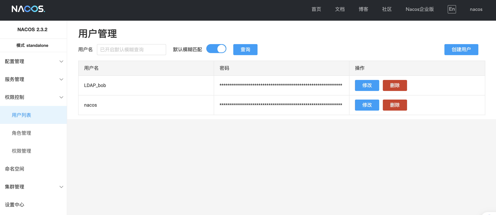

        1. 进入角色管理页面，点击 **绑定角色** 给用户创建角色

            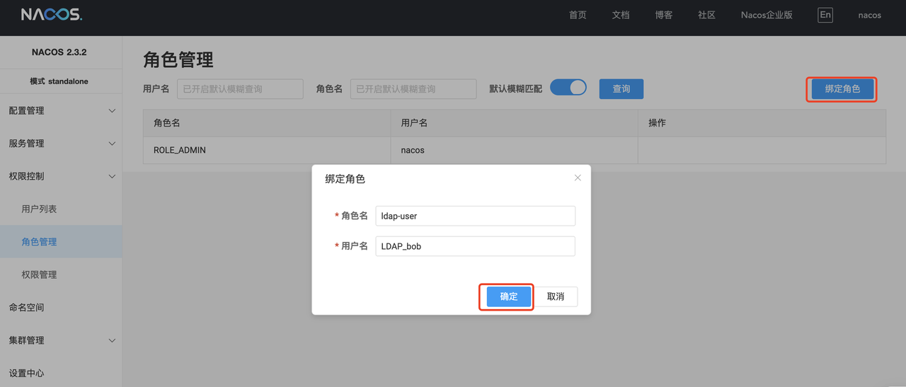

        1. 进入权限管理页面，点击 **添加权限** 给角色绑定 public 的只读权限，则 LDAP_bob 用户只具有 public 命名空间下的只读权限。

            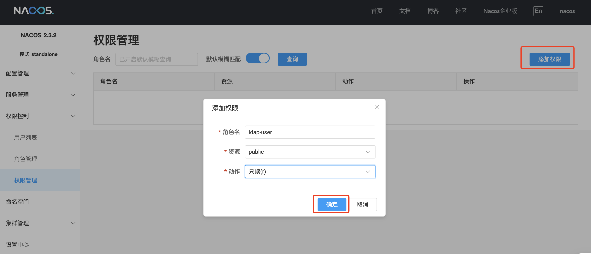

!!! note

    ldap 添加用户 bob，同步到 nacos 那边之后是 LDAP_bob。
    ldap 删除用户 bob 后，nacos 端的 LDAP_bob 还能正常使用。
