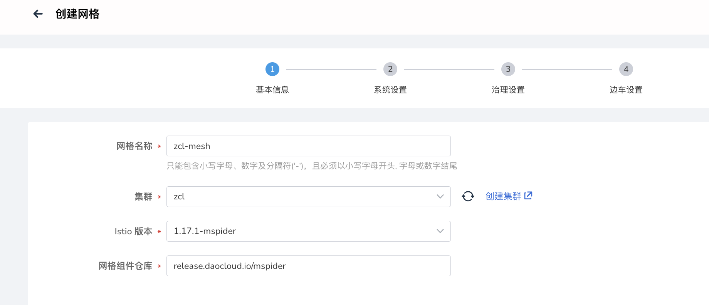
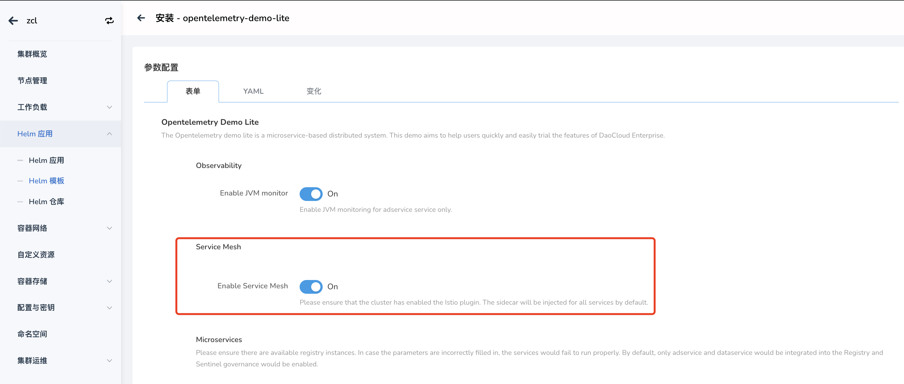
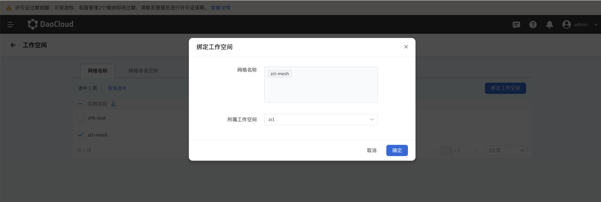
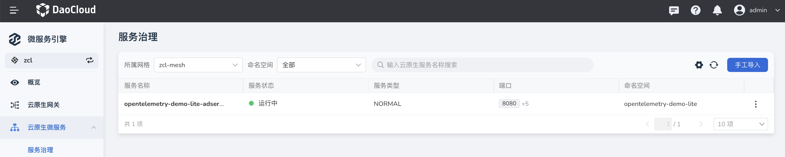
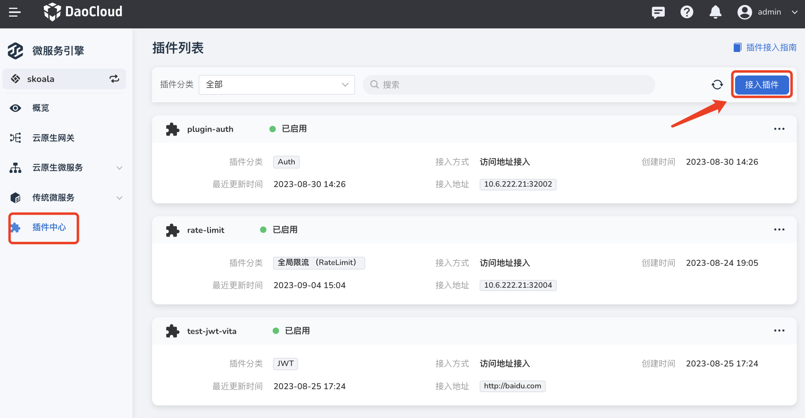
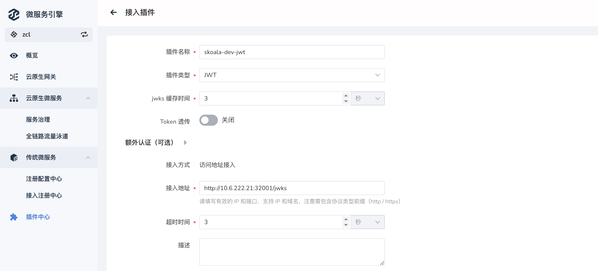
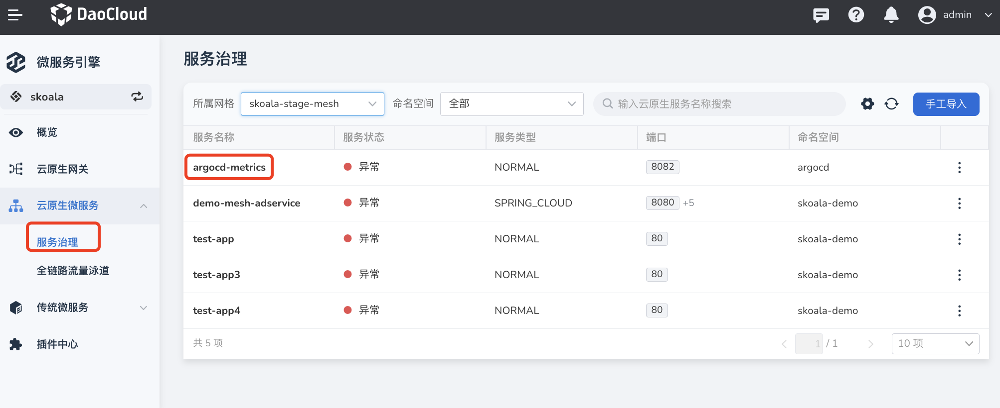
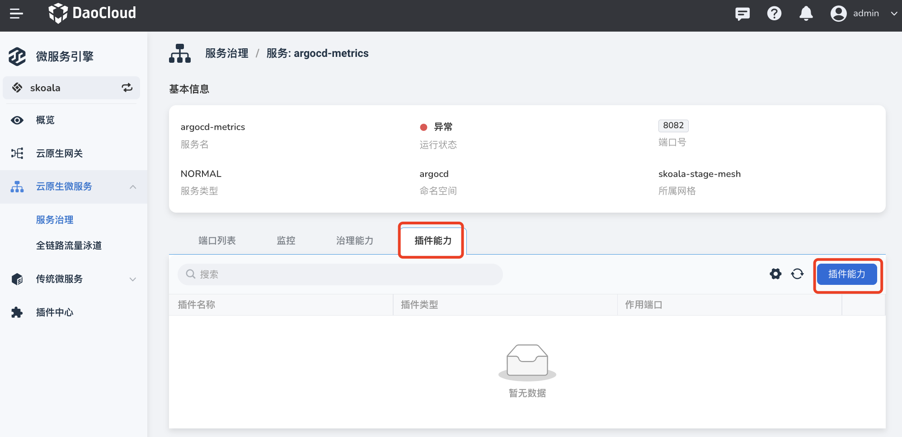
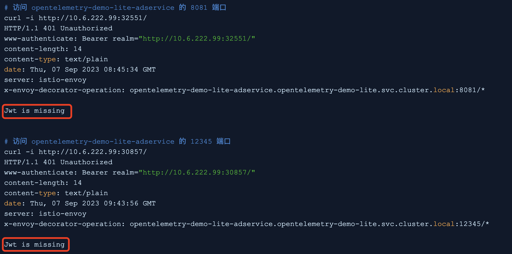
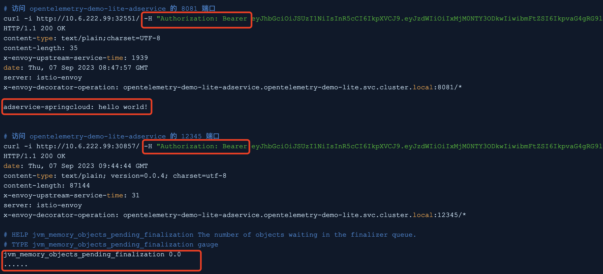

# 在云原生微服务中使用 JWT 插件

DCE 5.0 微服务引擎支持在云原生微服务中使用 JWT 插件，为服务添加安全认证。

## 前提条件

为了在云原生微服务中使用 JWT 插件，需要先满足下列前提条件。

### 创建服务网格

首先需要在 DCE 5.0 的[服务网格](../../../mspider/intro/index.md)模块中，为目标服务所在的集群创建服务网格。目前支持创建托管网格、专有网格、外接网格三种类型的网格。

有关具体网格的创建步骤，可参考[创建托管/专有网格](../../../mspider/user-guide/service-mesh/README.md)或[创建外接网格](../../../mspider/user-guide/service-mesh/external-mesh.md)。

### 开启边车注入

在目标集群中部署应用，并在服务网格中为演示应用开启边车注入。

!!! note

    - 由于此次演示使用的服务是 opentelemetry-demo-lite，所以使用 Helm 模板的形式部署应用。
    - 如您使用其他服务，可以通过[创建工作负载](../../../kpanda/user-guide/workloads/create-deployment.md)或 [Helm 模板](../../../kpanda/user-guide/helm/helm-app.md)或其他方式在集群中部署应用。

### 为网格绑定工作空间

为目标网格绑定一个工作空间，使得网格可以使用对应工作空间内的资源。

### 在微服务引擎中接入服务

进入微服务引擎模块，将演示应用导入云原生微服务模块，具体步骤可参考[导入服务](../../cloud-ms/service.md)。

## 接入并绑定插件

满足上述前提条件之后，接入 JWT 插件并将插件绑定到微服务端口，就可以在微服务中使用该插件。

1. 进入微服务引擎，在左侧导航栏点击`插件中心`，然后在页面右上角点击`接入插件`。

    

2. 填写插件配置，最后在页面右下角点击`确定`即可。。

    

3. 在微服务引擎的左侧导航栏点击`云原生微服务`，然后点击目标服务的名称。

    

4. 在服务详情中点击`插件能力`页签，然后在右侧点击`插件能力`。

    

5. 填写插件配置，将插件和服务端口绑定。
  
    

## 验证插件效果

完成前述操作后，接下来通过调用服务来验证插件效果。按照预期，此时访问服务时必须要添加认证请求头才能成功访问，否则无法访问服务。

1. 如果不带请求头访问服务，返回 missing，服务无法访问，符合预期效果。

    

2. 带上认证请求头再次访问，此时可以正常返回接口内容，符合预期效果。

    
