# 示例应用体验微服务治理

微服务引擎属于 DCE5.0 高级版功能，其中包含了注册中心、配置中心、微服务治理（传统微服务、云原生微服务）、云原生网关等模块；本来将带您体验如何示例应用部署成功后，体验微服务治理功能。

## 流程说明

- 在应用工作台部署示例应用，并启用微服务治理功能
- 启用传统微服务治理
- 配置对应的治理规则
- 暴露服务 API
- 通过 Postman 访问测试服务

## 示例应用介绍

示例应用来自于 OpenTelemetry 的标准演示应用，可以很好体现云原生以及可观测能力。也方便我们的治理规则进行呈现，下方是 DaoCloud 大微服务团队基于 DCE5.0 功能优化了示例应用，并开源在 GIthub。

- <https://github.com/openinsight-proj/openinsight-helm-charts>

> 应用架构图

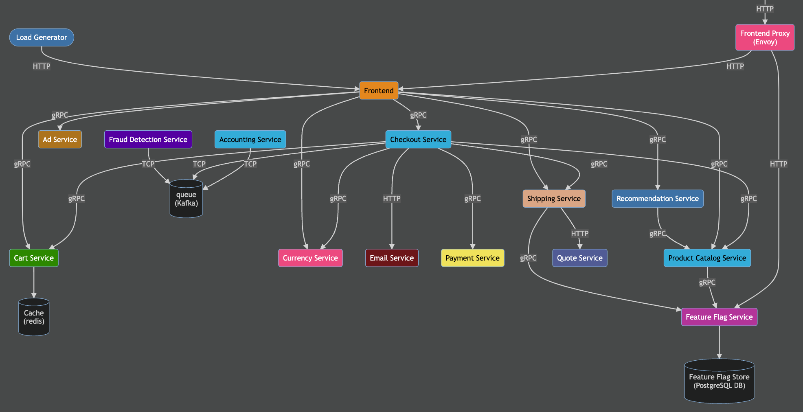

更多示例应用请查看，我们的开源站点： <https://github.com/openinsight-proj/openinsight-helm-charts>

## 应用部署

应用工作台是 DCE5.0 提供的应用管理模块，方便您在这里创建/维护多种类型的应用，支持 CICD，方便快捷将应用部署到任何集群之中。

了解更多应用工作台内容，可点击 [应用工作台去查看](../../amamba/01ProductBrief/WhatisAmamba.md)

### 部署方式选取

应用工作台目前支持基于 Git repo、Jar 包、Image、Helm Chart 等部署方式，这里通过 `Git repo` 的方式部署为例。

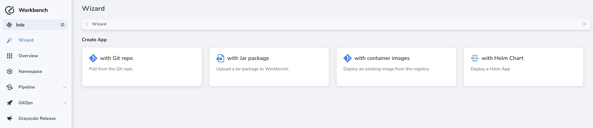

### 部署准备

#### 导入 Helm Chart

这一步需要在 `容器管理` 内操作，跳转到 Helm Chart 仓库，添加仓库：

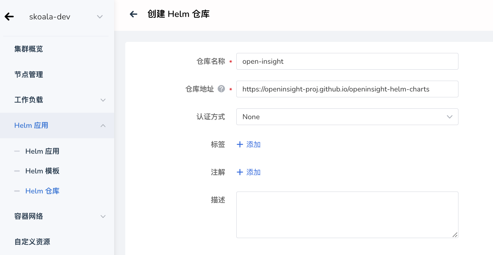

#### 准备 Nacos 实例

这里具体的操作，参考注册中心配置即可，[](../registry/managed/registry-lcm/create-registry.md)

注意获取注册中心的链接地址信息，稍后会在下方应用安装时使用。

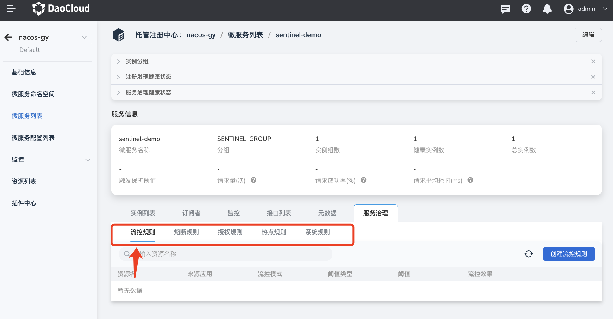

### 部署应用

在应用工作台直接选取使用 Helm Chart 的方式安装，找到 openinsight 应用，然后选取部署即可。

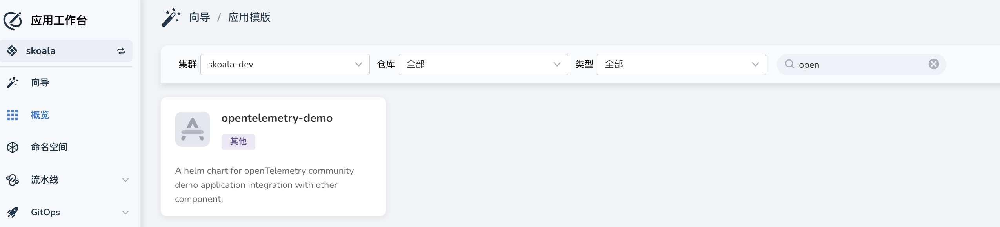


### 参数配置

在 Helm 的安装界面，注意确认对一个的部署位置，以及下方的参数配置，通过关键词 `JAVA_OPTS` 找到对应模块，更新下方的配置。

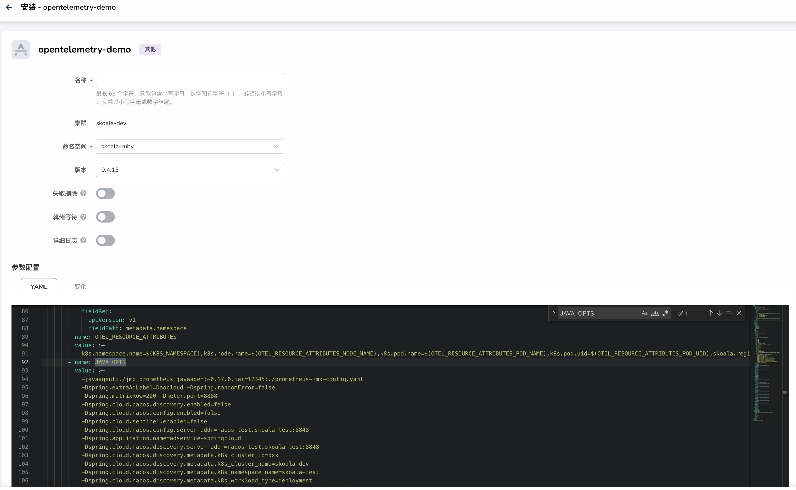

- 通过上面获取到的注册中心地址
- 更新下方的配置参数，主要更新字段有
    - Dspring.cloud.nacos.discovery.enabled
    - Dspring.cloud.nacos.config.enabled
    - Dspring.cloud.nacos.config.server-addr
    - Dspring.cloud.nacos.discovery.server-addr
    - Dspring.cloud.nacos.discovery.metadata.k8s_cluster_id
    - Dspring.cloud.nacos.discovery.metadata.k8s_cluster_name
    - Dspring.cloud.nacos.discovery.metadata.k8s_namespace_name

> 配置修改位置如下：

```java
-javaagent:./jmx_prometheus_javaagent-0.17.0.jar=12345:./prometheus-jmx-config.yaml
    -Dspring.extraAdLabel=Daocloud -Dspring.randomError=false
    -Dspring.matrixRow=200 -Dmeter.port=8888
    -Dspring.cloud.nacos.discovery.enabled=false        # 启用 Nacos 服务注册发现
    -Dspring.cloud.nacos.config.enabled=false           # 启用 Nacos 配置管理能力
    -Dspring.cloud.sentinel.enabled=false
    -Dspring.cloud.nacos.config.server-addr=nacos-test.skoala-test:8848           # 配置 Nacos 注册中心地址
    -Dspring.application.name=adservice-springcloud
    -Dspring.cloud.nacos.discovery.server-addr=nacos-test.skoala-test:8848        # 配置 Nacos 注册中心地址
    -Dspring.cloud.nacos.discovery.metadata.k8s_cluster_id=xxx                    # 配置 Nacos 注册中心所在集群 ID
    -Dspring.cloud.nacos.discovery.metadata.k8s_cluster_name=skoala-dev           # 配置 Nacos 注册中心所在集群名称
    -Dspring.cloud.nacos.discovery.metadata.k8s_namespace_name=skoala-test        # 配置 Nacos 注册中心所在命名空间
    -Dspring.cloud.nacos.discovery.metadata.k8s_workload_type=deployment
    -Dspring.cloud.nacos.discovery.metadata.k8s_workload_name=adservice-springcloud
    -Dspring.cloud.nacos.discovery.metadata.k8s_service_name=adservice-springcloud
    -Dspring.cloud.nacos.discovery.metadata.k8s_pod_name=${HOSTNAME}
    -Dspring.cloud.sentinel.enabled=false
    -Dspring.cloud.sentinel.transport.dashboard=nacos-test-sentinel.skoala-test:8080
```

创建成功后，应用会出现在应用工作台的 Helm 应用列表。

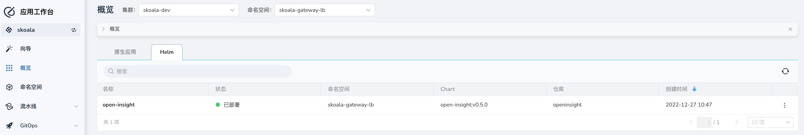

### 其他部署方式

如果您采用其他部署方式，则可能根据部署方式的不同，配置注册中心地址的方法有所区别。

#### Java 项目自行开发调试

这里一般指 Java 项目，在开发时，需要集成 Nacos 的 SDK，DCE5.0 提供的注册中心模块完全兼容开源 Nacos，所以您可以直接使用开源 Nacos 的 SDK。

当使用 java -jar 启动项目时，注意增加对应的环境变量配置即可

```java
    -Dspring.cloud.nacos.discovery.enabled=false        # 启用 Nacos 服务注册发现
    -Dspring.cloud.nacos.config.enabled=false           # 启用 Nacos 配置管理能力
    -Dspring.cloud.sentinel.enabled=false
    -Dspring.cloud.nacos.config.server-addr=nacos-test.skoala-test:8848           # 配置 Nacos 注册中心地址
    -Dspring.application.name=adservice-springcloud
    -Dspring.cloud.nacos.discovery.server-addr=nacos-test.skoala-test:8848        # 配置 Nacos 注册中心地址
    -Dspring.cloud.nacos.discovery.metadata.k8s_cluster_id=xxx                    # 配置 Nacos 注册中心所在集群 ID
    -Dspring.cloud.nacos.discovery.metadata.k8s_cluster_name=skoala-dev           # 配置 Nacos 注册中心所在集群名称
    -Dspring.cloud.nacos.discovery.metadata.k8s_namespace_name=skoala-test        # 配置 Nacos 注册中心所在命名空间
    -Dspring.cloud.nacos.discovery.metadata.k8s_workload_type=deployment
    -Dspring.cloud.nacos.discovery.metadata.k8s_workload_name=adservice-springcloud
    -Dspring.cloud.nacos.discovery.metadata.k8s_service_name=adservice-springcloud
    -Dspring.cloud.nacos.discovery.metadata.k8s_pod_name=${HOSTNAME}
```

注意上面的 `metadata` 信息不要缺失，否则在注册中心内呈现的服务会缺失这部分信息

#### 使用应用工作台镜像部署

当通过应用工作台使用容器镜像部署时，可以方便的通过配置开启微服务治理，并直接选取对应的注册中心模块。

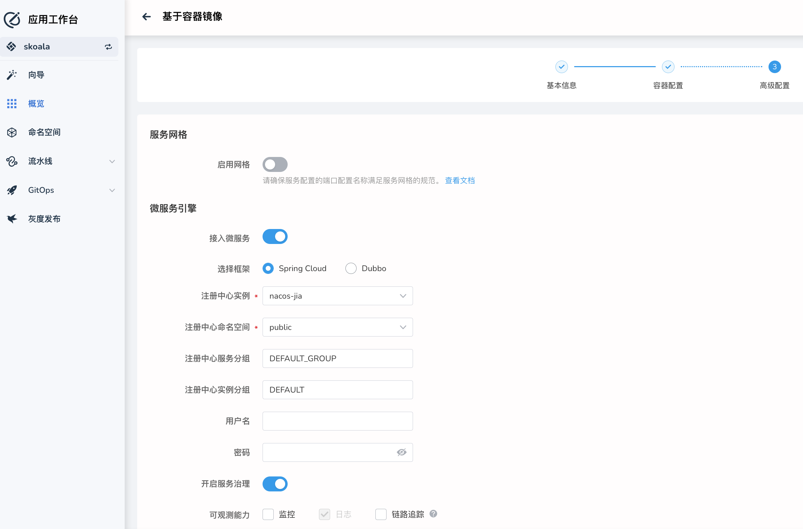

## 微服务治理策略

当应用部署成功后，我们可以在之前准备的注册中心内看到对应的服务。


### 治理策略示例：限流

这里限流策略示例，我们通过简单的配置即可为服务增加对应的限流策略。

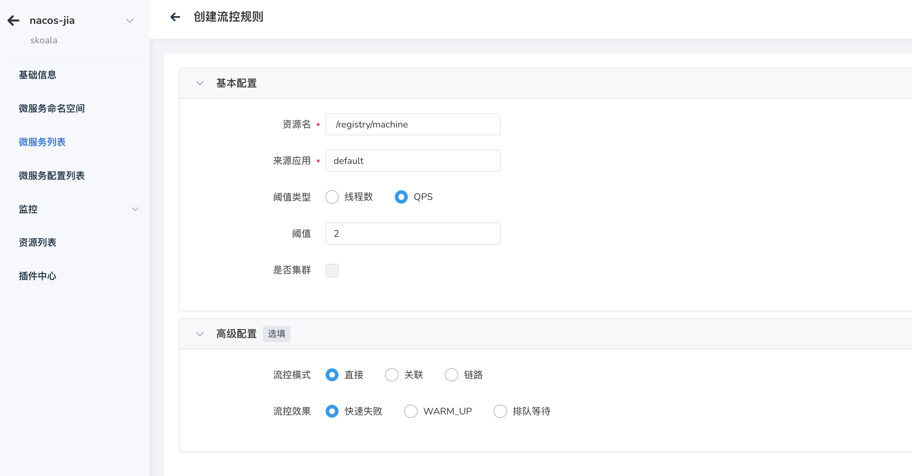

### 限流策略测试

通过访问服务地址，我们可以看到在 1 分钟内请求次数大于 2 次之后，后续请求都会被拦截；在超过 1 分钟后自动恢复。

### 更多策略

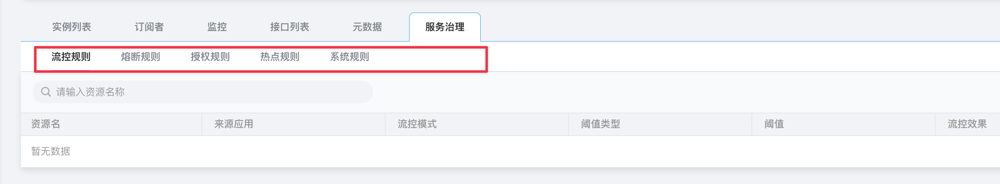

## 云原生网关开放 API

当微服务应用部署完成，我们需要通过 API 网关将应用入口开放给外部访问，到这一步才是完成的服务使用体验。

### 创建云原生网关

首先，我们需要创建一个云原生网关，具体操作步骤可以参考： [创建云原生网关](../ms-gateway/gateway/create-gateway.md)

这里我们已经准备好了一云原生网关


> 注意，创建网关时，网关所部署的工作集群应用与示例应用在同一个集群，并且在云原生网关的纳管命名空间内需要包含实例应用所在的命名空间

### 服务接入与发现

基于 DCE5.0 的特性，云原生网关会自动发现纳管的命名空间内的服务，所以我们无需单独创建服务。

本次演示采用 Nacos 注册中心的服务，很大程度上扩宽了网关可接入的服务数量，我们可以在服务接入中选择，接入 Nacos 注册中心的服务。

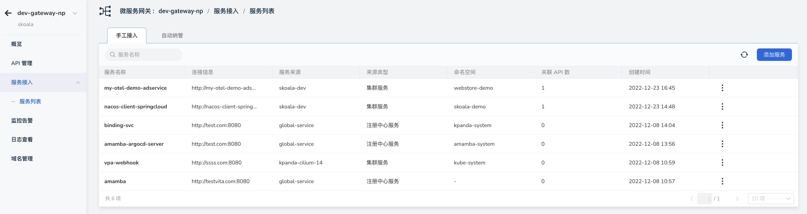

手工接入的作用，当服务不在纳管的命名空间，或者我们想接入注册中心或者其他外部服务时（使用域名/IP），可以采用手工接入的方式。

### 创建对应的 API 路由

跳转到 API 列表，使用右上方 创建 API，完成对应的 API，注意选择对应的服务；以下是对应示例应用的 API 基本信息


> 更多 API 创建细节，可以参考对应的文档 [创建 API](../ms-gateway/api/add-api.md)

### 访问应用

当网关 API 创建完成后，我们使用在创建 API 时，配置的**域名**与**外部 API 路径**，即可成功访问到应用的页面；下方是访问页面。

> 示例应用首页


> 示例应用订单确认页


## 结语

以上就是整个微服务引擎模块的体验之旅，在整个 DCE5.0 的能力支持下我们顺利完成了从应用部署、到微服务治理策略的配置、到使用云原生网关能力将 API 开放并实际访问。

### 更多能力

当我们的应用部署成功之后，对于后续的应用维护过程中，实际非常依赖 DCE5.0 提供的可观测能力；接下来，我们会补充对应可观测能力实践。

- 查看应用部署后的拓扑结构
- 查看应用的日志内容
- 查看云网关网关 API 的访问日志
