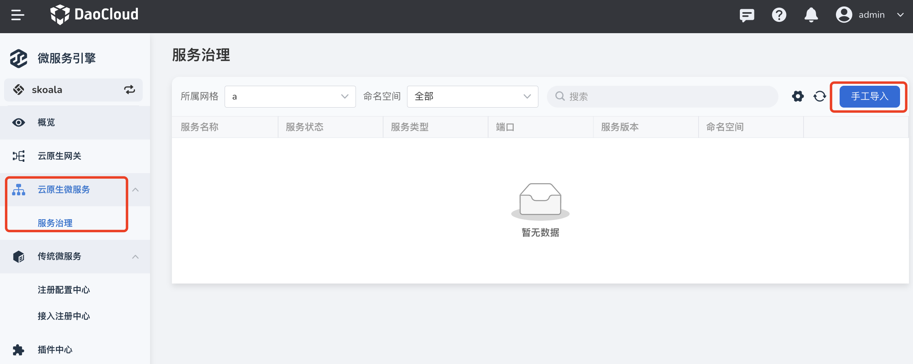
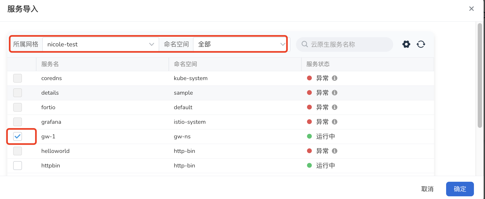
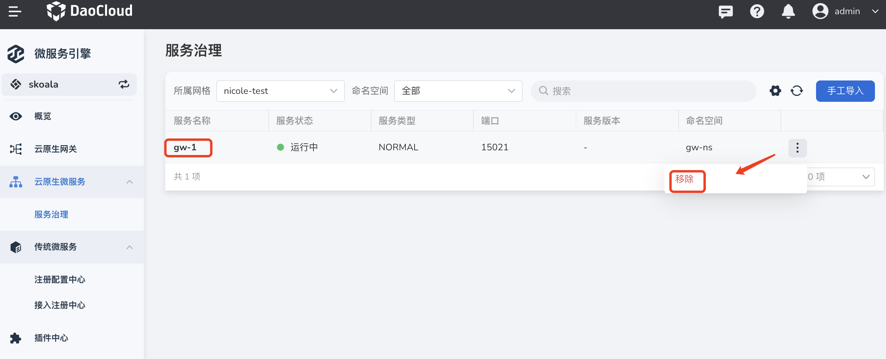
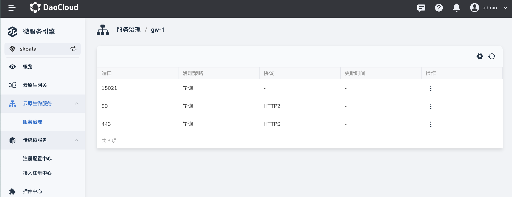

# 导入/移除服务

开始治理云原生微服务之前，首先需要将服务导入微服务引擎。目前仅支持从 [DCE 5.0 服务网格](../../mspider/intro/index.md)模块下的网格中导入服务。

## 导入服务

1. 进入`微服务引擎`模块，在左侧点击`云原生微服务`->`服务治理`，然后在右上角点击`手工导入`。

    

2. 筛选目标服务所在的服务网格和命名空间，勾选该服务，然后点击`确定`即可。

    

## 查看服务

查看已经导入的所有云原生微服务，点击服务名称进一步查看服务暴露的端口和协议。

## 移除服务

在右侧操作栏移除不需要的微服务。

