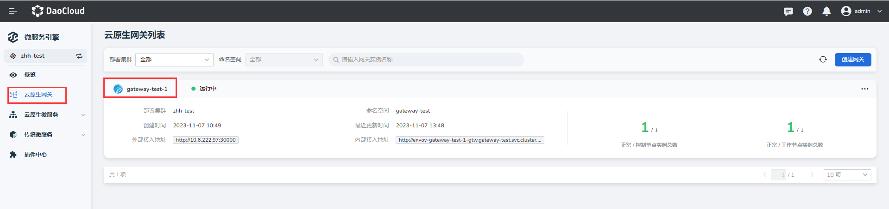
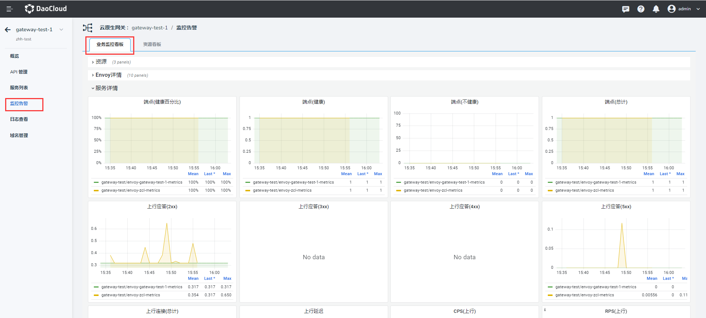
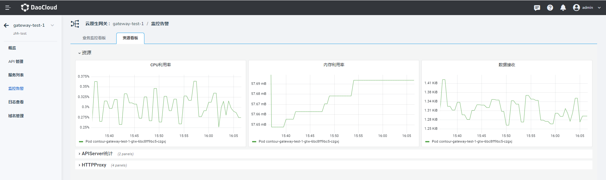

---
hide:
  - toc
---

# 监控告警

微服务网关通过内置 Grafana 看板监控网关的资源使用情况、Envoy 的监控详情、服务监控详情、APIServer、HTTPProxy 等资源的运行信息。

1. 进入微服务引擎模块，在左侧导航栏点击微服务网关，点击目标网关的名称。

## 业务监控看板

2. 在左侧导航栏点击`监控告警`，点击`业务监控看板`页签可查看业务监控信息。

<!-- | 指标              | 含义                                              |
| :---------------- | :-------------------------------- |
| CPU 利用率        | 用于监测 Kubernetes 集群中的 Pod 的 CPU 利用率。                                       |
| 内存利用率        | 用于监测 Kubernetes 集群中的 Pod 的 Memory 利用率。                                             |
| 数据接收          | 用于监测 Kubernetes 集群中的 Pod 接收的网络字节数。                                                      |
| Envoy 连接(Open)  | 用于记录与 Envoy 代理相连接的 HTTP/HTTPS 下游（即客户端）的活动连接数，这包括正在处理请求或保持打开状态的连接数。                         |
| Envoy(堆内存)     | 用于记录 Envoy 代理服务器使用的内存堆的大小，内存堆是用于动态分配内存的一部分，用于存储对象、数据结构和其他运行时数据。                   |
| Envoy(已分配内存) | 用于记录 Envoy 代理服务器当前分配的内存总量，它表示 Envoy 在运行过程中使用的实际物理内存大小。                                       |
| 监听器(Active)    | 用于记录 Envoy 代理中当前处于活动状态的监听器（Listener）的数量，监听器用于接收和处理传入的网络连接请求，它们定义了代理的网络入口点和配置。                      |
| 监听器(Warming)   | 用于记录 Envoy 代理中当前正在启动或预热中的监听器（Listener）的数量，监听器的启动和预热过程是指在监听器可以接受和处理传入的网络连接之前所需的初始化和准备阶段。     |
| 监听器(Draining)  | 用于记录 Envoy 代理中当前正在排空中的监听器（Listener）的数量，监听器的排空是指在停止接受新连接之前，等待所有现有连接关闭的过程。这通常是进行平滑升级、维护或停止代理时的一种策略，以确保已建立的连接正常结束。 |
| 下行连接(总计)    | 用于记录与 Envoy 代理相连接的 HTTP/HTTPS 下游（即客户端）的活动连接数，这包括正在处理请求或保持打开状态的连接数。         |
| 下行延迟          | 用于记录 HTTP 下游请求的处理时间分布情况，它将请求根据其处理时间分为不同的时间桶（buckets），每个时间桶表示一个时间范围的请求数量。            |
| RPS(下行)         | 用于记录 Envoy 代理接收到的 HTTP 下游请求的总数。                      |
| CPS(下行)         | 用于记录与 Envoy 代理相连的 HTTP 下游（即客户端）的连接总数。                     |
| 端点(健康百分比)  | 用于记录集群成员的健康状态百分比，集群成员通常是指代理所连接的上游服务或后端服务的实例或节点。                |
| 端点(健康)        | 用于记录集群成员的健康状态，集群成员通常是指代理所连接的上游服务或后端服务的实例或节点。           |
| 端点(不健康)      | 用于记录集群成员的不健康状态，集群成员通常是指代理所连接的上游服务或后端服务的实例或节点。                                                      |
| 端点(总计)        | 用于记录集群成员的数量，集群成员通常是指代理所连接的上游服务或后端服务的实例或节点。                                                            |
| 上行应答(2xx)     | 表示从 Envoy 代理发送到上游集群状态码为 2xx 的请求数量。                        |
| 上行应答(3xx)     | 表示从 Envoy 代理发送到上游集群状态码为 3xx 的请求数量。                        |
| 上行应答(4xx)     | 表示从 Envoy 代理发送到上游集群状态码为 4xx 的请求数量。                        |
| 上行应答(5xx)     | 表示从 Envoy 代理发送到上游集群状态码为 5xx 的请求数量。                        |
| 上行连接(总计)    | 用于记录与上游集群的当前活动连接数，活动连接是指与上游集群建立的有效连接，表示正在使用的连接数。                                                |
| 上行延迟          | 用于将上游集群请求的响应时间按照预定义的时间区间（或桶）进行分组，并记录每个时间区间内的请求数量。                                              |
| CPS(上行)         | 用于记录与上游集群建立的总连接数，它统计了与上游集群建立的所有连接，无论这些连接是活动的还是已经关闭的。                                        |
| RPS(上行)         | 记录了代理向上游集群发送的所有请求的数量，该指标可以帮助监控和度量与上游集群之间的请求流量。                                                    | -->

## 资源看板

3. 点击`资源看板`页签可查看资源监控信息。

<!-- | 指标                                                   | 含义                        |
| :----------------------------------------------------- | :------------------------- |
| CPU 利用率                                             | 用于监测 Kubernetes 集群中的 Pod 的 CPU 利用率。                                      |
| 内存利用率                                             | 用于监测 Kubernetes 集群中的 Pod 的 Memory 利用率。                                   |
| 数据接收                                               | 用于监测 Kubernetes 集群中的 Pod 接收的网络字节数。                                   |
| 已接收的 Kubernetes 对象更新总计(按操作与对象 Kind 计) | 按操作和对象类型分类的，由 Kubernetes 事件触发 Contour 产生变化的总数在时间范围内的平均值。 |
| 已接收的 Kubernetes 对象更新总计(按对象 Kind 计)       | 按对象类型分类的，由 Kubernetes 事件触发 Contour 产生变化的总数在时间范围内的平均值。       |
| HTTPProxy(总计)                                        | 用于监测 HTTPProxy 资源的数量（网关 API 数量 + 网关域名数量）。                             |
| HTTPProxy(孤儿)                                        | 用于监测是否存在孤立的 HTTPProxy 资源（状态为 orphaned 的 HTTPProxy）。                     |
| HTTPProxy(有效)                                        | 用于监测是否存在有效的 HTTPProxy 资源（状态为 valid 的 HTTPProxy）。                        |
| HTTPProxy(无效)                                        | 用于监测是否存在无效的 HTTPProxy 资源（状态为 invalid 的 HTTPProxy）。                      | -->
