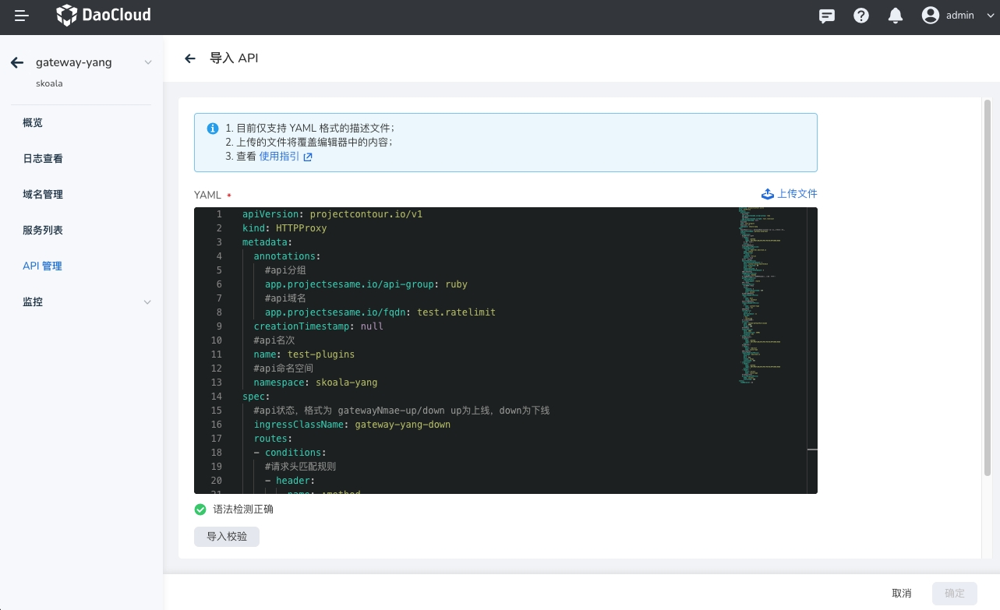

# API导入

API导入功能通常用于从外部系统或服务中获取数据并将其导入到当前应用中。以下是一个简单的API导入功能的样例说明，包括请求格式和处理逻辑。
 
在API管理中，点击“导入 API”按钮，用户可以上传或填写新的API信息，以便将其录入到系统中。


通过YAML格式的文件导入API配置。



样例如下

```yaml
apiVersion: projectcontour.io/v1
kind: HTTPProxy
metadata:
  annotations:
    #api分组
    app.projectsesame.io/api-group: ruby
    #api域名
    app.projectsesame.io/fqdn: test.ratelimit
  creationTimestamp: null
  #api名称
  name: test-plugins-1
  #api命名空间
  namespace: skoala-yang
spec:
  #api状态，格式为 gatewayNmae-up/down up为上线，down为下线
  ingressClassName: gateway-yang-down
  routes:
  - conditions:
    #请求头匹配规则
    - header:
        name: :method
        regex: GET|POST|DELETE|PUT|PATCH|OPTIONS|HEAD
      #路径开头匹配  
      prefix: /
    #cookie重写规则
    cookieRewritePolicies:
    - domainRewrite:
        value: demo-dev.daocloud.io
      name: cookie
      pathRewrite:
        value: /
      sameSite: Strict
      secure: true
    #健康检查规则  
    healthCheckPolicy:
      healthyThresholdCount: 1
      host: contour-envoy-healthcheck
      intervalSeconds: 60
      path: /test
      timeoutSeconds: 2
      unhealthyThresholdCount: 3
    #负载均衡策略  
    loadBalancerPolicy:
      strategy: Random
    #路径重写策略，路径重写仅适用于路径开头匹配  
    pathRewritePolicy:
      replacePrefix:
      - replacement: /test2
    #限流策略  
    rateLimitPolicy:
      #本地限流策略
      local:
        requests: 2
        responseStatusCode: 429
        unit: second
    #请求头重写策略    
    requestHeadersPolicy:
      set:
      - name: host
        value: testhost
    #响应头重写策略    
    responseHeadersPolicy:
      set:
      - name: content-type
        value: xxx
    #重试策略    
    retryPolicy:
      count: 1
      perTryTimeout: 1s
      retryOn:
      - 5xx
      - cancelled
    #路由的后端服务  
    services:
    - name: sesame-ba73aa79cd-sesame
      port: 8088
      weight: 100
    #超时策略  
    timeoutPolicy:
      idle: 300s
      idleConnection: 3600s
      response: 15s
  - conditions:
    #请求方法匹配
    - header:
        name: :method
        regex: GET|POST|DELETE|PUT|PATCH|OPTIONS|HEAD
      prefix: /
    #请求头匹配  
    - header:
        exact: redirect
        name: route-type
    #重定向策略    
    requestRedirectPolicy:
      hostname: daocloud.io
      path: /
      port: 443
      scheme: https
      statusCode: 301
  - conditions:
    - header:
        name: :method
        regex: GET|POST|DELETE|PUT|PATCH|OPTIONS|HEAD
      prefix: /
    - header:
        exact: direct
        name: route-type
    #直接响应策略    
    directResponsePolicy:
      body: success
      statusCode: 200
status:
  loadBalancer: {}

---


```