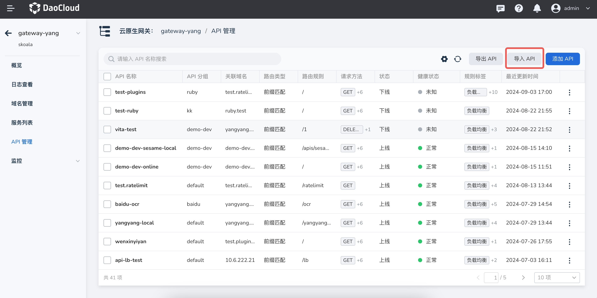

# API 导入

API 导入功能通常用于从外部系统或服务中获取数据并将其导入到当前应用中。
以下是一个简单的 API 导入功能的样例说明，包括请求格式和处理逻辑等。

依次选择 **微服务引擎** -> **云原生网关** ，点击某个正常运行的网关名称，在左侧导航栏选择 **API 管理** ，
点击右上角的 **导入 API** 按钮，您可以上传或填写新的 API 信息并将其录入到 DCE 5.0 微服务引擎中。



通过 YAML 格式的文件导入 API 配置。


YAML 样例如下：

```yaml
apiVersion: projectcontour.io/v1
kind: HTTPProxy
metadata:
  annotations:
    app.projectsesame.io/api-group: ruby # api分组
    app.projectsesame.io/fqdn: test.ratelimit # api域名
  creationTimestamp: null
  name: test-plugins-1 # api名称
  namespace: skoala-yang # api命名空间
spec:
  ingressClassName: gateway-yang-down # api状态，格式为 gatewayNmae-up/down，up为上线，down为下线
  routes:
    - conditions:
        - header: # 请求头匹配规则
            name: :method
            regex: GET|POST|DELETE|PUT|PATCH|OPTIONS|HEAD
          prefix: / # 路径开头匹配
      cookieRewritePolicies: # cookie重写规则
        - domainRewrite:
            value: demo-dev.daocloud.io
          name: cookie
          pathRewrite:
            value: /
          sameSite: Strict
          secure: true
      healthCheckPolicy: # 健康检查规则
        healthyThresholdCount: 1
        host: contour-envoy-healthcheck
        intervalSeconds: 60
        path: /test
        timeoutSeconds: 2
        unhealthyThresholdCount: 3
      loadBalancerPolicy: # 负载均衡策略
        strategy: Random
      pathRewritePolicy: # 路径重写策略，路径重写仅适用于路径开头匹配
        replacePrefix:
          - replacement: /test2
      rateLimitPolicy: # 限流策略
        local: # 本地限流策略
          requests: 2
          responseStatusCode: 429
          unit: second
      requestHeadersPolicy: # 请求头重写策略
        set:
          - name: host
            value: testhost
      responseHeadersPolicy: # 响应头重写策略
        set:
          - name: content-type
            value: xxx
      retryPolicy: # 重试策略
        count: 1
        perTryTimeout: 1s
        retryOn:
          - 5xx
          - cancelled
      services: # 路由的后端服务
        - name: sesame-ba73aa79cd-sesame
          port: 8088
          weight: 100
      timeoutPolicy: # 超时策略
        idle: 300s
        idleConnection: 3600s
        response: 15s
    - conditions:
        - header: # 请求方法匹配
            name: :method
            regex: GET|POST|DELETE|PUT|PATCH|OPTIONS|HEAD
          prefix: /
        - header: # 请求头匹配
            exact: redirect
            name: route-type
      requestRedirectPolicy: # 重定向策略
        hostname: daocloud.io
        path: /
        port: 443
        scheme: https
        statusCode: 301
    - conditions:
        - header:
            name: :method
            regex: GET|POST|DELETE|PUT|PATCH|OPTIONS|HEAD
          prefix: /
        - header:
            exact: direct
            name: route-type
      directResponsePolicy: # 直接响应策略
        body: success
        statusCode: 200
status:
  loadBalancer: {}
```
