# API 策略配置

DCE 5.0 微服务网关支持九种 API 策略：负载均衡、路径改写、超时配置、重试机制、请求头重写、响应头重写、Websocket、本地限流、健康检查。可以单独使用某一种策略，也可以组合使用多种策略达到最佳实践。<!--有关 API 策略的组合配置，参考[API 策略配置最佳实践]()-->

有两种方式可以配置 API 策略：

- 在创建 API 的过程中设置策略，参考[添加 API](manage-api.md#api_1)。
- 在 API 创建完成后通过[更新 API 策略配置](manage-api.md#api_2)进行调整。

**每一项策略的配置说明如下**:

**视频教程**：[API 策略的高级配置](../../../videos/skoala.md#api-策略的高级配置1)

## 负载均衡

当 API 的目标后端服务为多实例服务时，可以通过负载均衡策略控制流量分发，根据业务场景调整不同服务的实例接收到的流量。

- 随机
  
    默认的负载均衡策略。选择随机规则时，网关会将请求随机分发给后端服务的任意实例。在流量较小时，部分后端服务可能会负载较多。效果参考下图：

    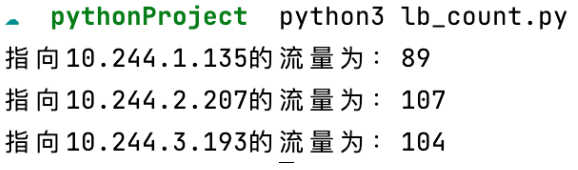

- 轮询
  
    向后端服务的所有实例轮流分发请求，各个服务实例接收到的请求数基本相近。此规则可以在流量较小时保障流量的平均分配。效果参考下图：

    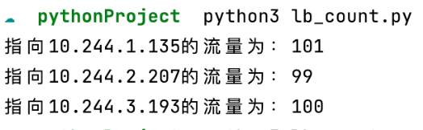

- 权重
  
    根据 API 目标后端服务的权重分发流量，权重数值越大，优先级越高，承担的流量也相对较多。服务权重的配置入口见下图：

    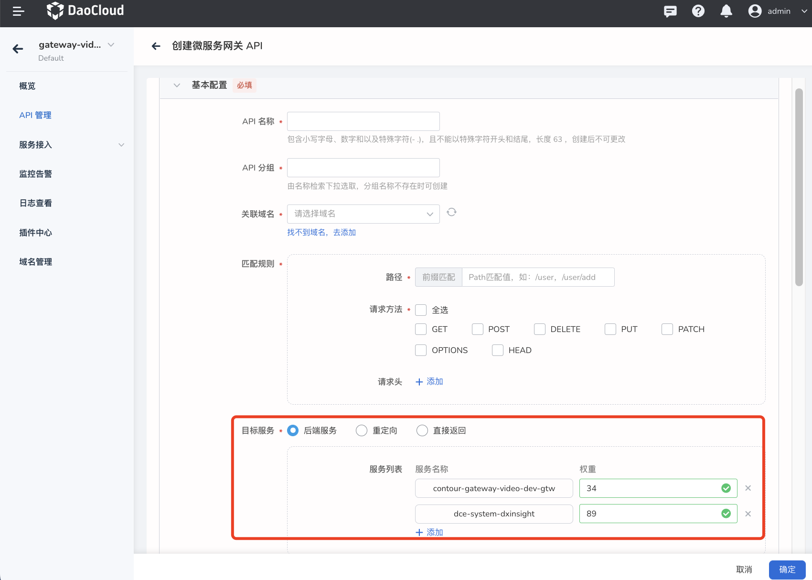

- Cookie
  
    将来源请求头中属于相同 Cookie 的流量分发到固定的后端服务实例，前提是后端服务能够根据 Cookie 做出不同的响应处理。

- 请求 Hash
  
    选择请求 Hash 时，可以通过一些高级策略来进负载均衡分配。当前支持的 Hash 策略为：IP、请求参数。

    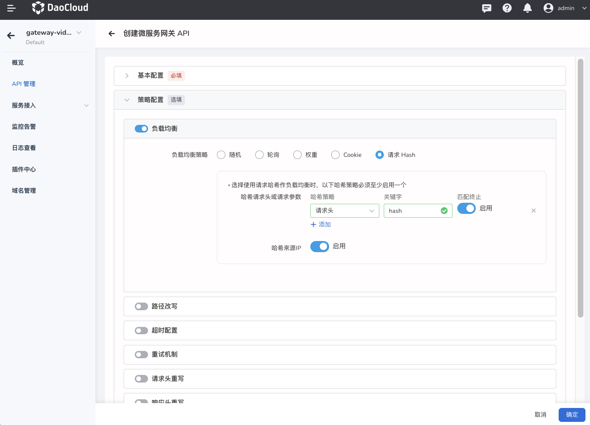

## 路径改写

如果对外暴露的 API 路径与后端服务提供的路径不一致，可以改写 API 路径使其与后端服务的路径一致，确保服务的正常访问。
启用路径改写后，网关会将外部请求流量转发到重写后的路径。

注意：**需要确保重写的路径是真实存在的，并且路径正确，以 “/” 开头**。

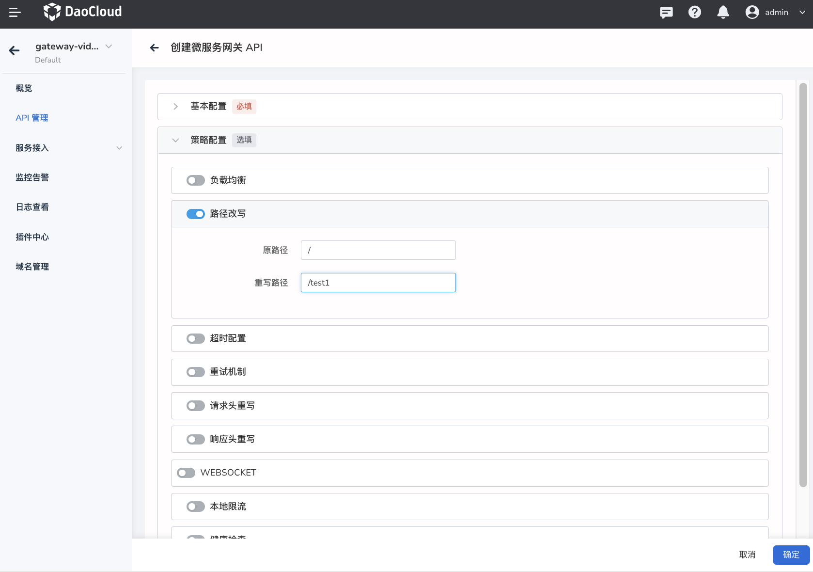

## 超时配置

设置请求响应的最大时长，如果超出所设置的最大时长，则直接请求失败。超时时长支持数值类型为 >=1 的整数值，时间单位为“秒（s）”。

超时配置默认处于关闭状态，开启后必须配置超时时长。开启超时配置有助于减少异常处理导致的阻塞问题。

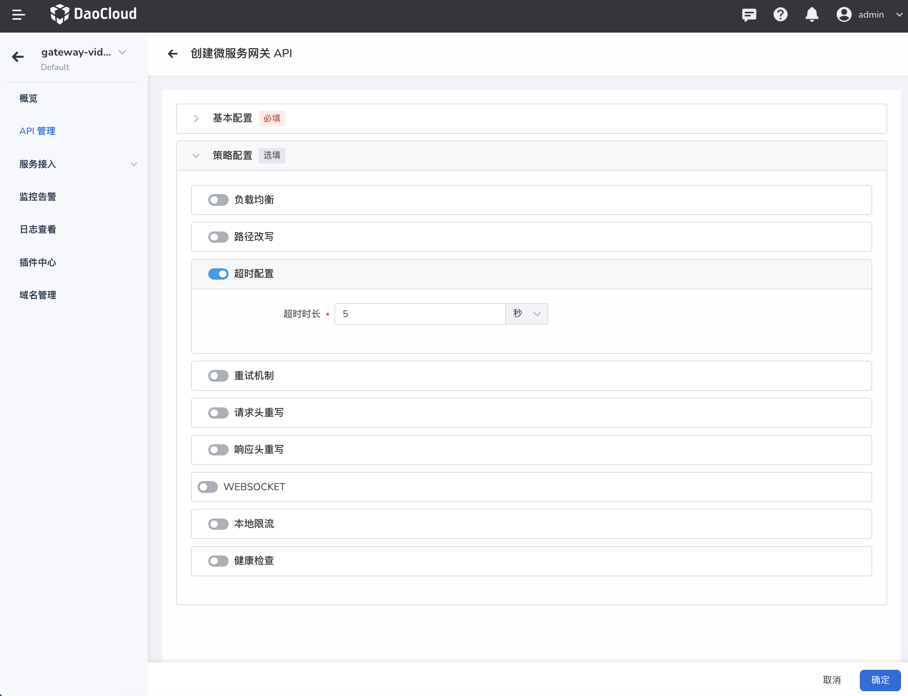

## 重试机制

微服务网关的 API 支持配置非常丰富的重试机制。启用重试机制后，网关会在请求失败时自动重新尝试访问。达到重试超时时间之后自动触发再次重试，当重试次数达到配置的最大重试次数时停止重试。重试机制默认处于关闭状态，开启后必须配置重试次数和重试超时时长。

支持通过自定义配置选择不同的重试条件，自定义重试状态码等。

### HTTP 重试

- 5XX 响应错误：后端服务响应 HTTP status_code 大于 500 时进行重试。
- 网关错误：当响应结果为网关错误提示时，自动进行重试。
- 请求重置：当响应结果为请求重置消息时，自动进行重试。
- 连接失败：当响应结果为网络连接失败的返回时，自动进行重试。
- 拒绝流：当响应结果为后端服务将请求标记为拒绝处理时，自动进行重试。
- 指定状态码：当后端服务响应 HTTP status_code 为特定状态码时自动进行重试，支持配置特定的状态码。

### GRPC 重试

- 请求被取消：当响应结果为GRPC 请求被后端服务取消时自动进行重试。
- 响应超时： 当后端服务响应超时，自动进行重试。
- 服务内部错误：当响应结果为服务内部错误时，自动进行重试。
- 资源不足：当响应结果为资源不足时，自动进行重试。
- 服务不可用时：当响应结果为后端不可用时，自动进行重试。

    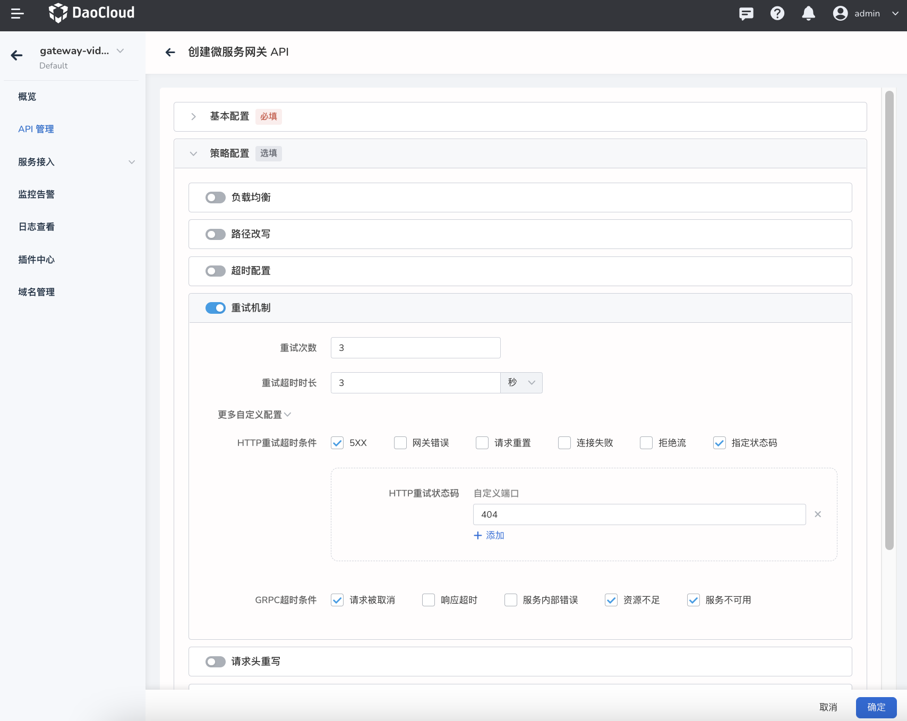

## 请求头/响应头改写

支持添加、修改、删除请求头和响应头及其对应的值。
  
- 增加请求头/响应头：使用`设置`动作，填写新的关键字和新值。
- 修改请求头/响应头：使用`设置`动作，填写已有的关键字并赋予新值。
- 移除请求头/响应头，使用`移除`动作，只填写需要移除的关键字即可，无需填写对应的值。

    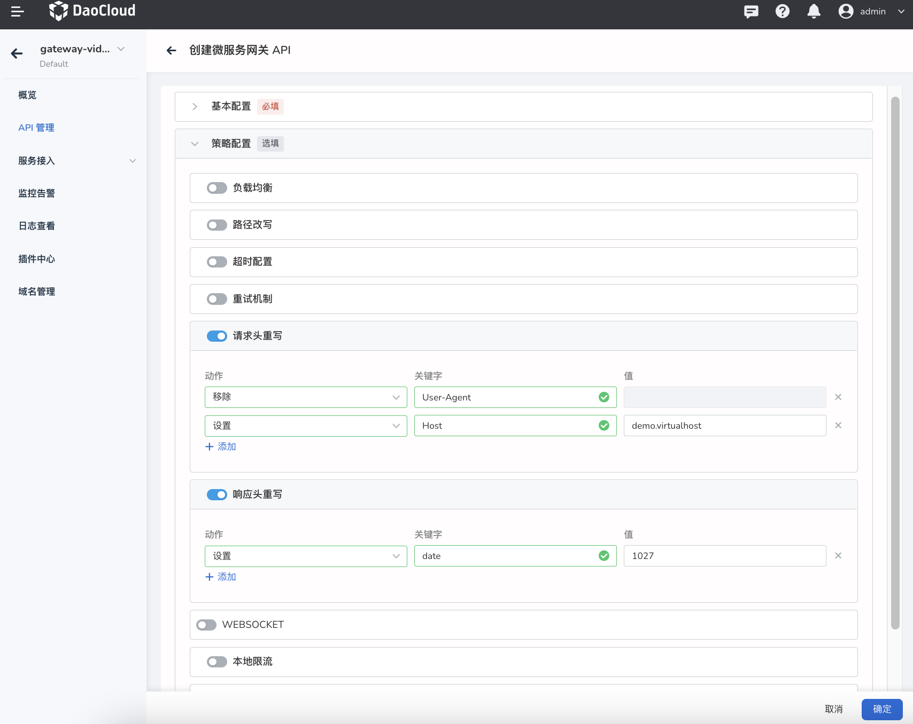

## Websocket

WebSocket 是一种在单个 TCP 连接上进行全双工通信的协议。WebSocket 使得客户端和服务器之间的数据交换变得更加简单，允许服务端主动向客户端推送数据。在 WebSocket API 中，浏览器和服务器只需要完成一次握手，两者之间就直接可以创建持久性的连接，并进行双向数据传输。

启用 Websocket 之后支持通过 Websocket 协议访问 API 的后端服务。

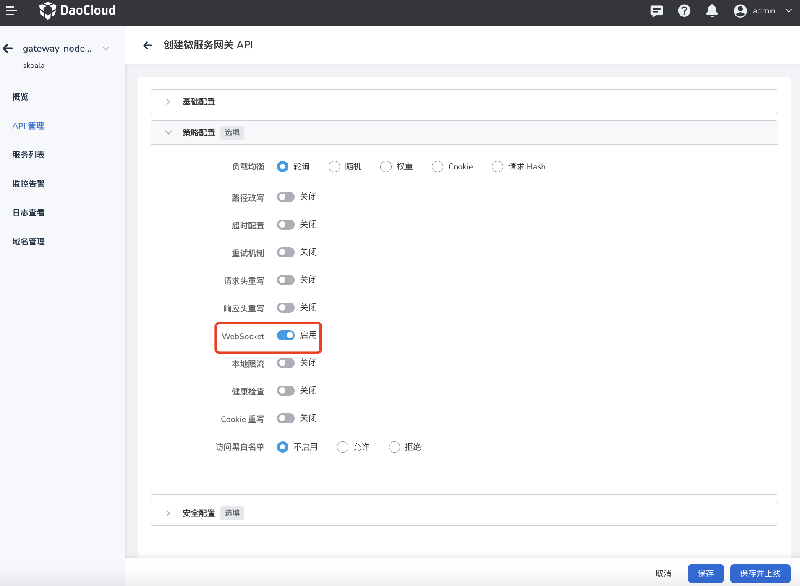

## 本地限流

微服务网关支持丰富的限流能力，支持在 API 层级启用本地限流能力

- 请求速率：时间窗口（秒/分/时）内允许的最大请求速率，例如每分钟最多允许 3 次请求。支持输入 >=1 的整数。
- 允许溢出速率：达到预设的请求速率时，仍旧允许额外处理一部分请求，适用于业务突增的流量高峰时段。支持输入 >=1 的整数。
- 限制返回码：默认返回码为 429，表示请求次数过多。可参考 envoy 官方文档了解[本地限流支持的状态码](https://github.com/envoyproxy/envoy/blob/v1.23.1/api/envoy/type/v3/http_status.proto#L137)。
- Header 关键字：默认为空，可根据需求自行设置。

    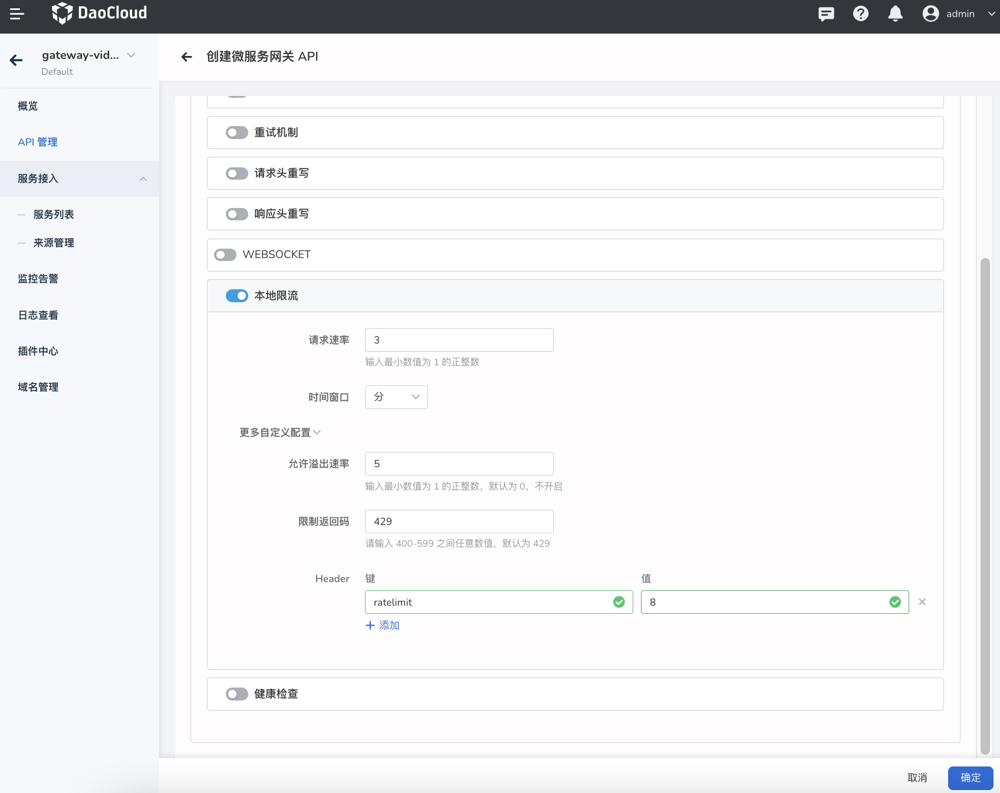

!!! info

    除了在 API 层级的本地限流能力之外，还可以通过[域名管理](../domain/manage-domain.md)针对整个域名进行限流处理。当 API 与域名同时配置限流策略时，以 API 层级的限流策略为准。

## 健康检查

通过设置健康检查地址，可以有效保证当后端服务异常时，网关自动进行负载均衡调整。对不健康的后端服务进行标记，停止向该服务分发流量。当后端服务恢复并通过设定的健康检查条件后，自动恢复流量分发。

- 健康检查路径：以 “/” 开头，并且全部后端服务的所有实例都应提供相同的健康检查接口。
- 特定健康检查主机：配置主机地址后，仅对该主机进行健康检查。
- 检查超时时间：健康检查超过配置时长时，标记健康检查失败。
标记健康/不健康检查次数：连续 N 次检查服务实例，每次的状态都为健康/不健康时才将服务标记为健康/不健康。
- 检查时间间隔：每次健康检查的时间间隔，时间单位为“秒”，例如每隔 10 秒进行一次健康检查。
- 检查超时时间：健康检查的最大超时时长，当健康检查超过配置的时长时，直接标记健康检查失败。
- 标记健康检查次数：连续检查 N 次并且每次结果都是健康时，才将服务实例标记为健康状态；当服务实例被标记为健康状态后，请求流量将会自动分发到该服务实例。
- 标记不健康检查次数：连续检查 N 次并且每次结果都是不健康时，就将服务实例标记为不健康状态，当服务实例被标记为不健康时，停止向该实例分发请求流量。

    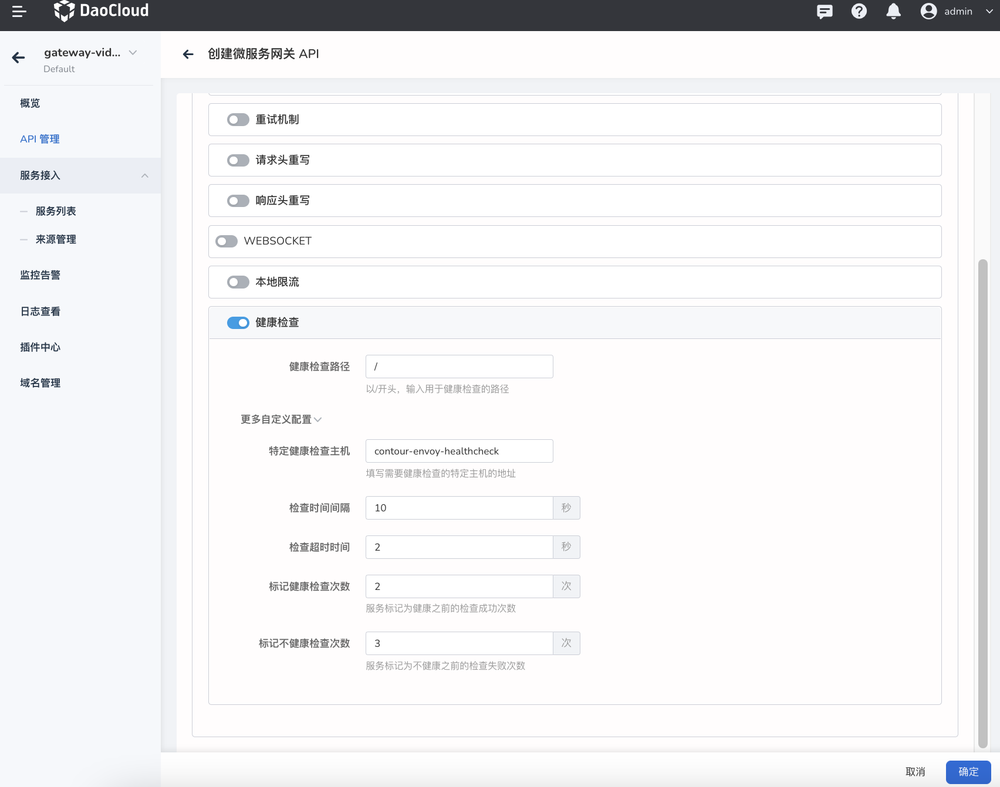