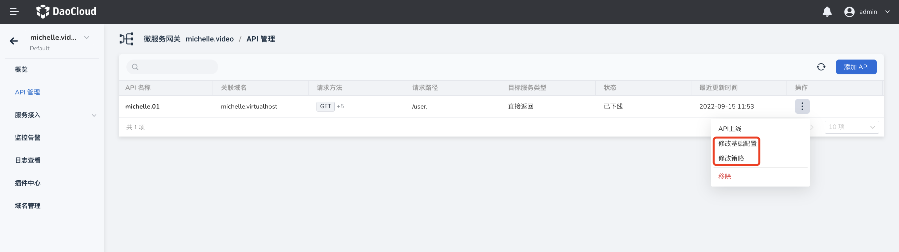
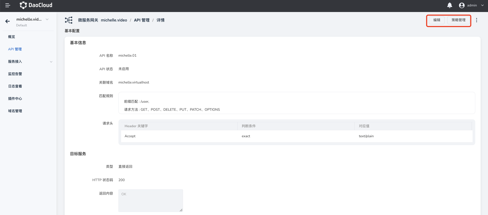

# 管理 API

微服务网关支持对网关实例的 API 进行全生命周期管理，包括 API 的添加、更新和删除。本页介绍如何更新 API。

## 更新 API

可以通过两种方式更新 API 的基础配置和策略配置。

- 在 `API 管理`页面找到需要更新的 API，在该 API 的右侧点击 **`ⵗ`** 选择`修改基础配置`或`修改策略`。

    

- 点击 API 名称进入 API 详情页，在页面右上角点击`编辑`更新基本信息，点击`策略管理`更新策略。

    
