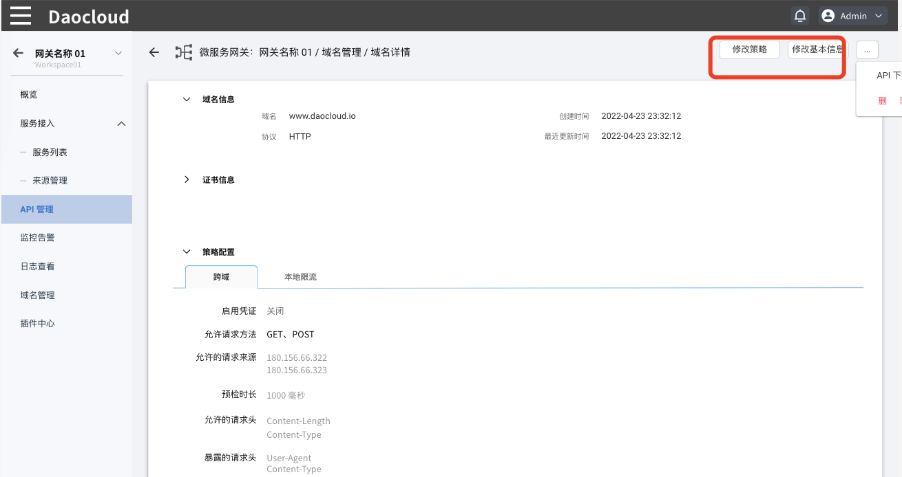
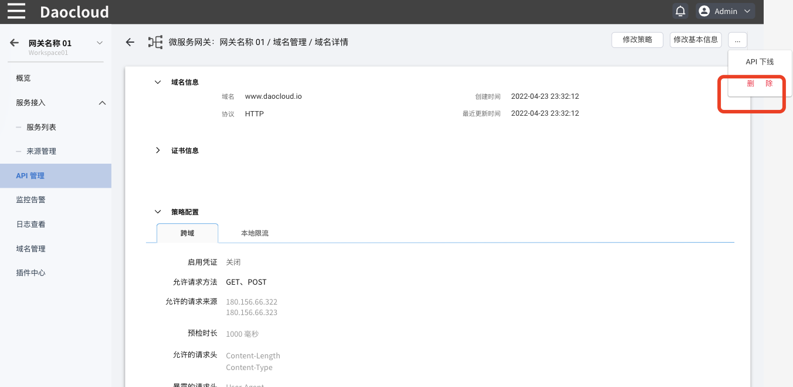
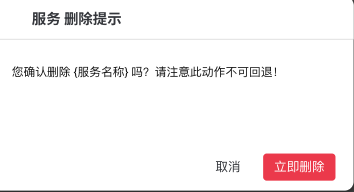

# 域名管理

微服务网关支持对统一托管的域名进行全生命周期管理，包括域名的添加、更新和移除。通过域名管理，可以将一个域名应用到网关内的多个 API，并拥有域名层级的策略配置能力。

## 添加域名

创建域名的步骤如下：

1. 点击网关名称，在左侧导航栏点击`域名管理`，然后在页面右上角点击`添加域名`。

    

2. 填写配置信息

    - 域名： 域名创建后不可以修改。
    - 协议： 默认选择 HTTP。如果选择 HTTPS，需要提供对应的 HTTPS 证书。

    !!! note

        目前仅支持 HTTPS，HTTPS 正在规划中。

    
    <!--
    - 仅 HTTPS: 启用后，网关会拒绝此域名的 HTTP 请求
    - 策略配置：参考[配置域名策略](domain-policy.md)
    -->

3. 在页面右下角点击`确认`

    点击`确认`后，将自动跳转到`域名管理`页面，可以在域名列表中看到刚才新建的域名。

    

## 修改域名

添加域名后，可以修改域名的访问协议和域名策略。

在 `域名管理`页面找到需要更新的域名，在该域名右侧点击 **`ⵗ`** 并选择`编辑`。

<!--### 修改域名策略配置

在 `域名管理`页面找到需要更新的域名，在该域名的右侧 **`ⵈ`** 操作按钮下选择`域名配置`。有关域名策略配置的详细说明，可参考 [配置域名策略](../api/api-policy.md)。

此外，也可以在域名详情页点击`修改基本信息`更新域名基本信息，点击`修改策略`更新域名的策略。

-->
## 删除域名

!!! warning

    正在被 API 使用的域名无法删除，域名删除后无法恢复。

<!--有两种方式可以删除域名：-->

在 `域名管理`页面找到需要删除的域名，在该域名右侧点击 **`ⵗ`** 并选择`移除`。

<!--- 在 `域名管理`页点击需要删除的域名的名称，进入该域名的详情页，在页面右上角点击 **`ⵈ`** 操作按钮然后选择`删除`，

    

点击删除后，在弹框中选择立即删除。

-->
