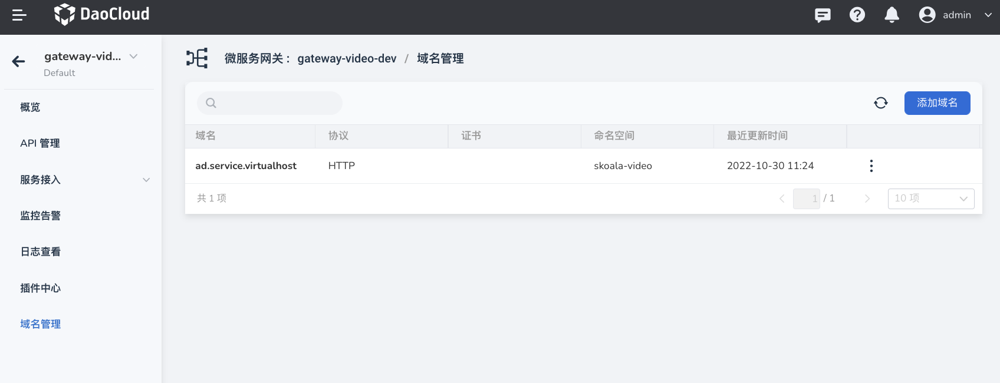
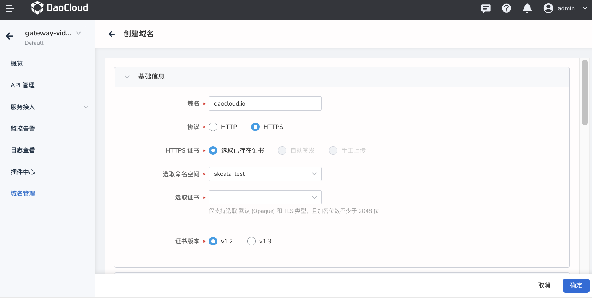
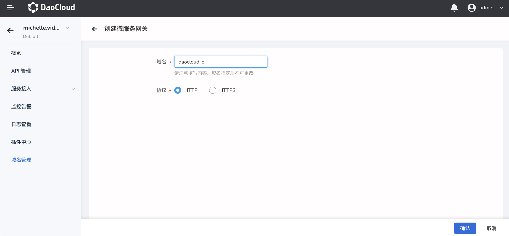
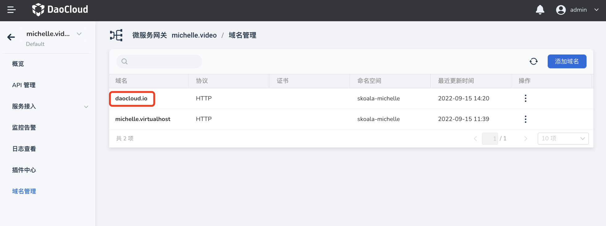
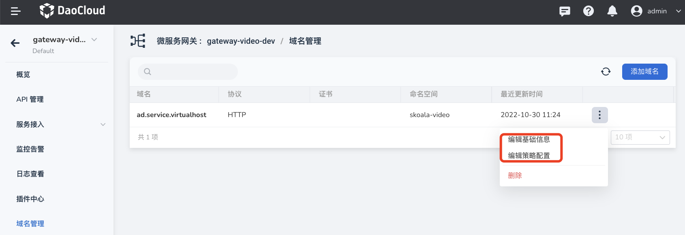
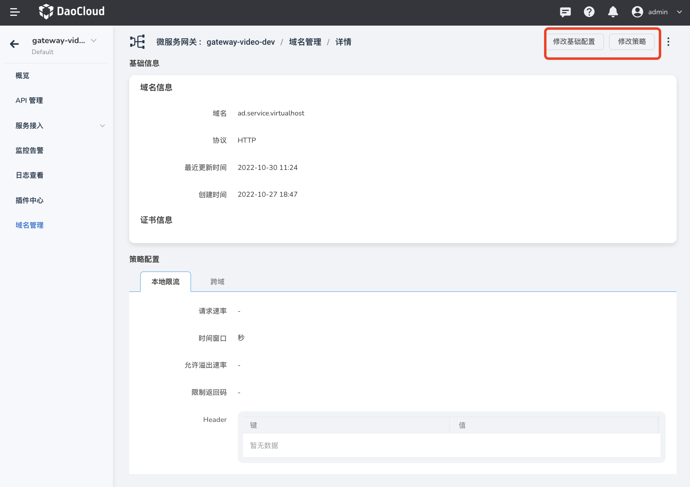
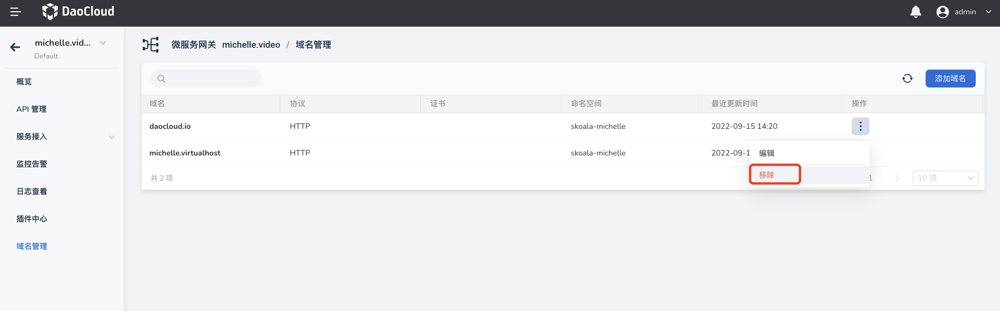
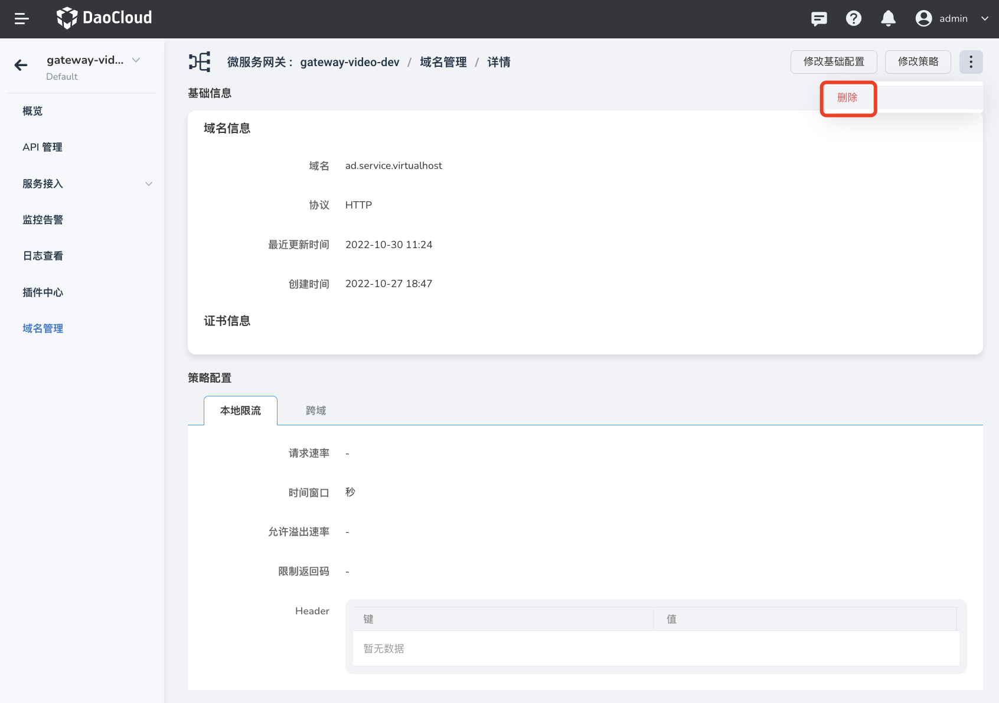
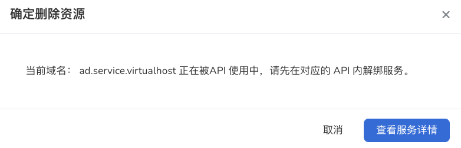

# 域名管理

微服务网关支持对统一托管的域名进行全生命周期管理，包括添加、更新、删除域名域名。通过域名管理，可以将一个域名应用到网关内的多个 API，并且可以配置域名层级的网关策略。

## 添加域名

添加域名的步骤如下：

1. 点击目标网关的名称进入网关概览页面，然后在左侧导航栏点击`域名管理`，在页面右上角点击`添加域名`。

    

2. 填写配置信息

    域名的配置信息分为`基础信息`（必填）和`策略配置`（可选）两部分。

    - 域名：域名创建后不可以修改。
    - 协议：默认选择 HTTP。如果选择 HTTPS，需要提供对应的 HTTPS 证书。

        > 目前仅支持选取已经存在的证书，自动签发证书和手动上传证书功能正在开发。

        

    - 本地限流：参考[本地限流](../api/api-policy.md#_6)
    - 跨域：参考[跨域](domain-policy.md#_2)

        

    <!--
    - 仅 HTTPS: 启用后，网关会拒绝此域名的 HTTP 请求
    - 策略配置：参考[配置域名策略](domain-policy.md)
    -->

3. 在页面右下角点击`确定`

    点击`确定`后，将自动跳转到`域名管理`页面，可以在域名列表中看到刚才新建的域名。

    

## 修改域名

可以通过两种方式修改域名的基础信息和策略配置。

- 在 `域名管理`页面找到需要更新的域名，在右侧点击 **`ⵗ`** 选择`编辑基础信息`或`编辑策略配置`。

    

- 点击域名名称进入域名详情页，在页面右上角点击`修改基础配置`更新基本信息，点击`修改策略`更新策略。

    

## 删除域名

!!! danger

    - 正在被 API 使用的域名无法删除，需要先删除相关的 API 然后才能删除域名。
    - 域名删除后无法恢复。

可以通过两种方式删除域名。

- 在`域名管理`页面找到需要删除的域名，在点击 **`ⵗ`** 并选择`删除`。

    

- 点击域名名称进入域名的详情页，在页面右上角点击 **`ⵗ`** 操并选择`删除`。

    

    如果域名正在被某个 API 使用，需要页面提示点击`查看服务详情`去删除对应的 API。<!--待ui更新后更新描述-->

    
