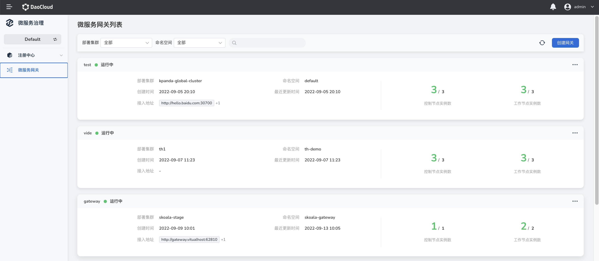
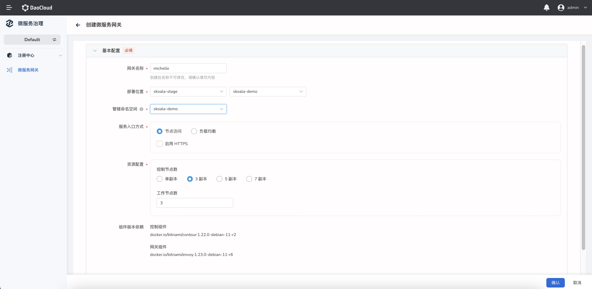
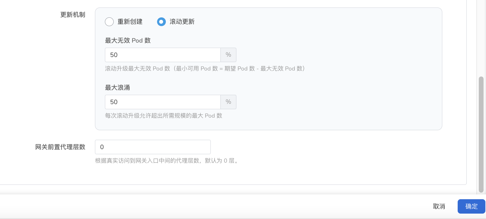
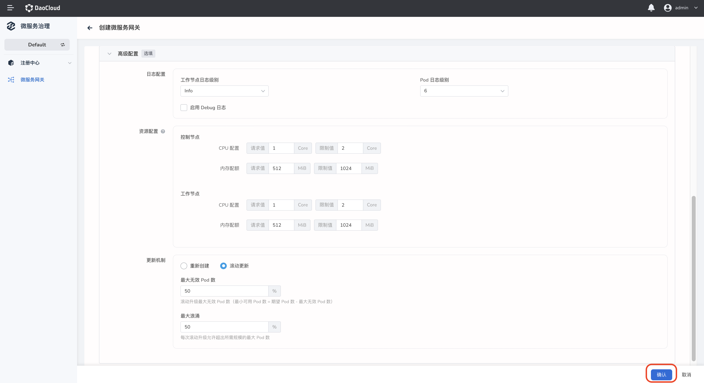

---
hide:
  - toc
---

# 创建微服务网关

微服务网关支持多租户实例的高可用架构，兼容多种模式微服务的统一网关接入能力。本页介绍如何创建微服务网关实例。

创建微服务网关的步骤如下：

1. 在左侧导航栏点击`微服务网关`，在`微服务网关列表`页的右上角点击`创建网关`，进入微服务网关的创建页面。

    

2. 参考以下说明填写基本配置（必填）

    - 网关名称：长度不超过 63 个字符，支持字母、数字、下划线。名称在网关创建完成后不可更改。
    - 部署集群：选择将网关部署在哪个集群。

        > 如果可选列表中没有出现目标集群，可以去容器管理模块中[接入](../../../kpanda/user-guide/clusters/integrate-cluster.md)或[创建](../../../kpanda/user-guide/clusters/create-cluster.md)集群并通过全局管理模块将该[集群或集群下的命名空间绑定到当前工作空间](../../../ghippo/user-guide/workspace/quota/#_4)。

    - 命名空间（部署）：选择将网关部署在哪个命名空间。一个命名空间中只能部署一个网关。
    - 命名空间（管辖）：设置新建的网关可以管辖哪些命名空间。默认管辖网关所在的命名空间。支持同时管辖多个命名空间。同一个命名空间不能被两个网关同时管辖。

        

    - 服务入口方式：

        - 集群内访问：只能在同一集群内部访问服务

            

        - 节点端口：通过节点的 IP 和静态端口访问服务，支持从集群外部访问服务

            

        - 负载均衡器：使用云服务提供商的负载均衡器使得服务可以公开访问

            - 外部流量策略：`Cluster` 指流量可以转发到集群中其他节点上的 Pod；`Local`指流量只能转发到本节点上的 Pod
            - 负载均衡类型：MetalLB 或其他。其他指
            - MetalLB IP 池：支持自动选择或指定 IP 池子
            - 负载均衡器 IP 地址：支持自动选择或指定 IP

                

    - 资源配置：为当前网关配置多少控制节点和工作节点。单副本存在不稳定性，需谨慎选择
    - 组件版本依赖：展示创建网关需要依赖的组件，不可编辑

        

3. 参考以下说明填写高级配置（选填）

    - 日志配置：设置工作节点 （envoy）的日志级别和 Pod 的日志级别
    - 资源配置：为控制节点和工作节点配置 CPU 和内存资源

       

    - 更新机制：`重新创建`指删除原来的网关并新建一个网关，`滚动更新`指不删除网关，而是滚动式地更新网关相关的 Pod
    - 网关前置代理层数：请求从客户端到网关中途需要经过几个代理端点。需要根据实际情况填写。例如`客户端-Nginx-网关`的代理层数为 1，因为中间只经过 1 个 Nginx 代理端点。

        

4. 在页面右下角点击`确认`后返回微服务网关列表页面，在右侧可以执行[更新网关](update-gateway.md)或[删除网关](delete-gateway.md)的操作。

    
