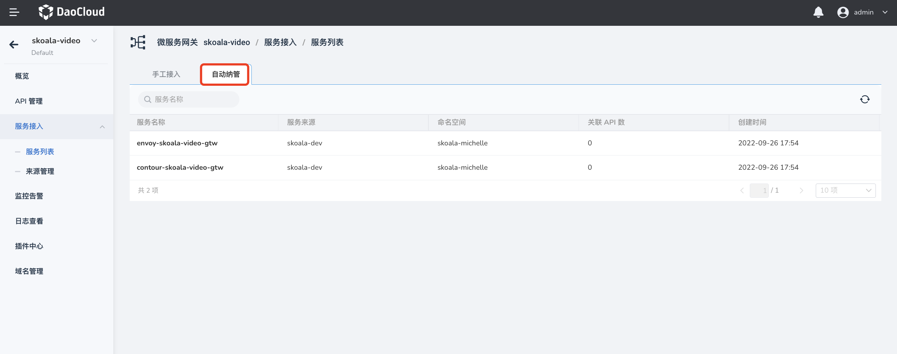

# 服务接入

添加成功的服务会出现在服务列表页面，添加 API 时也可以选择列表中的服务作为目标后端服务。微服务网关支持通过手动接入和自动纳管两种方式添加服务。本页介绍如何自动纳管服务。

[网关实例创建](../gateway/create-gateway.md)成功之后，该实例所在集群中的服务会被自动添加到该实例的服务列表中，无需手动添加。

## 查看

在`服务列表`页面点击`自动纳管`，无需任何手动操作，即可查看网关自动发现并纳管的云原生微服务。

