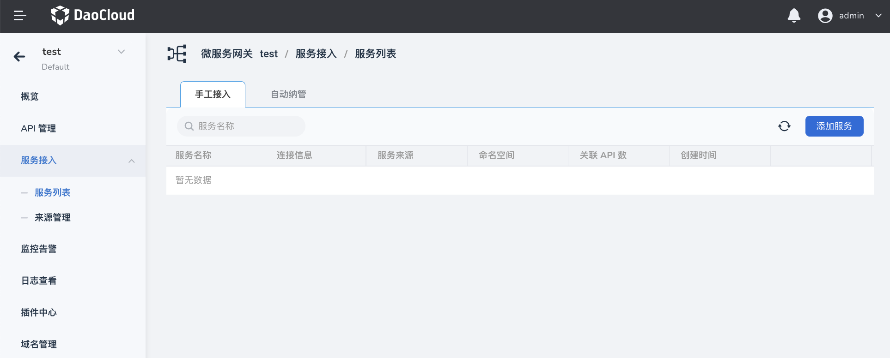
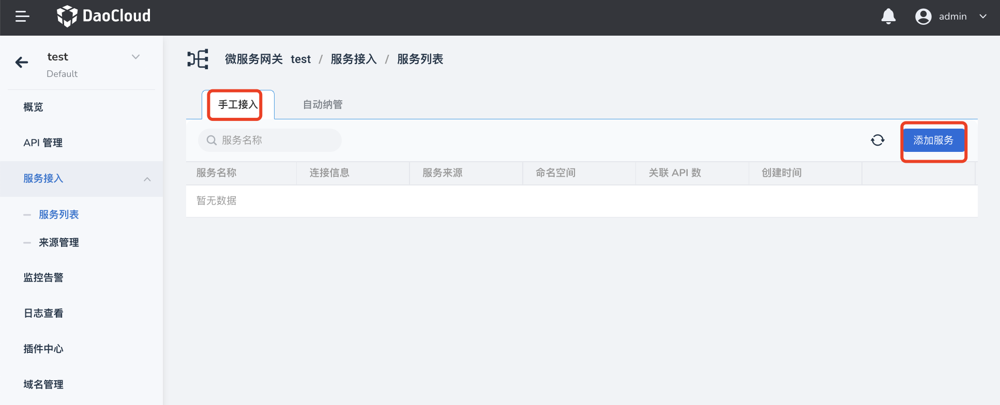
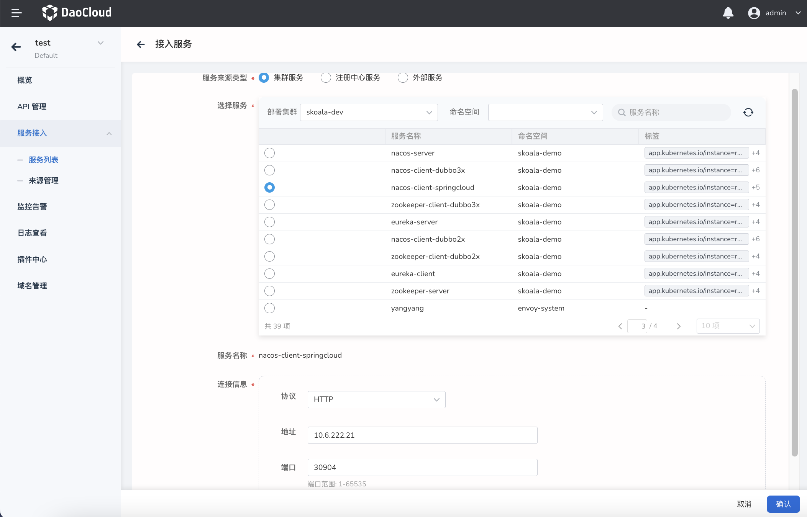

# 手动接入服务

添加成功的服务会出现在服务列表页面，添加 API 时也可以选择列表中的服务作为目标后端服务。微服务网关支持通过手动接入和自动发现两种方式添加服务。本页介绍如何手动接入服务。

1. 在`微服务网关列表`页面点击网关名称，进入网关详情页后，在左侧导航栏点击`服务接入`-->`服务列表`。

    

2. 在`服务列表`页面点击`手工接入`-->`添加服务`。

    

3. 选择服务来源，配置服务连接信息。

    

4. 在页面右下角点击`确认`。

## 更新服务

在`服务列表`页面找到需要更新的服务，在服务右侧点击 `ⵗ`，选择`更新`

## 删除服务

在`服务列表`页面找到需要更新的服务，在服务右侧点击 `ⵗ`，选择`删除`

!!! note

    删除服务之前，需要确保没有 API 正在使用该服务。

