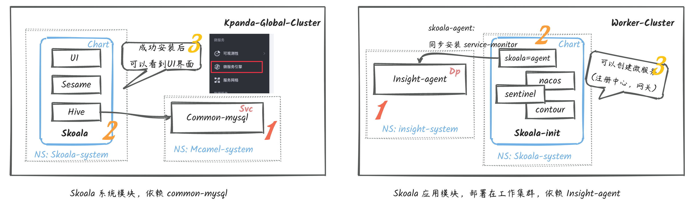

# 安装微服务引擎

## 前言

本教程旨在补充需要手工安装和升级的方式。

优先通过安装器进行安装 [https://docs.daocloud.io/install/intro/](https://docs.daocloud.io/install/intro/) ，请以官方教程文档为准。

### 安装器 v0.3.28 及之前

默认安装不支持；在安装规划时，可以修改  mainfest.yaml  开启 Skoala 自动安装

```bash
./dce5-installer install-app -m /sample/manifest.yaml
```

### 安装器 v0.3.29

支持默认安装 Skoala；但仍旧建议检查  mainfest.yaml，确保 Skoala 会被安装器安装。

enable 需要为 true，需要指定对应的 helmVersion：

```yaml
...
components:
  skoala:
    enable: true
    helmVersion: v0.12.2
    variables:
...
```

重要的话：默认安装器版本携带的是当时最新经过测试的版本；如无特殊情况，不建议更新默认的 helm 安装版本。

## 安装前检测

### Skoala 部署结构



### 检测 skoala 安装情况

查看 命名空间为 skoala-system 的之中是否有以下对应的资源，如果没有任何资源，说明 Skoala 的确没有安装。

```bash
~ kubectl -n skoala-system get pods
NAME                                   READY   STATUS    RESTARTS        AGE
hive-8548cd9b59-948j2                  2/2     Running   2 (3h48m ago)   3h48m
sesame-5955c878c6-jz8cd                2/2     Running   0               3h48m
ui-7c9f5b7b67-9rpzc                    2/2     Running   0               3h48m
 
~ helm -n skoala-system list
NAME        NAMESPACE       REVISION    UPDATED                                 STATUS      CHART               APP VERSION
skoala      skoala-system   3           2022-12-16 11:17:35.187799553 +0800 CST deployed    skoala-0.13.0       0.13.0
```

### 依赖 common-mysql 的安装情况

skoala 在安装时需要用到 mysql 来存储配置，所以必须要保证数据库存在；另外查看下 common-mysql 是否有 skoala 这个数据库。

```bash
~ kubectl -n mcamel-system get statefulset
NAME                                          READY   AGE
mcamel-common-mysql-cluster-mysql             2/2     7d23h
```

建议给到 skoala 用到的数据库信息如下：

- host: mcamel-common-mysql-cluster-mysql-master.mcamel-system.svc.cluster.local
- port: 3306
- database : skoala
- user: skoala
- password:

### 关于 insight-agent

Skoala 所有的监控的信息，需要依赖 Insight 的能力，则需要在集群中安装对应的 insight-agent；


对 Skoala 的影响：

- 如果 skoala-init 安装时未先安装 insight-agent，不会安装 service-monitor
- 如果需要安装 service-monitor，请先安装 insight-agent，再安装 skoala-init。

## 安装过程

### 初始化 数据库表

如果在 common-mysql 内的 skoala 数据库为空，请登录到 skoala 数据库后，执行以下 SQL：

```sql
CREATE TABLE `registry` (
`id` bigint(20) unsigned NOT NULL AUTO_INCREMENT,
`uid` varchar(32) DEFAULT NULL,
`name` varchar(50) NOT NULL,
`type` varchar(50) NOT NULL,
`addresses` varchar(1000) NOT NULL,
`namespaces` varchar(2000) NOT NULL,
`deleted_at` timestamp NULL COMMENT 'Time deteled',
`created_at` timestamp NOT NULL DEFAULT current_timestamp(),
`updated_at` timestamp NOT NULL DEFAULT current_timestamp() ON UPDATE current_timestamp(),
PRIMARY KEY (`id`),
UNIQUE KEY `idx_uid` (`uid`),
UNIQUE KEY `idx_name` (`name`)
) ENGINE=InnoDB AUTO_INCREMENT=1 DEFAULT CHARSET=utf8mb4;
 
CREATE TABLE `book` (
`id` bigint(20) unsigned NOT NULL AUTO_INCREMENT,
`uid` varchar(32) DEFAULT NULL,
`name` varchar(50) NOT NULL,
`author` varchar(32) NOT NULL,
`status` int(1) DEFAULT 1 COMMENT '0:下架，1:上架',
`isPublished` tinyint(1) unsigned NOT NULL DEFAULT 1 COMMENT '0: unpublished, 1: published',
`publishedAt` timestamp NULL DEFAULT NULL COMMENT '出版时间',
`deleted_at` timestamp NULL COMMENT 'Time deteled',
`createdAt` timestamp NOT NULL DEFAULT current_timestamp(),
`updatedAt` timestamp NOT NULL DEFAULT current_timestamp() ON UPDATE current_timestamp(),
PRIMARY KEY (`id`),
UNIQUE KEY `idx_uid` (`uid`),
UNIQUE KEY `idx_name` (`name`)
) ENGINE=InnoDB AUTO_INCREMENT=1 DEFAULT CHARSET=utf8mb4;
 
CREATE TABLE `api` (
`id` bigint(20) unsigned NOT NULL AUTO_INCREMENT,
`is_hosted` tinyint DEFAULT 0,
`registry` varchar(50) NOT NULL,
`service_name` varchar(200) NOT NULL,
`nacos_namespace` varchar(200) NOT NULL COMMENT 'Nacos namespace id',
`nacos_group_name` varchar(200) NOT NULL,
`data_type` varchar(100) NOT NULL COMMENT 'JSON or YAML.',
`detail` mediumtext NOT NULL,
`deleted_at` timestamp NULL COMMENT 'Time deteled',
`created_at` timestamp NOT NULL DEFAULT current_timestamp(),
`updated_at` timestamp NOT NULL DEFAULT current_timestamp() ON UPDATE current_timestamp(),
PRIMARY KEY (`id`),
UNIQUE KEY `idx_registry_and_service_name` (`registry`, `service_name`)
) ENGINE=InnoDB AUTO_INCREMENT=1 DEFAULT CHARSET=utf8mb4;
 
INSERT INTO `book` VALUES (1,'book-init','MicroService Pattern','daocloud',1,1,'2022-03-23 13:50:00',null,now(),now());
 
alter table registry add is_hosted tinyint default 0 not null after namespaces;
alter table registry add workspace_id varchar(50) not null DEFAULT 'default' after uid;
alter table registry add ext_id varchar(50) null after workspace_id;
 
drop index idx_name on registry;
create unique index idx_name on registry (name, workspace_id);
```

 完成以上操作，会在 Skoala 数据库内有 3 张表，注意检测对应 SQL 是否全部是生效。

### 配置 skoala helm repo

配置好 skoala 仓库，即可查看和获取到 skoala 的应用 chart

```bash
~ helm repo add skoala-release https://release.daocloud.io/chartrepo/skoala
~ helm repo update
```

> 需要事先安装 Helm

重点内容：增加完成后 Skoala-release 之后，常用需要关注的有 2 个 Chart：

- Skoala 是 Skoala 的控制端的服务，
    - 安装完成后，可以网页看到微服务引擎的入口
    - 包含 3 个组件 ui、hive、sesame
    - 需要安装在全局管理集群
- Skoala-init 是 Skoala 所有的组件 Operator
    - 仅安装到指定工作集群即可
    - 包含组件有：skoala-agent, nacos, contour, sentinel
    - 未安装时，创建注册中心和网关时会提示缺少组件

默认情况下，安装完成 skoala 到 kpanda-global-cluster(全局管理集群)，就可以在侧边栏看到对应的微服务引擎的入口了。

### 查看 skoala 组件 最新版本

升级部署脚本，一键部署全部组件。

在全局管理集群，查看 Skoala 的最新版本，直接通过 helm repo 来更新获取最新的；

```bash
~ helm repo update skoala-release
~ helm search repo skoala-release/skoala --versions
NAME                        CHART VERSION   APP VERSION DESCRIPTION
skoala-release/skoala       0.13.0          0.13.0      The helm chart for Skoala
skoala-release/skoala       0.12.2          0.12.2      The helm chart for Skoala
skoala-release/skoala       0.12.1          0.12.1      The helm chart for Skoala
skoala-release/skoala       0.12.0          0.12.0      The helm chart for Skoala
......
```

> 在部署 skoala 时，会携带当时最新的前端版本，如果想要指定前端 ui 的版本，
> 可以去看前端代码仓库获取对应的版本号：

在工作集群，查看 Skoala-init 的最新版本，直接通过 helm repo 来更新获取最新的

```bash
~ helm repo update skoala-release
~ helm search repo skoala-release/skoala-init --versions
NAME                        CHART VERSION   APP VERSION DESCRIPTION
skoala-release/skoala-init  0.13.0          0.13.0      A Helm Chart for Skoala init, it includes Skoal...
skoala-release/skoala-init  0.12.2          0.12.2      A Helm Chart for Skoala init, it includes Skoal...
skoala-release/skoala-init  0.12.1          0.12.1      A Helm Chart for Skoala init, it includes Skoal...
skoala-release/skoala-init  0.12.0          0.12.0      A Helm Chart for Skoala init, it includes Skoal...
......
```

### 执行部署（同样适用于升级）

直接执行命令即可，注意对应的版本号

```bash
~ helm upgrade --install skoala --create-namespace -n skoala-system --cleanup-on-fail \
    --set ui.image.tag=v0.9.0 \
    --set sweet.enable=true \
    --set hive.configMap.data.database.host=mcamel-common-mysql-cluster-mysql-master.mcamel-system.svc.cluster.local \
    --set hive.configMap.data.database.port=3306 \
    --set hive.configMap.data.database.user=root \
    --set hive.configMap.data.database.password=xxxxxxxx \
    --set hive.configMap.data.database.database=skoala \
    skoala-release/skoala \
    --version 0.13.0
```

> 自定义并初始化数据库参数；需要将数据库信息做配置添加进去
> --set sweet.enable=true \
> --set hive.configMap.data.database.host= \
> --set hive.configMap.data.database.port= \
> --set hive.configMap.data.database.user= \
> --set hive.configMap.data.database.password= \
> --set hive.configMap.data.database.database= \
>
> 自定义前端 ui 版本
> ui.image.tag=v0.9.0

查看部署的 pod 是否启动成功

```bash
~ kubectl -n skoala-system get pods
NAME                                   READY   STATUS    RESTARTS        AGE
hive-8548cd9b59-948j2                  2/2     Running   2 (3h48m ago)   3h48m
sesame-5955c878c6-jz8cd                2/2     Running   0               3h48m
ui-7c9f5b7b67-9rpzc                    2/2     Running   0               3h48m
```

### 卸载 skoala

这一步骤卸载，会把 skoala 相关的资源删除。

```bash
~ helm uninstall skoala -n skoala-system
```

### 更新 skoala

 更新操作同 3.4 部署，使用 helm upgrade 指定新版本即可

### 安装 skoala-init 到工作集群

由于 Skoala 涉及的组件较多，我们将这些组件打包到同一个 Chart 内，也就是 skoala-init，所以我们应该在用到微服务引擎的工作集群安装好 skoala-init

```bash
~  helm search repo skoala-release/skoala-init --versions
NAME                        CHART VERSION   APP VERSION DESCRIPTION
skoala-release/skoala-init  0.13.0          0.13.0      A Helm Chart for Skoala init, it includes Skoal...
skoala-release/skoala-init  0.12.2          0.12.2      A Helm Chart for Skoala init, it includes Skoal...
skoala-release/skoala-init  0.12.1          0.12.1      A Helm Chart for Skoala init, it includes Skoal...
skoala-release/skoala-init  0.12.0          0.12.0      A Helm Chart for Skoala init, it includes Skoal...
......
```

安装命令，同更新; 确认需要安装到指定的命名空间，确认看到全部 Pod 启动成功。

```bash
~ helm upgrade --install skoala-init --create-namespace -n skoala-system --cleanup-on-fail \
    skoala-release/skoala-init \
    --version 0.13.0
```

除了通过终端安装，UI 的方式 可以在 Kpanda 集群管理中 Helm 应用内找到 Skoala-init 进行安装。


卸载命令

```bash
~ helm uninstall skoala-init -n skoala-system
```
