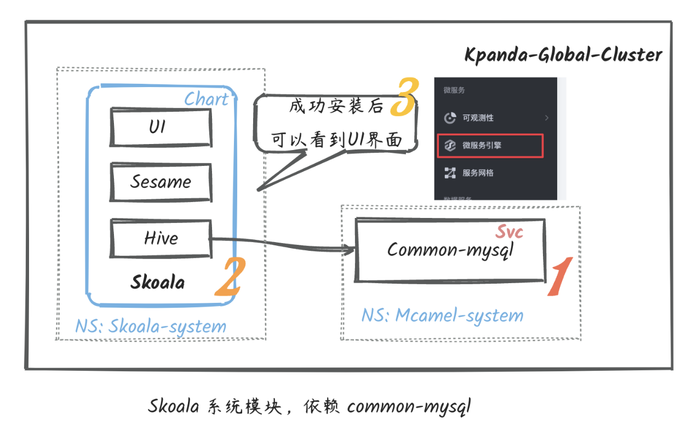

# 微服务引擎管理组件

本教程旨在补充需要手工 **单独在线安装** 微服务引擎模块的场景。下文出现的 `skoala` 是微服务引擎的内部开发代号，代指微服务引擎。

微服务引擎管理组件部署结构



蓝色框内的 chart 即 `skoala` 组件，需要安装在控制面集群，即 DCE 5.0 的全局集群 `kpanda-global-clsuter`，
详情可参考 DCE 5.0 的[部署架构](../../install/commercial/deploy-arch.md)。
安装 `skoala` 组件之后即可以在 DCE 5.0 的一级导航栏中看到微服务引擎模块。
另外需要注意：安装 `skoala` 之前需要安装好其依赖的 `common-mysql` 组件用于存储资源。

## 在线安装

如需安装微服务引擎，推荐通过 [DCE 5.0 商业版](../../install/commercial/start-install.md)的安装包进行安装；通过商业版可以一次性同时安装 DCE 的所有模块。

!!! note

    本文提供了在线安装的方式，如果已部署了离线商业版，建议参考[离线升级微服务引擎](#_11)离线安装或升级微服务引擎。

### 使用商业版安装包安装

通过商业版安装微服务引擎管理组件时，需要注意商业版的版本号（[点击查看最新版本](../../download/index.md)）。需要针对不同版本执行不同操作。

商业版的 **版本号 ≥ v0.3.29** 时，默认会安装微服务引擎管理组件，但仍旧建议检查 `mainfest.yaml` 文件进行确认
`components/skoala/enable` 的值是否为 `true`，以及是否指定了 Helm 的版本。

> 商业版中默认安装的是经过测试的最新版本。如无特殊情况，不建议修改默认的 Helm 版本。

??? note "如果商业版 ≤ v0.3.28，点击查看对应操作"

    此注释仅适用于商业版 ≤ v0.3.28；大多数情况下您的版本都会大于此版本。

    执行安装命令时，默认不会安装微服务引擎。需要对照下面的配置修改 `mainfest.yaml` 以允许安装微服务引擎。

    修改文件：

    ```bash
    ./dce5-installer install-app -m /sample/manifest.yaml
    ```

    修改后的内容：

    ```yaml
    ...
    components:
      skoala:
        enable: true
        helmVersion: v0.12.2 # 替换为当前最新的版本号
        variables:
    ...
    ```

### 检测微服务引擎是否已安装

查看 `skoala-system` 命名空间中是否有以下对应的资源。如果没有任何资源，说明目前尚未安装微服务引擎。

```bash
$ kubectl -n skoala-system get pods
NAME                                   READY   STATUS    RESTARTS        AGE
hive-8548cd9b59-948j2                  2/2     Running   0               3h48m
sesame-5955c878c6-jz8cd                2/2     Running   0               3h48m
skoala-ui-75b8f8c776-nbw9d             2/2     Running   0               3h48m

$ helm -n skoala-system list
NAME        NAMESPACE       REVISION    UPDATED                                 STATUS      CHART               APP VERSION
skoala     	skoala-system	2       	2023-11-03 10:23:22.373053803 +0800 CST	deployed    skoala-0.28.1       0.28.1
```

### 检测依赖的存储组件

安装微服务引擎时需要用到 `common-mysql` 组件来存储配置，所以要确保该组件已经存在。
此外，还需要查看 `common-mysql` 命名空间中是否有名为 `skoala` 的数据库。

```bash
$ kubectl -n mcamel-system get statefulset
NAME                                          READY   AGE
mcamel-common-mysql-cluster-mysql             2/2     7d23h
```

建议使用如下参数为微服务引擎配置数据库信息：

- host: mcamel-common-mysql-cluster-mysql-master.mcamel-system.svc.cluster.local
- port: 3306
- database : skoala
- user: skoala
- password:

!!! note

    - 如果未安装 common-mysql，可用自定义的数据库，上述参数按照实际情况填写即可。

### 检测依赖的监控组件

微服务引擎依赖 [DCE 5.0 可观测性](../../insight/intro/index.md)模块的能力。
如您需要监控微服务的各项指标、追踪链路，则需要在集群中安装对应的 `insight-agent`，
具体说明可参考[安装 insight-agent](../../insight/quickstart/install/install-agent.md)。


### 手动安装过程

一切就绪之后，就可以开始正式安装微服务引擎管理组件了。具体的流程如下：

!!! note

    - 如果安装的是 skoala-release/skoala v0.17.1 以下的版本，则需要手动初始化数据库表。
    - 如果安装的是 skoala-release/skoala v0.17.1 或更高版本，系统会自动初始化数据库表，无需手动进行。

??? note "如果初始化失败，请检查 skoala 数据库内是否有下方 3 张数据表以及对应的 SQL 是否全部生效"

    ```sql
    mysql> desc api;
    +------------------+-----------------+------+-----+-------------------+-----------------------------------------------+
    | Field            | Type            | Null | Key | Default           | Extra                                         |
    +------------------+-----------------+------+-----+-------------------+-----------------------------------------------+
    | id               | bigint unsigned | NO   | PRI | NULL              | auto_increment                                |
    | is_hosted        | tinyint         | YES  |     | 0                 |                                               |
    | registry         | varchar(50)     | NO   | MUL | NULL              |                                               |
    | service_name     | varchar(200)    | NO   |     | NULL              |                                               |
    | nacos_namespace  | varchar(200)    | NO   |     | NULL              |                                               |
    | nacos_group_name | varchar(200)    | NO   |     | NULL              |                                               |
    | data_type        | varchar(100)    | NO   |     | NULL              |                                               |
    | detail           | mediumtext      | NO   |     | NULL              |                                               |
    | deleted_at       | timestamp       | YES  |     | NULL              |                                               |
    | created_at       | timestamp       | NO   |     | CURRENT_TIMESTAMP | DEFAULT_GENERATED                             |
    | updated_at       | timestamp       | NO   |     | CURRENT_TIMESTAMP | DEFAULT_GENERATED on update CURRENT_TIMESTAMP |
    +------------------+-----------------+------+-----+-------------------+-----------------------------------------------+

    mysql> desc book;
    +-------------+------------------+------+-----+-------------------+-----------------------------------------------+
    | Field       | Type             | Null | Key | Default           | Extra                                         |
    +-------------+------------------+------+-----+-------------------+-----------------------------------------------+
    | id          | bigint unsigned  | NO   | PRI | NULL              | auto_increment                                |
    | uid         | varchar(32)      | YES  | UNI | NULL              |                                               |
    | name        | varchar(50)      | NO   | UNI | NULL              |                                               |
    | author      | varchar(32)      | NO   |     | NULL              |                                               |
    | status      | int              | YES  |     | 1                 |                                               |
    | isPublished | tinyint unsigned | NO   |     | 1                 |                                               |
    | publishedAt | timestamp        | YES  |     | NULL              |                                               |
    | deleted_at  | timestamp        | YES  |     | NULL              |                                               |
    | createdAt   | timestamp        | NO   |     | CURRENT_TIMESTAMP | DEFAULT_GENERATED                             |
    | updatedAt   | timestamp        | NO   |     | CURRENT_TIMESTAMP | DEFAULT_GENERATED on update CURRENT_TIMESTAMP |
    +-------------+------------------+------+-----+-------------------+-----------------------------------------------+
    10 rows in set (0.00 sec)

    mysql> desc registry;
    +--------------+-----------------+------+-----+-------------------+-----------------------------------------------+
    | Field        | Type            | Null | Key | Default           | Extra                                         |
    +--------------+-----------------+------+-----+-------------------+-----------------------------------------------+
    | id           | bigint unsigned | NO   | PRI | NULL              | auto_increment                                |
    | uid          | varchar(32)     | YES  | UNI | NULL              |                                               |
    | workspace_id | varchar(50)     | NO   |     | default           |                                               |
    | ext_id       | varchar(50)     | YES  |     | NULL              |                                               |
    | name         | varchar(50)     | NO   | MUL | NULL              |                                               |
    | type         | varchar(50)     | NO   |     | NULL              |                                               |
    | addresses    | varchar(1000)   | NO   |     | NULL              |                                               |
    | namespaces   | varchar(2000)   | NO   |     | NULL              |                                               |
    | is_hosted    | tinyint         | NO   |     | 0                 |                                               |
    | deleted_at   | timestamp       | YES  |     | NULL              |                                               |
    | created_at   | timestamp       | NO   |     | CURRENT_TIMESTAMP | DEFAULT_GENERATED                             |
    | updated_at   | timestamp       | NO   |     | CURRENT_TIMESTAMP | DEFAULT_GENERATED on update CURRENT_TIMESTAMP |
    +--------------+-----------------+------+-----+-------------------+-----------------------------------------------+
    12 rows in set (0.00 sec)
    ```

### 配置 skoala helm repo

配置好 Skoala 仓库，即可查看和获取到 skoala 的应用 chart

```bash
helm repo add skoala-release https://release.daocloud.io/chartrepo/skoala
helm repo update
```

> 需要事先安装 Helm

注意：添加 Skoala-release 仓库之后，通常需要关注的有 2 个 Chart：

`Skoala` 是微服务引擎的控制端的服务：

- 安装完成后，可以在 DCE 5.0 平台看到微服务引擎的入口
- 包含 3 个组件 skoala-ui、hive、sesame
- 需要安装在全局管理集群

默认情况下，安装完成 skoala 到 kpanda-global-cluster（全局管理集群），就可以在侧边栏看到对应的微服务引擎的入口了。

### 查看微服务引擎管理组件最新版本

在全局管理集群，查看 Skoala 的最新版本，直接通过 helm 命令获取版本信息；

```bash
$ helm repo update skoala-release
$ helm search repo skoala-release/skoala --versions
NAME                        CHART VERSION   APP VERSION DESCRIPTION
skoala-release/skoala       0.28.1       	0.28.1     	The helm chart for Skoala
skoala-release/skoala       0.28.0       	0.28.0     	The helm chart for Skoala
skoala-release/skoala       0.27.2       	0.27.2     	The helm chart for Skoala
skoala-release/skoala       0.27.1       	0.27.1     	The helm chart for Skoala
......
```

### 执行部署（同样适用于升级）

执行以下命令，注意对应的版本号：

```bash
$ helm upgrade --install skoala --create-namespace -n skoala-system --cleanup-on-fail \
    --set ui.image.tag=v0.19.0 \
    --set hive.configMap.database[0].driver="mysql" \
    --set hive.configMap.database[0].dsn="skoala:xxx@tcp(mcamel-common-mysql-cluster-mysql-master.mcamel-system.svc.cluster.local:3306)/skoala?charset=utf8&parseTime=true&loc=Local&timeout=10s" \
    skoala-release/skoala \
    --version 0.28.1
```

查看 Pod 是否启动成功：

```bash
$ kubectl -n skoala-system get pods
NAME                                   READY   STATUS    RESTARTS        AGE
hive-8548cd9b59-948j2                  2/2     Running   0               3h48m
sesame-5955c878c6-jz8cd                2/2     Running   0               3h48m
skoala-ui-7c9f5b7b67-9rpzc             2/2     Running   0               3h48m
```

## 在线升级

开始升级操作之前，了解一下微服务引擎的部署架构有助于更好地理解后续的升级过程。

微服务引擎由两个组件构成：

- `skoala` 组件安装在控制面集群，用于在 DCE 5.0 的一级导航栏中加载微服务引擎模块
- `skoala-init` 组件安装在工作集群，用于提供微服务引擎的核心功能，例如创建注册中心、网关实例等

!!! note

    - 升级微服务引擎时需要同时升级这两个组件，否则会存在版本不兼容的情况。
    - 有关微服务引擎的版本更新情况，可参考 [release notes](../intro/release-notes.md)。

由于 `skoala` 组件安装在控制面集群中，所以需要在控制面集群中执行下列操作。

1. 执行如下命令备份原有数据

    ```bash
    helm -n skoala-system get values skoala > skoala.yaml
    ```

2. 添加微服务引擎的 Helm 仓库

    ```bash
    helm repo add skoala https://release.daocloud.io/chartrepo/skoala
    ```

3. 更新微服务引擎的 Helm 仓库

    ```bash
    helm repo update
    ```

4. 执行 `helm upgrade` 命令

    ```bash
    helm --kubeconfig /tmp/deploy-kube-config upgrade --install --create-namespace -n skoala-system skoala skoala/skoala --version=0.28.1 --set hive.image.tag=v0.28.1 --set sesame.image.tag=v0.28.1 --set ui.image.tag=v0.19.0 -f skoala.yaml
    ```

    > 需要将 `version`、`hive.image.tag`、`sesame.image.tag`、`ui.image.tag` 四个参数的值调整为您需要升级到的微服务引擎的版本号。

## 离线升级

DCE 5.0 的各个模块松散耦合，支持独立安装、升级各个模块。此文档适用于通过离线方式安装微服务引擎之后进行的升级。

### 同步镜像

将镜像下载到本地节点之后，需要通过 [chart-syncer](https://github.com/bitnami-labs/charts-syncer) 或容器运行时将最新版镜像同步到您的镜像仓库。推荐使用 chart-syncer 同步镜像，因为该方法更加高效便捷。

#### chart-syncer 同步镜像

1. 使用如下内容创建 `load-image.yaml` 作为 chart-syncer 的配置文件

    `load-image.yaml` 文件中的各项参数均为必填项。您需要一个私有的镜像仓库，并参考如下说明修改各项配置。有关 chart-syncer 配置文件的详细解释，可参考其[官方文档](https://github.com/bitnami-labs/charts-syncer)。

    === "已安装 chart repo"

        若当前环境已安装 chart repo，则可以使用如下配置直接同步镜像。

        ```yaml
        source:
          intermediateBundlesPath: skoala-offline # 到执行 charts-syncer 命令的相对路径，而不是此 YAML 文件和离线包之间的相对路径
        target:
          containerRegistry: 10.16.23.145 # 需更改为你的镜像仓库 url
          containerRepository: release.daocloud.io/skoala # 需更改为你的镜像仓库
          repo:
            kind: HARBOR # 也可以是任何其他支持的 Helm Chart 仓库类别
            url: http://10.16.23.145/chartrepo/release.daocloud.io # 需更改为 chart repo url
            auth:
              username: "admin" # 你的镜像仓库用户名
              password: "Harbor12345" # 你的镜像仓库密码
          containers:
            auth:
              username: "admin" # 你的镜像仓库用户名
              password: "Harbor12345" # 你的镜像仓库密码
        ```

    === "未安装 chart repo"

        若当前环境未安装 chart repo，chart-syncer 也支持将 chart 导出为 `tgz` 文件并存放在指定路径。

        ```yaml
        source:
          intermediateBundlesPath: skoala-offline # (1)
        target:
          containerRegistry: 10.16.23.145 # (2)
          containerRepository: release.daocloud.io/skoala # (3)
          repo:
            kind: LOCAL
            path: ./local-repo # (4)
          containers:
            auth:
              username: "admin" # (5)
              password: "Harbor12345" # (6)
        ```

        1. 到执行 charts-syncer 命令的相对路径，而不是此 YAML 文件和离线包之间的相对路径
        2. 需更改为你的镜像仓库 url
        3. 需更改为你的镜像仓库
        4. chart 本地路径
        5. 你的镜像仓库用户名
        6. 你的镜像仓库密码

2. 执行同步镜像命令。

    ```shell
    charts-syncer sync --config load-image.yaml
    ```

#### Docker/containerd 同步镜像

1. 解压 `tar` 压缩包。

    ```shell
    tar xvf skoala.bundle.tar
    ```

    解压成功后会得到 3 个文件：

    - hints.yaml
    - images.tar
    - original-chart

2. 从本地加载镜像到 Docker 或 containerd。

    === "Docker"

        ```shell
        docker load -i images.tar
        ```

    === "containerd"

        ```shell
        ctr -n k8s.io image import images.tar
        ```

!!! note

    - 需要在每个节点上都通过 Docker 或 containerd 加载镜像。
    - 加载完成后需要 tag 镜像，保持 Registry、Repository 与安装时一致。

### 开始升级

镜像同步完成之后，就可以开始升级微服务引擎了。

=== "通过 helm repo 升级"

    1. 检查微服务引擎 helm 仓库是否存在。

        ```shell
        helm repo list | grep skoala
        ```

        若返回结果为空或如下提示，则进行下一步；反之则跳过下一步。

        ```none
        Error: no repositories to show
        ```

    2. 添加微服务引擎的 helm 仓库。

        ```shell
        helm repo add skoala-release http://{harbor url}/chartrepo/{project}
        ```

    3. 更新微服务引擎的 helm 仓库。

        ```shell
        helm repo update skoala-release # (1)
        ```

        1. helm 版本过低会导致失败，若失败，请尝试执行 helm update repo

    4. 选择您想安装的微服务引擎版本（建议安装最新版本）。

        ```shell
        helm search repo skoala-release/skoala --versions
        ```

        ```text
        NAME                   CHART VERSION  APP VERSION  DESCRIPTION
        skoala-release/skoala  0.14.0          v0.14.0       A Helm chart for Skoala
        ...
        ```

    5. 备份 `--set` 参数。

        在升级微服务引擎版本之前，建议您执行如下命令，备份老版本的 `--set` 参数。

        ```shell
        helm get values skoala -n skoala-system -o yaml > bak.yaml
        ```

    6. 执行 `helm upgrade`。

        升级前建议您覆盖 bak.yaml 中的 `global.imageRegistry` 字段为当前使用的镜像仓库地址。

        ```shell
        export imageRegistry={你的镜像仓库}
        ```

        ```shell
        helm upgrade skoala skoala-release/skoala \
        -n skoala-system \
        -f ./bak.yaml \
        --set global.imageRegistry=$imageRegistry
        --version 0.14.0
        ```

=== "通过 chart 包升级"

    1. 备份 `--set` 参数。

        在升级微服务引擎版本之前，建议您执行如下命令，备份老版本的 `--set` 参数。

        ```shell
        helm get values skoala -n skoala-system -o yaml > bak.yaml
        ```

    2. 执行 `helm upgrade`。

        升级前建议您覆盖 bak.yaml 中的 `global.imageRegistry` 为当前使用的镜像仓库地址。

        ```shell
        export imageRegistry={你的镜像仓库}
        ```

        ```shell
        helm upgrade skoala . \
        -n skoala-system \
        -f ./bak.yaml \
        --set global.imageRegistry=$imageRegistry
        ```

## 卸载微服务引擎管理组件

```bash
helm uninstall skoala -n skoala-system
```
