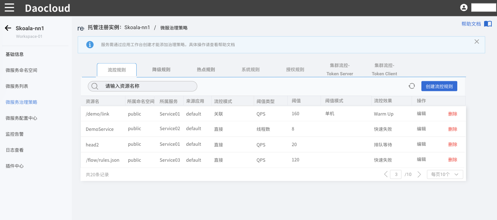
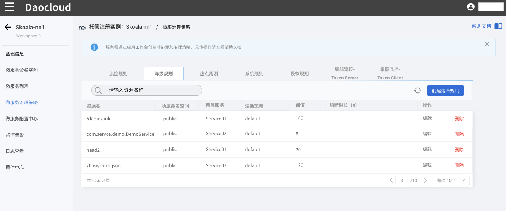
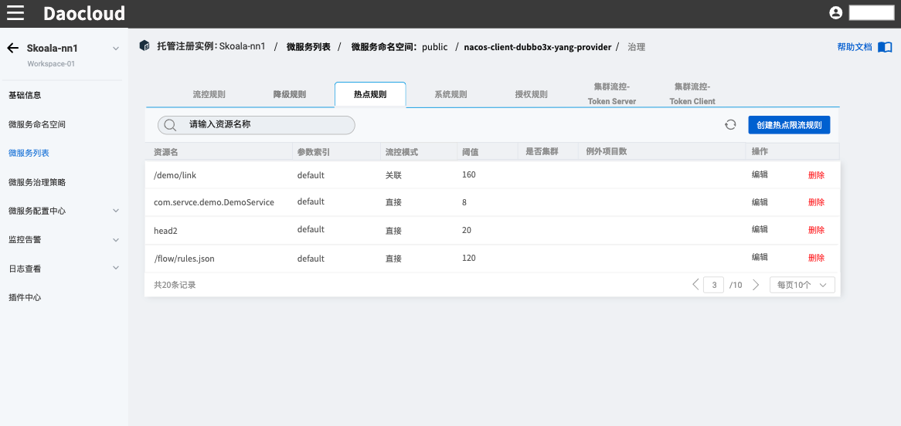
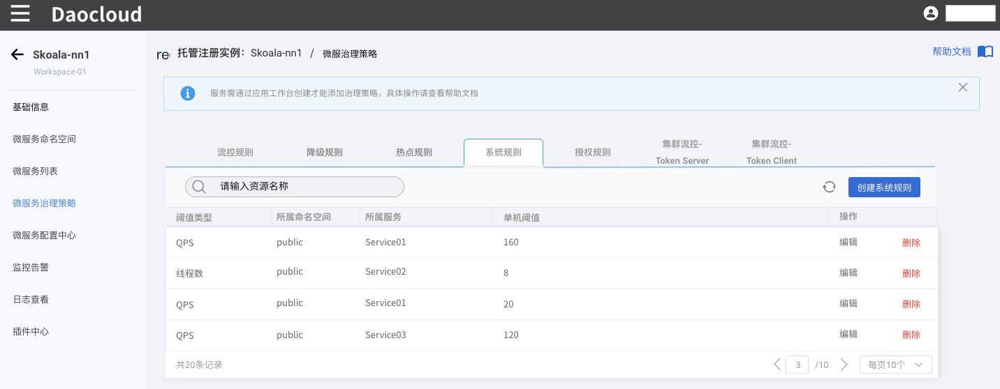
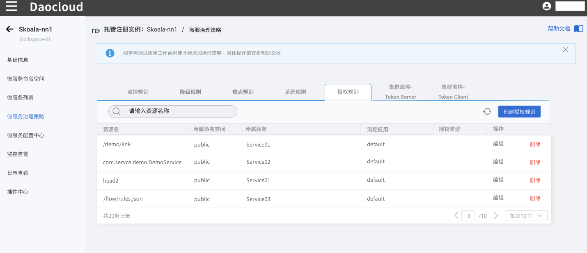
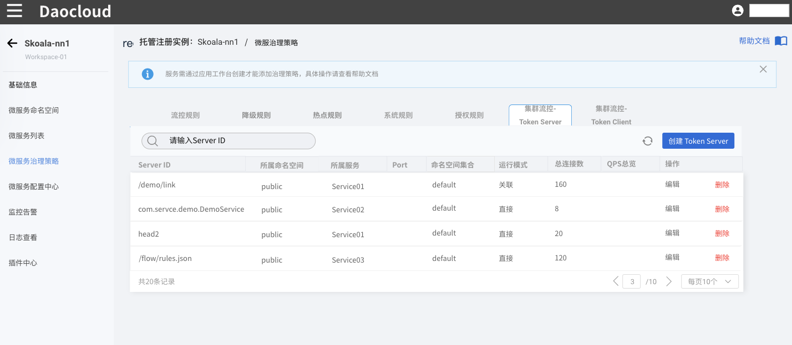

# 规则介绍

微服务引擎支持通过服务网格或 Sentinel 治理东西向流量。

## Sentinel 治理规则

- [流控规则](flow-control.md)

    流控规则的原理是监控应用或服务流量的 QPS 指标，当指标达到阈值时根据预先设定的规则对请求流量进行控制，防止应用因短时间内无法处理过多流量而崩溃。使用流控规则后，系统可以在接下来的空闲期间逐渐处理堆积的请求，当指标重新恢复到阈值以下后，恢复正常的流量请求控制。

- 熔断降级

    在分布式系统中，各个服务通常需要调用其他的内部或外部服务才能正常运行，如果被调用的服务不够稳定，那么级联效应会导致调用者自身的响应时间也变长，产生线程堆积甚至导致服务不可用。为了避免这种情况出现，需要通过熔断机制根据预设的规则切断不稳定的调用链路，或者对下游服务进行降级，保护系统的整体可用性。

- 热点规则

    热点指经常被访问的数据。设置热点规则时，需要配置热点参数（即需要统计访问量的目标参数），然后系统会统计对该热点参数的请求量，当达到一定的阈值后，包含该热点参数的资源就是被限制调用。热点规则适用于统计被频繁访问的资源，达到一定的阈值后限制对该资源的访问。

- 系统规则

    系统规则是指，由 Sentinel 综合系统容量、CPU 使用率、平均响应时间、入口 QPS 等数据，从整体维度出发自动选择流控规则控制请求流量。和其他规则不同的是，系统规则针对的是应用级别的入口流量，即仅对进入应用的流量生效，而其他规则通常是针对资源维度进行控制。

- 授权规则

    授权规则允许基于请求来源进行流量治理，例如仅放行白名单中的调用方发起的请求，不放行黑名单中的调用方发起的请求。

[流控规则](flow-control.md){ .md-button .md-button--primary }

## Mesh 治理规则

流量治理为用户提供了三种资源配置，虚拟服务、目标规则、网关规则。 通过配置相应规则可以实现路由、重定向、熔断、分流等多项流量治理功能。用户可以通过向导或YAML形式创建、编辑治理策略。

- 虚拟服务主要用于对请求流量的路由定制规则，并可以对数据流做出分流、重定向、超时返回等处理。
- 目标规则则更关注流量本身的治理，为请求流量提供更强大的负载均衡、连接存活探寻、熔断等功能。
- 网关规则为 Istio 网关提供服务在网关的暴露方式。

有关这三项治理规则的详细说明，可参考文档[流量治理](../../../../mspider/user-guide/traffic-governance/README.md)。

[虚拟服务](../../../../mspider/user-guide/traffic-governance/virtual-service.md){ .md-button .md-button--primary }
[目标规则](../../../../mspider/user-guide/traffic-governance/destination-rules.md){ .md-button .md-button--primary }
[网关规则](../../../../mspider/user-guide/traffic-governance/gateway-rules.md){ .md-button .md-button--primary }

<!--
- 资源名：资源的名称，资源是指规则的作用领域。

- 来源应用：Sentinel 可以针对调用者进行限流，默认为 default，表示不区分来源，全部限制。

- 流控模式：流控模式分为三种。
  
    - 直接模式：当前的资源达到阈值时，直接限流。
    - 关联模式：当关联的资源达到阈值时，限流关联资源。
    - 链路模式：只记录指定链路上的流量（指定资源从入口资源进来的流量，如果达到阈值，就可以限流）。

- 阈值类型：

    - QPS：QPS 指每秒钟的请求数量，当调用该接口的 QPS 达到阈值时进行限流。
    - 线程数：调用该接口的线程数达到阈值时进行限流。

- 阈值模式：

    - 单机阈值：仅针对某个节点设置阈值。
    - 是否集群：是否针对整个集群设置阈值。

- 流控效果：

    - 快速失败：流量超过设定的阈值时，直接拒绝请求。

    - Warm Up：缓慢增加通过的流量，逐渐预热系统，防止空闲系统突然涌入大量流量而被压垮。从请求 QPS 从 阈值 / 3 开始，设置预热时长，经预热时长后逐渐升至设定的 QPS 阈值。

    - 排队等待：流量超过阈值时排队匀速通过，阈值类型必须需设成 QPS，否则无效。适用于处理间隔性突发流量，在某一秒有大量请求涌入，而接下来的几秒则处于空闲状态，例如消息队列。

    

<!--
## 熔断降级

在分布式系统中，各个服务通常需要调用其他的内部或外部服务才能正常运行，如果被调用的服务不够稳定，那么级联效应会导致调用者自身的响应时间也变长，产生线程堆积甚至导致服务不可用。为了避免这种情况出现，需要通过熔断机制根据预设的规则切断不稳定的调用链路，或者对下游服务进行降级，保护系统的整体可用性。

- 熔断策略：

    - 慢调用比例：当请求的每秒平均响应时间超过最大 RT，且时间窗口内通过的请求数量 >=5，同时满足这两个条件时触发降级。

    - 异常比例：当统计时长内的请求数量达到最小请求数，并且异常请求的比例大于阈值时，触发熔断。

    - 异常数：统计时长内的异常请求数量超过阈值之后，触发熔断降级。

- 比例阈值：触发熔断的慢调用比例阈值百分比。

- 最大 RT ：请求的最长响应时间，超过该时间则判定为慢请求，单位为 ms，最大值为 4900。

- 熔断时长：设置熔断持续的时长，超过熔断时长后即取消熔断，恢复原来的服务调用。

- 最小请求数：触发熔断的最小请求数量，超出该数量时即启动熔断机制。

    

- 统计时长：统计时间窗口，即统计某一段时间内的请求量。

## 热点规则

热点指经常被访问的数据。设置热点规则时，需要配置热点参数（即需要统计访问量的目标参数），然后系统会统计对该热点参数的请求量，当达到一定的阈值后，包含该热点参数的资源就是被限制调用。热点规则适用于统计被频繁访问的资源，达到一定的阈值后限制对该资源的访问。

- 参数索引：指定热点参数的下标，从 0 开始。如果额外参数不匹配则默认为 0.
- 参数例外项：针对指定的参数值单独设置阈值，仅支持基本类型和字符串类型。

## 系统规则

系统规则是指，由 Sentinel 综合系统容量、CPU 使用率、平均响应时间、入口 QPS 等数据，从整体维度出发自动选择流控规则控制请求流量。需要注意的是，系统规则仅对入口流量生效，即进入应用的流量。设置系统规则时需要选择阈值类型，目前支持五种阈值：

- Load：将系统的负载作为启发指标，进行自适应系统保护。当系统负载超过设定的启发值，且系统当前的并发线程数超过估算的系统容量时才会触发系统保护。

!!! note

    Load 类型的阈值仅对 Linux/Unix-like 机器生效。

- RT：当单台机器上所有入口流量的平均响应时间达到阈值即触发系统保护，单位是毫秒。

- 线程数：当单台机器上所有入口流量的并发线程数达到阈值即触发系统保护。

- 入口 QPS：当单台机器上所有入口流量的 QPS 达到阈值即触发系统保护。

- CPU 使用率：当系统 CPU 使用率超过阈值即触发系统保护（取值范围 0.0-1.0）。

    

## 授权规则

- 流控应用：调用方，也就是调用来源，比如 app 端调用或 pc 端调用。

- 授权类型：

    - 白名单：只有请求来源位于白名单内时才可放行。

    - 黑名单：请求来源位于黑名单时不通过，放行其余的请求。

    

<!--
## 集群流控

集群流控可以控制某个服务调用整个集群的实时调用量，可以解决因流量不均匀导致总体限流效果不佳的问题。集群流控可以精确地控制整个集群的调用总量，结合单机限流兜底，更好地发挥流量防护的效果。

-->
