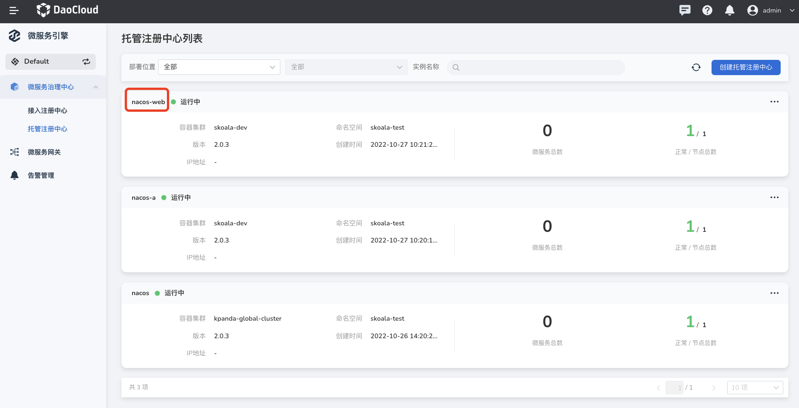
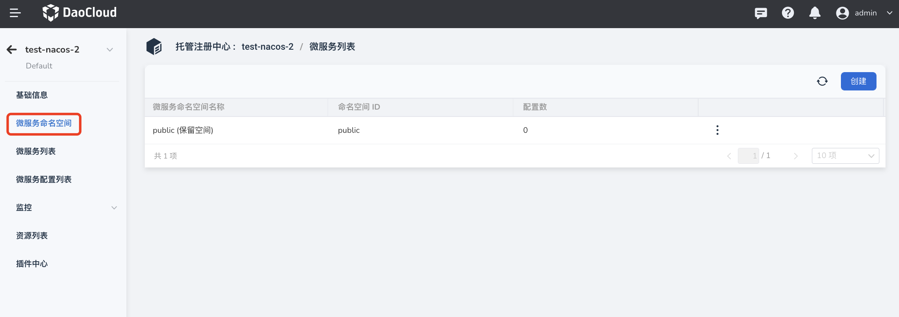
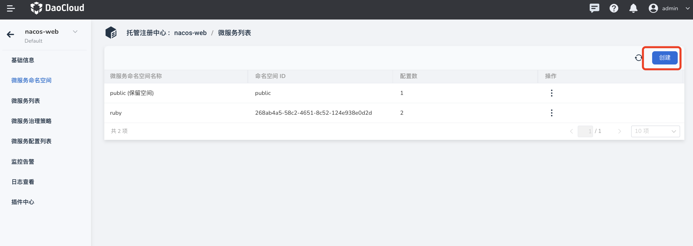
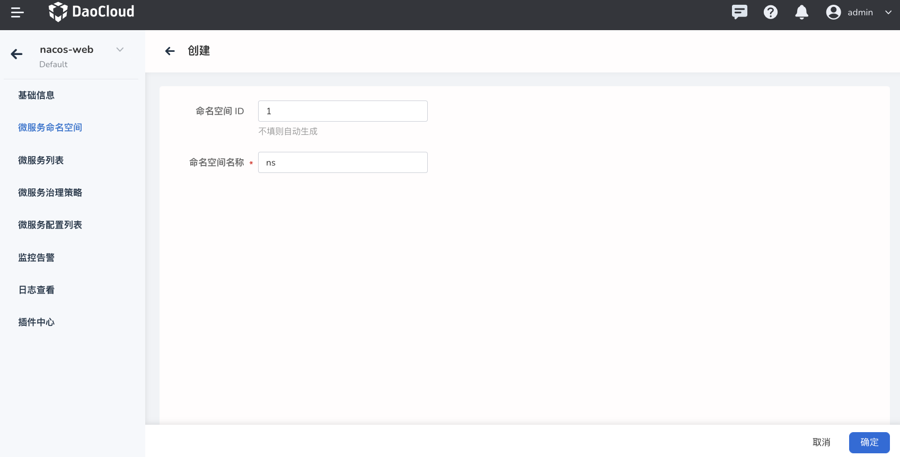
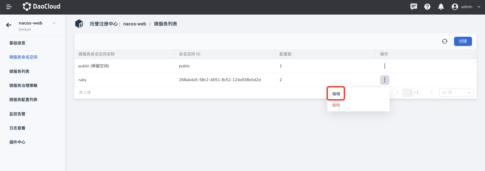
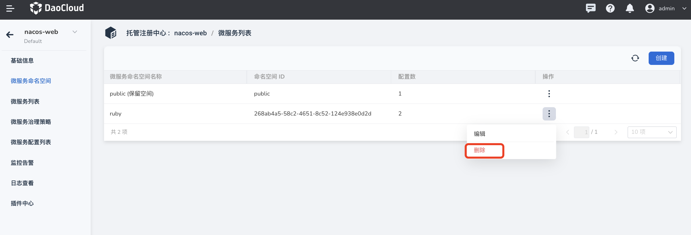

# 微服务命名空间

微服务引擎模块中的命名空间指的是 Nacos 的命名空间，并非 Kubernetes 的命名空间。对于托管型注册中心，系统会自动创建一个名为 public 的命名空间作为默认的命名空间。该命名空间不可编辑、不可删除，属于系统自带的保留命名空间。

## 进入命名空间列表

1. 在注册中心列表页点击注册中心名称，然后在左侧点击点击`微服务命名空间`即可进入命名空间列表页。

    

2. 命名空间列表主要显示命名空间的名称、ID、该命名空间下的配置数。

    可以在命名空间列表页面进行命名空间的创建、更新、删除操作。

    

## 创建微服务命名空间

1. 在微服务命名空间列表页面的右上角点击`创建`，进入创建页面。
  
    

2. 填写命名空间的 ID，名称和描述信息，点击`确定`。

    如果不填写 ID, 系统会自动生成一个 ID。命名空间 ID 在创建之后不可更改。

    

## 更新微服务命名空间

1. 在对应命名空间的右侧操作栏下点击`编辑`，进入更新页面。

    

2. 修改命名空间的名称、描述信息，点击`确定`。
  
    

## 删除微服务命名空间

在对应命名空间的右侧操作栏下点击`删除`，进行删除。

!!! note
  
    删除命名空间之前，必须清理该命名空间下的所有资源，否则无法删除命名空间。

