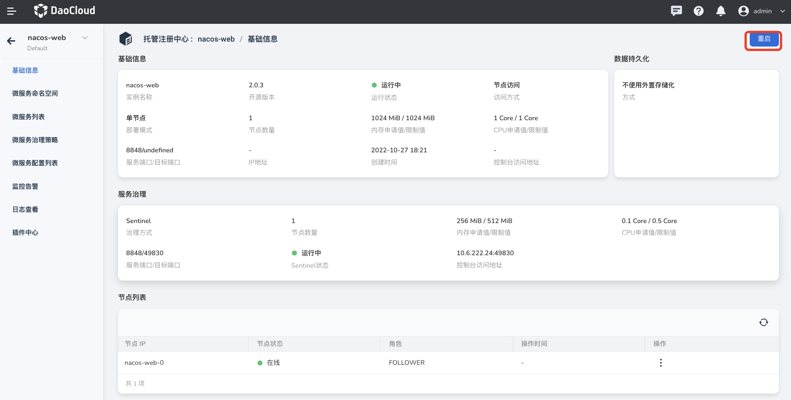
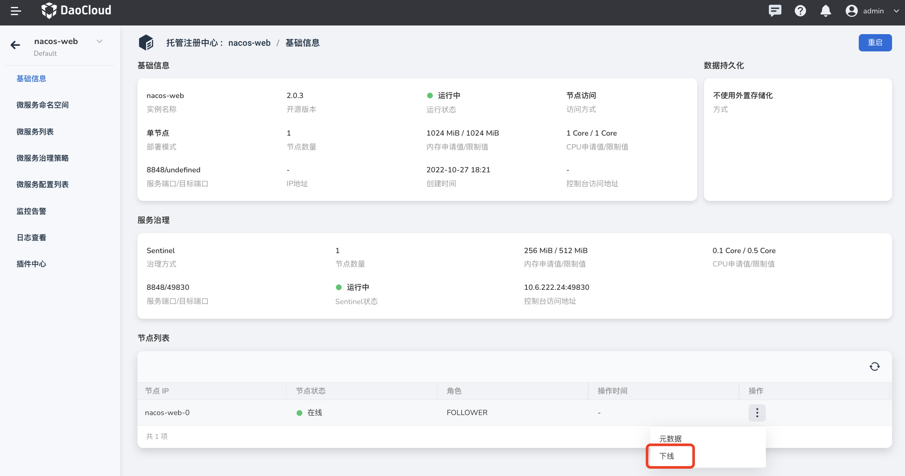
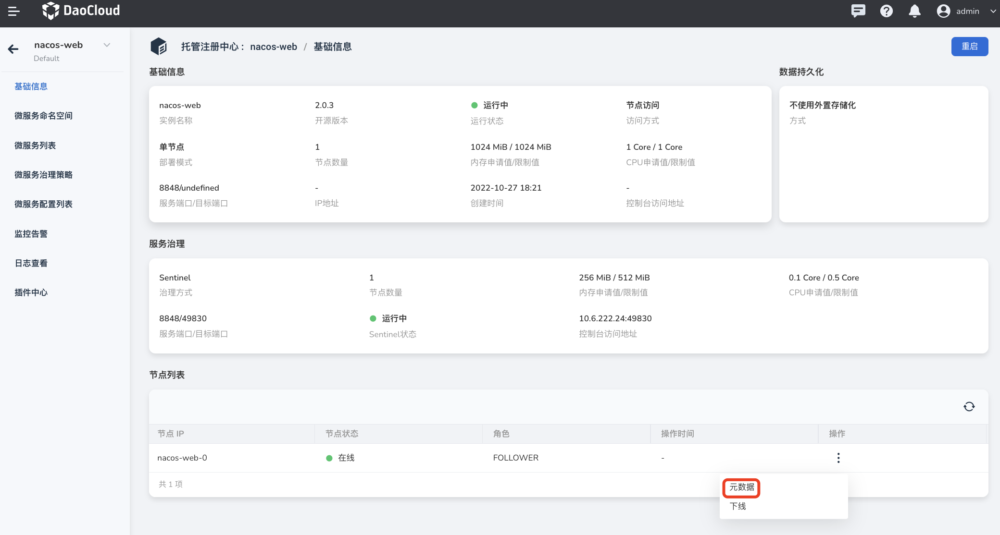

# 查看注册中心详情

在托管注册中心列表页找到需要查看详情的注册中心实例，点击实例名称进入基础信息页面。

在基础信息页面可以查看注册中心的`基础信息`、`服务治理信息`（需要开启服务治理功能）、`节点列表`、`数据持久化`信息等。
“运行状态”是注册中心实例信息的一部分，用于反映注册中心实例的状态。

**相关操作**：

- 重启注册中心实例：在页面右上角点击`重启`可以对整个托管注册中心实例进行重启。

    

- 节点上下线：在节点列表中选择目标节点，修改节点状态。

    - 下线

      单击`操作`列的`下线`，修改节点实例状态为“下线”

    - 上线

      单击`操作`列的`上线`，修改节点实例状态为“上线”

      

- 查看节点元数据

    
