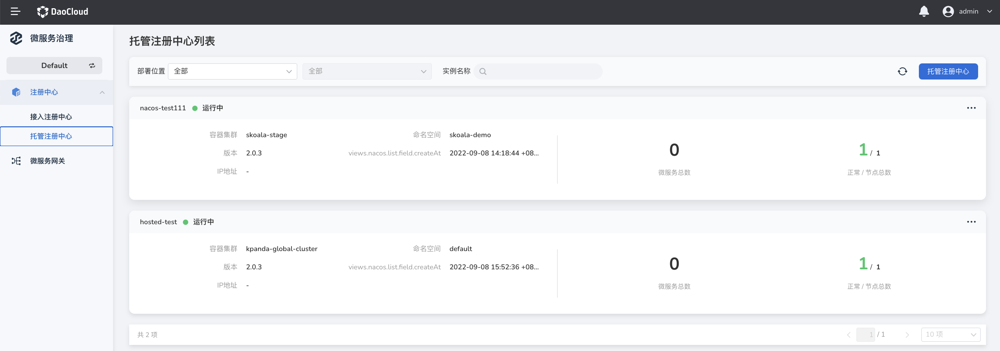
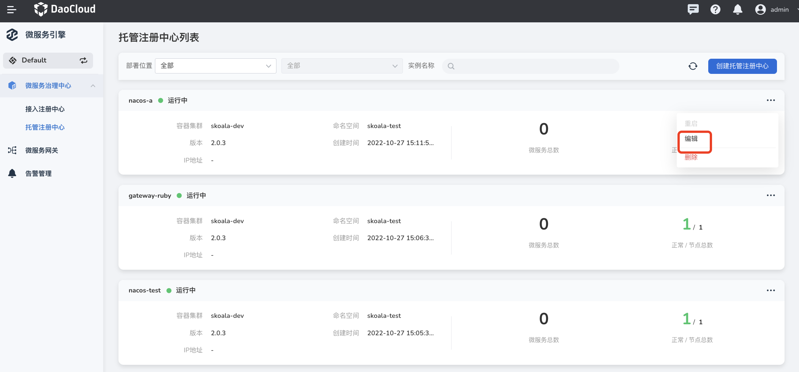
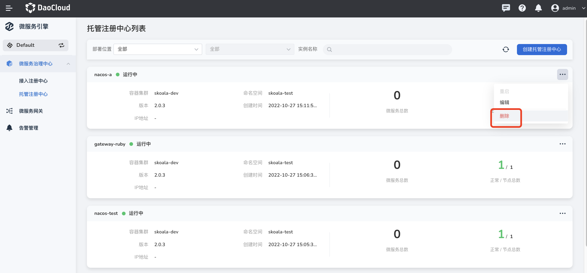
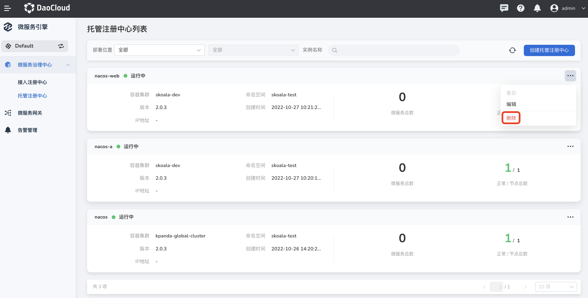

# 管理托管注册中心

微服务治理中心支持托管Nacos注册中心。相对于接入注册中心而言，托管注册中心支持更多操作，包括注册中心实例的基础信息、微服务命名空间管理、微服务列表、微服务配置列表、监控告警、日志查看、插件中心  等。

本页将对托管注册中心实例的创建、更新及删除做详细介绍。

## 创建托管注册中心

创建托管注册中心的步骤如下。

1. 在左侧导航栏点击`微服务治理中心`->`托管注册中心`，然后在页面右上角点击`创建托管注册中心`，进入托管注册中心实例创建创建的页面

    

2. 依次填写实例创建信息，配置所需访问方式、部署方式（生产环境下建议使用`高可用`方式）以及数据持久化方式（建议使用外置存储化）在页面底部点击`确认`

    为了让您更加准确的选择组件规格，点击`《实例能力评估》`查看在2 Core 4 GiB、4 Core 8 GiB和8 Core 16 GiB等主流规格下的TPS（吞吐量）

    

    如果操作正确，页面右上角会弹出创建成功的消息，在`托管注册中心列表`页会展示新建的注册中心实例。

## 更新托管注册中心

1. 在`托管注册中心列表`页找到需要更新的托管注册中心，点击右侧的 **`⋯`** 操作按钮选择`编辑`。

    
- 托管注册中心实例名称和部署位置不可编辑

2. 修改好之后，在页面右下角点击`确认`。

    !!! warning

        修改存储池/数据库，变动存储位置后，之前的数据不会随之迁移。

## 删除托管注册中心

!!! note
  
    移除托管注册中心之前，需要先清空该注册中心实例下面的各类资源，包括微服务和微服务下面的实例，关闭治理能力（若开启治理功能）等。

1. 在`托管注册中心列表`页找到需要更新的托管注册中心，点击右侧的 **`⋯`** 操作按钮选择`删除`。

    

2. 输入注册中心实例名称，点击`删除`。

    

## 查看托管注册中心详情

在托管注册中心列表页找到需要查看详情的注册中心实例，点击实例名称进入基础信息页面。

在基础信息页面可以查看注册中心的`基础信息`、`服务治理信息`（需要开启服务治理功能）、`节点列表`、`数据持久化`信息等。
“运行状态”是注册中心实例信息的一部分，用于反映注册中心实例的状态。

**相关操作**：

- 重启注册中心实例：在页面右上角点击`重启`可以对整个托管注册中心实例进行重启

    

- 节点上下线：在节点列表中选择目标节点，修改节点状态节
    - 下线
    单击`操作`列的`下线`，修改节点实例状态为“下线”
    - 上线
    单击`操作`列的`上线`，修改节点实例状态为“上线”

    

- 查看节点元数据

    

