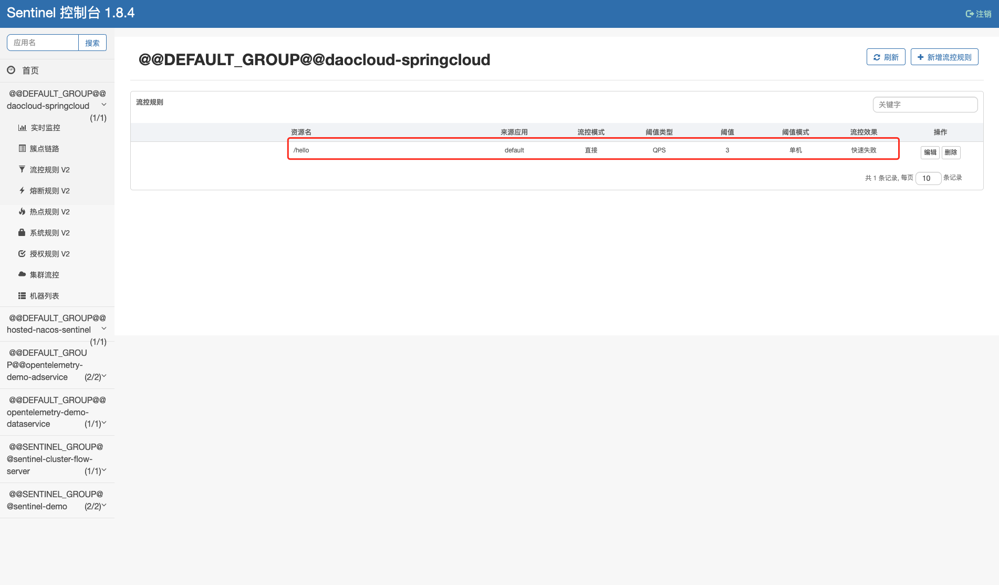
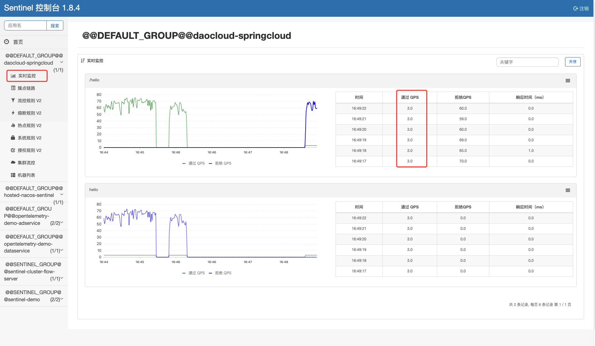

# 服务接入 Sentinel 规范

为了正常使用 DCE 5.0 微服务引擎提供的 [Sentinel 流量治理](../trad-ms/hosted/plugins/sentinel.md)和查看
[Sentinel 数据监控](../trad-ms/hosted/monitor/components.md)，需要将应用接入 Sentinel 控制台，并且传递应用参数时需要满足一定规范。

## JAVA（无框架）

!!! note

    - 下述操作使用于任何版本的 Sentinel SDK 版本。
    - 使用下述方式接入服务时，使用界面创建规则并不会生效，因为客户端并无连接 Nacos 等存储获取规则，而是直接基于内存设置规则。
    - 下述方式主要适用于 Sentinel 快速接入验证或者没有使用 Spring Cloud 框架的场景。

<!-- - 代码可参考：<https://gitlab.daocloud.cn/ndx/sentinel/-/tree/main/sentinel-demo/daocloud-java> -->

1. 在 `pom.xml` 文件中添加依赖项。

    ```xml
    <!-- 添加 sentinel 核心依赖-->
    <dependency>
      <groupId>com.alibaba.csp</groupId>
      <artifactId>sentinel-core</artifactId>
      <version>1.8.6</version>
    </dependency>

    <!-- 添加 sentinel 控制台依赖-->
    <dependency>
      <groupId>com.alibaba.csp</groupId>
      <artifactId>sentinel-transport-simple-http</artifactId>
      <version>1.8.6</version>
    </dependency>
    ```

2. 使用 Sentinel API 设置规则。

    ```java
    private static void initFlowRules(){
      List<FlowRule> rules = new ArrayList<>();
      FlowRule rule = new FlowRule();
      rule.setResource("HelloWorld");
      rule.setGrade(RuleConstant.FLOW_GRADE_QPS);
      // Set limit QPS to 20.
      rule.setCount(20);
      rules.add(rule);
      FlowRuleManager.loadRules(rules);
    }
    ```

3. 使用 Sentinel API 定义资源。

    ```java
    public static void main( String[] args ) {
      // 配置规则
      initFlowRules();
   
      while (true) {
      // 1.5.0 版本开始可以直接利用 try-with-resources 特性
      try (Entry entry = SphU.entry("HelloWorld")) {
      // 被保护的逻辑
      System.out.println("hello world");
      } catch (BlockException ex) {
      // 处理被流控的逻辑
      System.out.println("blocked!");
      }
      }
    }
    ```

4. 添加 jvm 参数连接 Sentinel 控制台，并启动应用。

    ```shell
    # ip:port 为 Sentinel 控制台地址
    -Dcsp.sentinel.dashboard.server=10.6.176.50:32196
    ```

5. 打开 Sentinel 控制台，找到相应应用验证流控效果。

    

## JAVA（SpringCloud）框架

接入 SpringCloud 框架的微服务时，需要符合以下要求。

### project.name 名称规范

应用接入 Sentinel 控制台的参数 `project.name` 必须使用如下格式：

```java
{{nacos_namespace_id}}@@{{nacos_group}}@@{{appName}}
```

!!! note

    - 符合此规范时，Sentinel 的治理规则会被推送到对应命名空间下，对应配置分组中的配置中心。
    - 第一部分 `{{nacos_namespace_id}}` 指的是 Nacos 命名空间的 **ID**，而非命名空间的名称。
    - Nacos 的 `public` 命名空间对应的 ID 是空字符 “”。如果想把应用接入 `public` 命名空间，必须使用空字符串，例如 `@@A@@appA`。
    - 必须符合此规范，否则会引起未知错误。

### Sentinel 写入 Nacos 配置中心 dataId 的命名规范

- 流控规则：{{appName}}-flow-rules
- 熔断规则：{{appName}}-degrade-rules
- 系统规则：{{appName}}-system-rules
- 授权规则：{{appName}}-authority-rules
- 热点规则：{{appName}}-param-rules

appName 为 project.name 三段式的最后一段。

### Sentinel 与 Nacos 约定的内置通讯用户

```yaml
username: skoala
password: 98985ba0-da90-41f6-b6dc-96f2ec49d973
```

### 推荐的接入方式

满足上述三项条件之后，推荐使用下述接入方式将 SpringCloud 框架的微服务接入 Sentinel。

!!! note

    - 满足上述三项条件后，DCE 5.0 微服务引擎并不强制要求使用某种特定的接入方式。
    - DCE 5.0 微服务引擎完全兼容相关开源框架使用，开发者可以根据需求灵活使用合适的接入方式。

<!--- 代码可参考：https://gitlab.daocloud.cn/ndx/sentinel/-/tree/main/sentinel-demo/daocloud-springcloud-->

1. 在 `pom.xml` 文件中添加依赖项，

    版本对应关系参考：[版本说明](https://github.com/spring-cloud-incubator/spring-cloud-alibaba/wiki/版本说明)。

    ```xml
    <!-- 添加 Sentinel 依赖-->
    <dependency>
      <groupId>com.alibaba.cloud</groupId>
      <artifactId>spring-cloud-starter-alibaba-sentinel</artifactId>
    </dependency>

    <!-- 添加 Sentinel Nacos 数据源依赖-->
    <dependency>
      <groupId>com.alibaba.csp</groupId>
      <artifactId>sentinel-datasource-nacos</artifactId>
    </dependency>

    <dependency>
      <groupId>org.springframework.boot</groupId>
      <artifactId>spring-boot-starter-web</artifactId>
    </dependency>
    ```

1. 在项目中添加 `application.yaml` 配置文件。

    ```yaml title="application.yaml"
    nacos:
      # Nacos 地址
      address: 10.6.176.50:30760
      # Nacos 配置中心命名空间
      namespace:
      # Nacos 配置中心分组
      group: DEFAULT_GROUP

    # 接入 sentinel 控制台的应用名
    project:
      name: ${nacos.namespace}@@${nacos.group}@@${spring.application.name}
    spring:
      application:
        name: daocloud-springcloud
      cloud:
        sentinel:
          # Sentinel Nacos 数据源
          datasource:
            flow:
              nacos:
                server-addr: ${nacos.address}
                dataId: ${spring.application.name}-flow-rules
                groupId: ${nacos.group}
                namespace: ${nacos.namespace}
                # 微服务引擎规定：Nacos 和 Sentinel 约定的用户及密码
                username: skoala
                password: 98985ba0-da90-41f6-b6dc-96f2ec49d973
                ruleType: flow
            degrade:
              nacos:
                server-addr: ${nacos.address}
                # 微服务引擎规定：Sentinel 写入 Nacos 的名称约定
                dataId: ${spring.application.name}-degrade-rules
                groupId: ${nacos.group}
                namespace: ${nacos.namespace}
                # 微服务引擎规定：Nacos 和 Sentinel 约定的用户及密码
                username: skoala
                password: 98985ba0-da90-41f6-b6dc-96f2ec49d973
                rule-type: degrade
            system:
              nacos:
                server-addr: ${nacos.address}
                # 微服务引擎规定：Sentinel 写入 Nacos 的名称约定
                dataId: ${spring.application.name}-system-rules
                groupId: ${nacos.group}
                namespace: ${nacos.namespace}
                # 微服务引擎规定：Nacos 和 Sentinel 约定的用户及密码
                username: skoala
                password: 98985ba0-da90-41f6-b6dc-96f2ec49d973
                rule-type: system
            authority:
              nacos:
                server-addr: ${nacos.address}
                # 微服务引擎规定：sentinel 写入 nacos 的名称约定
                dataId: ${spring.application.name}-authority-rules
                groupId: ${nacos.group}
                namespace: ${nacos.namespace}
                # 微服务引擎规定：nacos 和 sentinel 约定的用户及密码
                username: skoala
                password: 98985ba0-da90-41f6-b6dc-96f2ec49d973
                rule-type: authority
            param-flow:
              nacos:
                server-addr: ${nacos.address}
                # 微服务引擎规定：sentinel 写入 nacos 的名称约定
                dataId: ${spring.application.name}-param-rules
                groupId: ${nacos.group}
                namespace: ${nacos.namespace}
                # 微服务引擎规定：nacos 和 sentinel 约定的用户及密码
                username: skoala
                password: 98985ba0-da90-41f6-b6dc-96f2ec49d973
                rule-type: param-flow

    ```

1. 编写相关的 Web API。

    ```java
    @SpringBootApplication
    @RestController
    @RequestMapping
    public class App {
        public static void main( String[] args ) {
            SpringApplication.run(App.class, args);
        }
   
        @GetMapping("/hello")
        public String hello(){
            return "hello world";
        }
    }
    ```

1. 在 Sentinel 控制台创建流控规则。

    

1. 启动应用并添加连接 Sentinel 控制台的 jvm 参数

    ```java
    -Dcsp.sentinel.dashboard.server=10.6.176.50:32196
    ```

1. 使用脚本访问设置了流控规则的 Web API。例如：

    ```java
    while true; do curl http://localhost:8080/hello; done
    ```

1. Sentinel 控制台验证规则是否生效。

    
