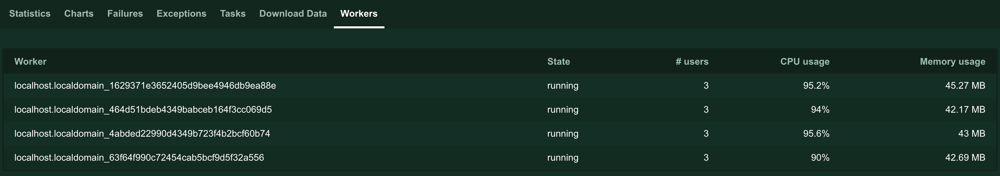
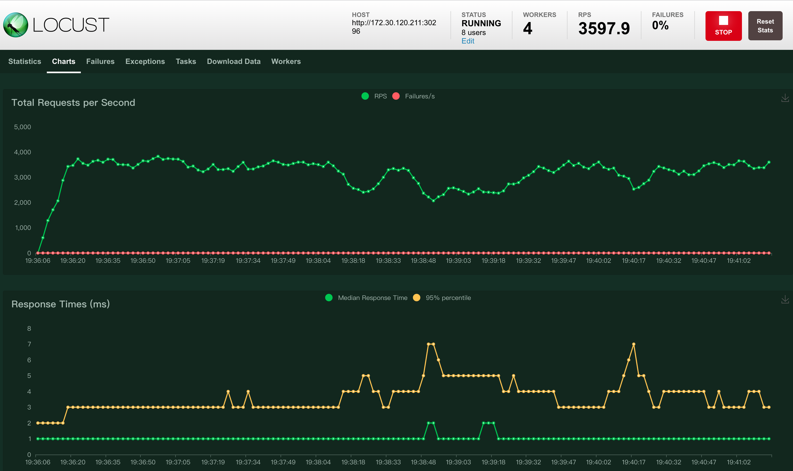
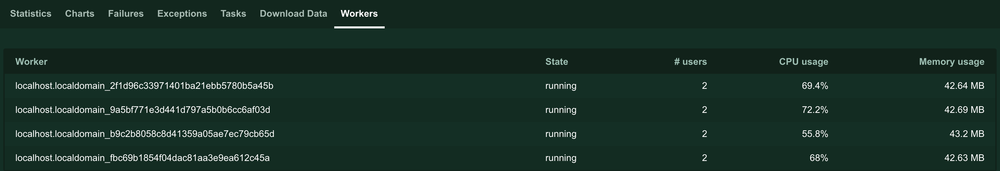

# 网关压力测试报告

本文介绍 DCE 5.0 云原生网关在不同场景下的性能表现，便于您根据需求为网关配置合适的资源。

## 测试环境

开始测试之前，需要部署 DCE 5.0，下载安装测试工具，并准备好用于测试的压力机。

| 对象         | 角色                           |说明
| -------------- | ------------------------------ | ---|
| DCE 5.0 云原生网关|测试对象|采用一主一从的模式，部署位置：172.30.120.211 |
|Locust|测试工具|采用 1+4 的主从分布式运行模式，四台压测机的资源配置均为 8 核 8 G|
|Nginx|用于测试网关性能的演示服务|通过 DCE 5.0 云原生网关访问，访问地址为：http://172.30.120.211:30296/|
| contour |  DCE 5.0 云原生网关的控制面 |版本为 1.23.1|
| envoy |  DCE 5.0 云原生网关的数据面  |版本为 1.24.0|
| 全局管理 | DCE 5.0 云原生网关依赖的组件 |版本为 0.12.1|
| 容器管理 | DCE 5.0 云原生网关依赖的组件 |版本为 0.13.1|
| 微服务引擎 | DCE 5.0 云原生网关依赖的组件 |版本为 0.15.1|

## 性能指标

- 吞吐量（RPS）：每秒处理的请求数。结合 CPU 使用率，判断 DCE 5.0 云原生网关在特定资源配置下每秒可以处理的并发请求数。吞吐量越高，说明网关性能越好
- 响应时间（TS）：测试 DCE 5.0 云原生网关在特定资源配置下，处理特定并发请求时的响应时间。响应时间越短，说明网关性能越好。
- CPU 使用率：测试处理特定数量的并发请求时，DCE 5.0 云原生网关实例的 CPU 使用情况。当 CPU 使用量达到 90% 以上时，认为 CPU 接近满载，此时的吞吐量（RPS）是当前配置能够正常处理的最大并发请求数。CPU 使用率越低，说明网关性能越好。

## 测试脚本

- 在 Locust Web 机器执行如下命令，收集压测结果

    ```
    docker run -p 8089:8089 --network=host -v $PWD:/mnt/locust locustio/locust -f /mnt/locust/gateway-external-nginx.py --master
    ```

- 在 Locust 压测机执行如下命令，模拟用户访问，执行压力测试

    ```
    docker run -p 8089:8089 --network=host -v $PWD:/mnt/locust locustio/locust -f /mnt/locust/gateway-external-nginx.py --worker --master-host=172.30.120.210
    ```

- 压测脚本 `gateway-external-nginx.py`

    ```
    from locust import task
    from locust.contrib.fasthttp import FastHttpUser

    class ShellCard(FastHttpUser):

      host = "http://172.30.120.211:30296" # 被测服务的访问地址
      @task
      def test(self):
        header = {"Host": "external.nginx"}
        self.client.get("/", headers=header)
    ```

## 测试结果

主要测试 nginx 服务在处理一定数量的并发请求时，

## 测试 nginx 吞吐量：三副本，不限制资源

- 并发用户数为 4

    此时每秒吞吐量大约为 4300， CPU 使用率为 60% 左右。资源未充分利用，理论上仍有能力处理更多请求。

    
    

- 并发用户数为 8

    此时每秒吞吐量大约为 5700， CPU 使用率为 80% 左右。仍有少量资源空闲，可以尝试增加并发请求数，测试吞吐量上限。

    
    

- 并发用户数为 12

    此时每秒吞吐量大约为 6700， CPU 使用率为 90% 以上。只有极少量资源空闲，CPU 接近满载，视为达到吞吐量上限。
    
    
    

!!! success

    综上，当服务部署三副本且不限制资源用量时，DCE 5.0 云原生网关能够处理的最大并发请求数大约为 6000 到 7000，较同类产品而言可谓性能优异。

## 探究 contour 资源配置对 envoy 的性能影响

DCE 5.0 云原生网关是在开源项目 contour 和 envoy 的基础上进一步研发优化而来。contour 充当网关的控制平面，envoy充当数据平面。下方展示了 contour 配置不同资源时，envoy 的性能表现。

由于创建 DCE 5.0 云原生网关时，系统要求必须为网关配置不低于 1 核 1 G 的资源。因此，本次测试中 contour 的资源限制最低为 1 核 1 G。
此外，为了更好地体现 contour 的资源配置的影响，将 envoy 的资源限制设置为 6 核 3 G，保证 envoy 自身始终具有较高的性能，不会因为自身资源不足而影响测试结果。

为保证压测机器资源负载正常，故默认locust users为8

- 并发用户数为 4

    此时每秒吞吐量大约为 4300， CPU 使用率为 60% 左右。资源未充分利用，理论上仍有能力处理更多请求。

    
    

- 并发用户数为 8

    此时每秒吞吐量大约为 5700， CPU 使用率为 80% 左右。仍有少量资源空闲，可以尝试增加并发请求数，测试吞吐量上限。

    
    

- 并发用户数为 12

    此时每秒吞吐量大约为 6700， CPU 使用率为 90% 以上。只有极少量资源空闲，CPU 接近满载，视为达到吞吐量上限。
    
    
    

!!! success

    综上，可以看出contour的资源配置对envoy的性能几乎没有影响


探究envoy资源配置对吞吐量的影响
envoy固定为1副本
contour配置为1c1g
nginx配置为3副本，不限制资源
envoy resources 1c1g
locust 4 users

locust 8 users

locust 16 users

envoy resources 2c1g
locust 4 users

locust 8 users

envoy  resources 3c1g
locust 8 users

locust 12 users

envoy resources 4c2g
locust 8 users

locust 12 users

envoy resources 5c2g
locust 8 users

locust 12 users

envoy resouces 6c2g
locust 12 users

locust 16 users

以上，envoy的cpu配置对吞吐量起决定性因素，在当前压测资源下，通过envoy访问nginx的吞吐量能够达到直接访问nginx的吞吐量的80%以上

网关实例能力简略汇总
压测应用	网关
节点数	3	3	3	1	1	1	1	1	1
资源规格	不限制资源	不限制资源	不限制资源	1c1g	2c1g	3c1g	4c2g	5c2g	6c2g
吞吐量	4300	5700	6700	1100	2200	3500	4200	4700	5400


